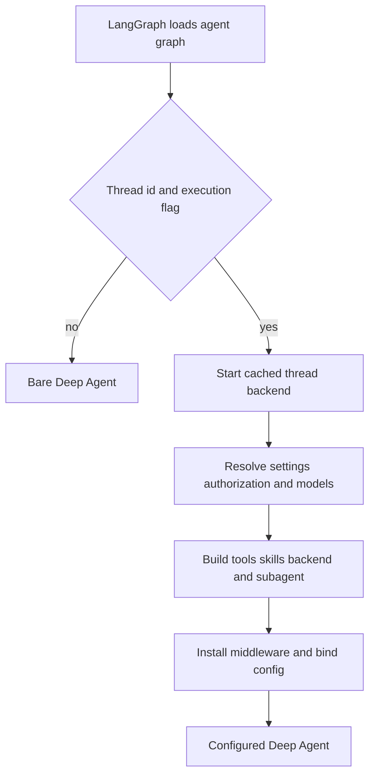
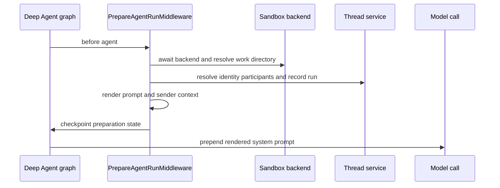

# Coding Agent Assembly

`get_agent(config)` is the deployment-facing factory for the primary coding graph. The `agent` entry in `langgraph.json` points to `agent.graphs.agent:traced_agent`, which re-exports `get_agent`. For an executable, thread-bound request, the factory delegates to `build_agent`: it starts the thread backend early, resolves durable settings and sender authority, then passes models, a backend, skills, tools, a general-purpose subagent, and middleware to `create_deep_agent`.

## Execution gate and configuration

The execution gate separates graph discovery from costly thread-bound assembly.

`build_agent` sets `DEFAULT_RECURSION_LIMIT`. It returns `create_deep_agent(system_prompt="", tools=[])` when `configurable.thread_id` is absent or `__is_for_execution__` is not exactly `True`; this avoids sandbox creation and custom middleware while LangGraph reads graph metadata. In either path it calls `with_config(bindable_config(config))`, stripping `__pregel_*` values. Those runtime-provided objects must not be captured into a reusable graph because they are not serializable for later state reads.

`RunConfig` is the defensive boundary for `configurable`, a mapping assembled by webhooks, dashboard, and cron paths. Its declared fields are optional, extras are preserved, and `parse` drops only fields which fail validation. Thus one malformed value does not discard a usable `thread_id` or unrelated launcher data.

## Factory control flow and sandbox choice

`profile_login` represents the sender who initiated this run and drives authorization. Thread settings are different: they are seeded from a profile for a new hosted thread and then persist on that thread, so a later participant does not replace its model policy merely by posting.

The factory creates a cached sandbox proxy and calls `start()` before settings and integrations are loaded. Its reconnect callback selects `LocalShellBackend` for `source == "desktop"`; hosted runs call `ensure_sandbox_for_thread(thread_id, workspace_slug=...)`. Desktop validates that `local_project_path` is either a registered project or a managed worktree before exposing it as the shell root.

For hosted threads, sandbox lifecycle is intentionally conservative. It reuses a cached connection or reconnects the sandbox id in thread metadata, refreshes the GitHub proxy and git identity, or creates and persists a sandbox when none is bound. An unreachable existing sandbox raises rather than silently replacing uncommitted work. A deleted sandbox is recreated because its stale id would otherwise permanently prevent future runs; selected callers can explicitly allow replacement of an unreachable re-derivable sandbox.

## Settings, model policy, and persistence

The main and general-purpose-subagent model/effort pairs resolve by precedence:

1. Workspace defaults (desktop uses local defaults).
2. Dashboard profile overrides; a profile may separately override the subagent.
3. Stored thread settings, including routing settings.
4. A canonicalized per-run `agent_model_id` plus `agent_effort`, only when the model is supported and accepts that effort.

The accepted per-run pair applies to both main and subagent and is stored in hosted thread settings with repository instructions and routing choices. The Fable availability gate is applied **after** that persistence, preserving a deployment-wide switch as a per-run decision. Slack ask runs disable adaptive routing; otherwise adaptive routing may add `ModelSelectionMiddleware` with configured route models. The factory records resolved model information in `configurable` and graph metadata. Provider construction failures are represented by deferred error models so assembly can complete and the failure is reported at call time. A fallback model middleware is installed only when its id differs from the primary model.

## Backend, skills, and offloaded artifacts

The agent backend is a `CompositeBackend` whose default is the sandbox proxy. It overlays read-only routes for bundled skills and, in hosted runs, organization skills held in the LangGraph store. Hosted user skills are added only when a private credential login is available and are namespaced by that login; desktop instead exposes a read-only `StateBackend` user-skill snapshot. The resulting ordered `skill_sources` is supplied to both parent and general-purpose subagent.

Desktop adds routes for the Deep Agents virtual `/large_tool_results/` and `/conversation_history/` directories. They lead to an artifact root keyed by sanitized thread id outside the selected project, preventing history and tool-result offloads from showing up as git changes.

## Prompt and durability-facing preparation

The graph is assembled with an empty static `system_prompt`. `PrepareAgentRunMiddleware` creates `rendered_system_prompt` in its `before_agent` phase, and its base middleware prepends that rendered text as a system message on each model call. `construct_system_prompt` delegates the ordered main template to `system/main`, incorporating the working directory and environment, dashboard/source guidance, configured default prompt and repository boundary, collaboration and untrusted-comment guidance, repository and workspace instructions, recent thread context, admin workspace guidance, and conditional sandbox-download guidance.

The preparation hook resolves fresh thread-specific context before model calls and checkpoints its completion.

Hosted preparation resolves the GitHub token, triggering identity, sandbox work directory, workspace, participant blocks, and optional recent-thread context. It identifies the sender from the latest human message, only appends participant context blocks not already visible in history, and records run model/source metadata and invocation usage on a best-effort basis. Sandbox attachment failures notify the user before being re-raised.

`BasePrepareRunMiddleware` persists `run_prepared` and `run_prepared_for` in graph state. The fingerprint combines middleware type, latest-message content, and configuration. A resumed attempt with the same fingerprint skips setup; a later invocation re-prepares fresh credentials and context. Because a failure before checkpoint persistence can execute preparation again, implementations must be idempotent. These state fields are omitted from user-visible output but form the durability latch for preparation.

## Tools and independent subagent

The parent starts with a curated static surface: web and background work, plan/user/thread/sandbox/PR/automation operations, and conditionally service/download, Slack, admin, private-admin, and bridge-result tools. Personal settings and user skill tools require a known private credential scope; channel-history reads additionally require a private thread. Thread-bound Slack tools require trusted source context with channel and thread identifiers. Desktop replaces the surface with `http_request`, `fetch_url`, and `web_search`; stop-summary replaces it with Slack thread reading and reply.

`ExcludeToolsMiddleware` removes the selected Deep Agents tools at runtime. Its exclusion set varies for stop summaries, Slack asks, and automatic incident sweeps, where actions such as delegation or mutation may be removed even if they were initially registered. The run also installs input/image validation, tool-error conversion, task retry, PR/workflow guards, GitHub proxy refresh, message-queue checks, reply/CLI-result requirements when applicable, usage and step-limit handling.

MCP and Notion tools are loaded concurrently during factory assembly only for non-desktop, non-stop-summary runs with known credential scope. They are exposed through `DynamicToolMiddleware`: the model must call `load_integration_tools` before calling a connected tool. The middleware resets selected integrations at run start, rejects name collisions with static and Deep Agent tools, serializes each group build, and turns loader failures into unavailable-tool results. It can preserve provider prompt caches by anchoring native tool additions after the load result.

The configured `general-purpose` subagent is a separately compiled fork. It receives the same skills, its own model, transcript, dynamic tools, conversation offloading, provider guards and applicable workflow/PR guards. Parent middleware therefore does not automatically protect it. `_SubagentToolGuard` blocks Slack and other parent-context-sensitive operations at call time (while source-free channel reads may remain), and its inherited-middleware exclusions prevent parent reply and selection behavior from being applied to the fork. Changes to a parent-only restriction should be reviewed against this boundary.

## Middleware ordering and operational consequences

Middleware is passed outermost to innermost. `ConversationOffloadingMiddleware` and `PrepareAgentRunMiddleware` occur first, followed by transcript/incident/workspace-skill context and input/tool controls. Guards and proxy/message-queue handling follow; timeout wrap-up, reply requirements, notifications, usage, optional model selection/fallback, and dynamic tools follow them. Provider/message sanitizers, stable tool-result ordering, `ModelErrorMiddleware`, and `ModelCallTimeoutMiddleware` are innermost. The innermost timeout covers the provider call and can propagate to outer fallback middleware. The factory relies on `create_deep_agent`'s built-in `PatchToolCallsMiddleware` rather than adding a redundant orphaned-tool-call repairer.

When a dashboard JWT and tools base URL are configured for a hosted normal assembly, the factory saves tool context for the thread after graph creation. Test-oriented `tool_surface` assembly instead returns the graph plus its dynamic middleware and exclusion set without starting the backend.

## Change guidance and focused tests

Treat `build_agent` as the assembly seam for changing model policy, backends, tool visibility, skill routes, subagent behavior, or middleware. Preserve the execution gate, the separation of initiating-sender authority from durable thread choices, early backend startup, and the independent-subagent boundary. In particular, do not broaden a static tool list without reviewing its runtime exclusions and subagent guard.

`tests/agent/test_agent_assembly_context.py` captures factory arguments to verify public/private skill and tool routes, eager sandbox startup, sender draft preference, Slack visibility, private admin tools, and parent-only subagent behavior. `tests/agent/test_factory_tool_loading.py` verifies that MCP and Notion loading is concurrent. `tests/models/test_agent_subagent_models.py` verifies profile inheritance and Fable gating. See also [Middleware Stack](middleware-stack.md), [Sandbox Lifecycle](sandbox-lifecycle.md), [Models, Profiles, and Instructions](../concepts/models-profiles-instructions.md), [Threads and State](../concepts/threads-and-state.md), and [Tools](../concepts/tools.md).
