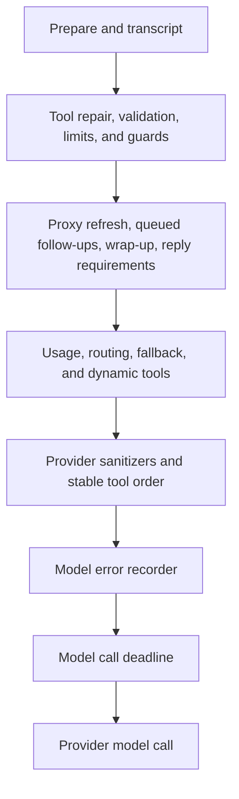
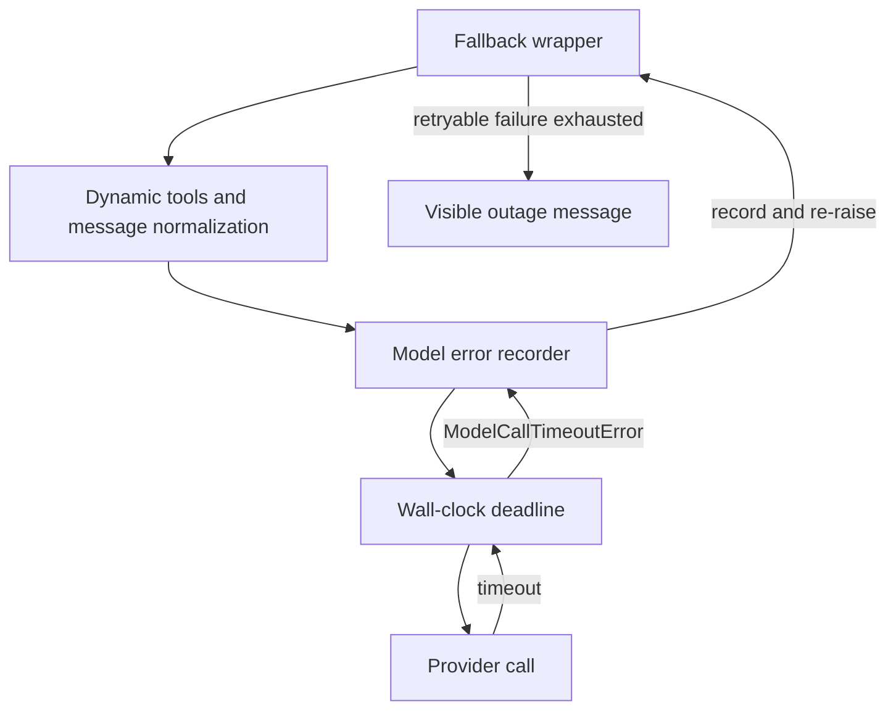

# Agent Middleware and Failure Boundaries

`get_agent` and `get_reviewer_agent` supply ordered middleware to `create_deep_agent`. The order is outer to inner: an earlier wrapper sees and can handle work or an exception from every later wrapper. Consequently, placement is a runtime contract—not merely registration order. The coding agent also gives delegated subagents a different, deliberately narrower inherited set.

## Coding-agent envelope

The current coding-agent stack, outer to inner, is:

1. `ConversationOffloadingMiddleware`
2. `PrepareAgentRunMiddleware`
3. `TranscriptMiddleware`
4. `IncidentMiddleware` when an incident session exists
5. `WorkspaceSkillsMiddleware` for eligible non-local runs
6. `SanitizeToolInputsMiddleware`
7. `ValidateImageReadsMiddleware`
8. `ModelCallLimitMiddleware`
9. `ToolErrorMiddleware`
10. `ExcludeToolsMiddleware`
11. `SubdirAgentsReadMiddleware`
12. `ToolRetryMiddleware` for `task`
13. `PullRequestCreationGuardMiddleware`, except in local runs
14. `WorkflowPushGuardMiddleware`
15. `refresh_github_proxy_before_model`
16. `check_message_queue_before_model`, except in stop-summary mode
17. `TimeoutWrapupMiddleware`
18. `RequireUserReplyMiddleware`
19. `RequireCliResultMiddleware` when CLI output is required
20. `notify_step_limit_reached`
21. `record_run_usage`
22. `ModelSelectionMiddleware` when adaptive routing is enabled
23. `ModelFallbackMiddleware` when a different fallback model resolves
24. `DynamicToolMiddleware` when integration groups exist
25. the Fireworks, OpenAI Responses, and thinking-block message sanitizers
26. `StableToolResultOrderMiddleware`
27. `ModelErrorMiddleware`
28. `ModelCallTimeoutMiddleware`

The coding-agent request crosses its outer-to-inner middleware phases before reaching the provider.

The first preparation hook is checkpoint-aware. `BasePrepareRunMiddleware` fingerprints the latest message, middleware class, and preparation configuration; a matching checkpointed latch skips setup when the same invocation resumes. Its subclasses must nevertheless be idempotent: a failure before the checkpoint can execute setup again. The preparation wrapper also prepends the rendered system prompt to a model request.

Conversation offloading derives from Deep Agents summarization: it can summarize automatically or, when configured for manual offloading, summarize and jump directly to the end. Dynamic integrations take a different approach: only names are initially advertised, and the costly credential or MCP tool construction waits until the agent explicitly loads a group. At the tool boundary, malformed `read_file.offset` and `read_file.limit` strings are coerced before validation. `ValidateImageReadsMiddleware` further prevents a file with an image extension but non-image bytes from becoming a provider-rejected image content block.

Before every applicable model turn, the proxy hook best-effort refreshes a near-expiry sandbox GitHub token. The queue hook reads the `(queue, thread_id)` store namespace, turns the snapshot of follow-up messages into human input in FIFO order, and removes only messages it consumed so arrivals during image or model resolution remain queued. This is the integration point for follow-up messages; it also consumes a pending autofix event.

`TimeoutWrapupMiddleware` begins its clock lazily, so graph construction cannot age a run. After `OPEN_SWE_WRAPUP_TIMEOUT_SECONDS` (45 minutes by default), it adds the wrap-up instruction to each subsequent model request. The reply and optional CLI-result middleware enforce completion-surface requirements, while the step-limit after-agent hook detects the model-limit marker and posts a Slack warning when an active Slack thread exists. `RecordRunUsageMiddleware` tags model responses with routing/invocation metadata and finalizes invocation usage both on normal completion and on a model-call error.

## Tool policy and failure boundary

The tool wrappers deliberately distinguish recoverable feedback from a dead execution environment:

* `ToolErrorMiddleware` converts ordinary unhandled tool exceptions to `ToolMessage(status="error")`, so the model can inspect and correct the failure rather than losing the entire run.
* A `SandboxRetryableConnectionError` is a special recoverable result: the SDK guarantees the WebSocket upgrade failed before the execute frame was sent, so retrying cannot double-run a command. The middleware returns a `sandbox_transient` tool error.
* A truly unreachable sandbox is notified and re-raised. Continuing would make every later sandbox call fail and repeat notifications.
* `retry_transient_sandbox_errors` is the lower-level counterpart for direct operations: it retries only that SDK-marked pre-start error, up to four attempts unless a caller supplies an elapsed-time deadline, using bounded exponential backoff with jitter.

`ToolRetryMiddleware` is narrower than the sandbox helper. It wraps the delegated `task` tool with two retries, one-second initial delay, and ten-second maximum delay. Its predicate includes retryable HTTP statuses, transport failures, and `ModelCallTimeoutError`; this is important because subagents do not receive the coding agent's fallback wrapper. Prompt/context failures return structured failed data to the caller; other exhausted failures propagate.

The two delivery guards sit inside the general tool error wrapper. The PR guard prevents shell fallback creation paths through `execute` or `background_execute`, including `gh pr create`, API, and direct curl forms, so PR creation stays attributable to its dedicated tool. The workflow guard inspects pushes that affect `.github/workflows`; it records an approval request and returns a blocked tool result until the matching change fingerprint is approved, then forwards a rewritten safe command.

## Model-call recovery

The innermost deadline covers the provider call itself. A stall becomes `ModelCallTimeoutError`, a `TimeoutError`, and travels outward through `ModelErrorMiddleware`, which logs/classifies it, records the type and classification on thread metadata when context is available, and re-raises unchanged. The optional fallback layer can therefore treat the deadline as transient.

The timeout is recorded before fallback either retries across providers or produces a terminal response.

Fallback is installed only if the resolved fallback model differs from the primary. It alternates primary and fallback models across six default attempts (the initial call plus the five-entry backoff schedule), uses positive jitter on delayed retries, and handles connection, timeout, retryable `ModelError`, and selected 408/409/425/429/5xx/529 provider failures. Provider model-access errors are surfaced immediately as an `AIMessage`; exhausted transient retries normally return an outage `AIMessage`, while `surface_outage_message=False` re-raises the final exception. `ModelCallTimeoutMiddleware` takes `OPEN_SWE_MODEL_CALL_TIMEOUT_SECONDS`, falls back to 900 seconds for missing, invalid, or non-positive input, and uses `asyncio.wait_for` above provider-level timeouts.

## Reviewer differences and settlement

The reviewer has a smaller, purpose-specific chain: `PrepareReviewerRunMiddleware`, tool-input sanitization, the model-call limit, tool errors, proxy refresh, queue consumption, wrap-up, three provider sanitizers, `RepairOrphanedToolCallsMiddleware`, stable tool ordering, model-error recording, the model deadline, and `settle_review_check_on_exit`.

It has no conversation offloading, transcript, incident/workspace skills layers, image-read validation, tool exclusion, subdirectory instructions, task retry, PR/workflow guards, reply/CLI requirements, usage recording, routing, fallback, or dynamic tools. Orphan repair makes a resumed review provider-valid: before a model call it inserts a synthetic error `ToolMessage` immediately after each AI tool call without a corresponding result, allowing the model to retry an interrupted operation.

The final reviewer hook protects PR status semantics. If a tracked review check remains because the run ended without publishing, it closes it as neutral—not failure—so reviewer infrastructure trouble is not presented as a code failure. If `publish_review` completed but only the completion PATCH failed, stored pending result data is instead retried with its real conclusion.

## Safe changes and focused tests

Maintain wrapper order when changing this system. In particular, placing the deadline outside the recorder/fallback path would lose classification or timeout recovery; moving a guard outside the generic tool boundary changes which errors become model-visible; and changing queue consumption must retain the snapshot-and-preserve-new-arrivals invariant. New direct sandbox retries require the same pre-start guarantee before they may be considered safe.

Focused tests in `tests/middleware` exercise fallback eligibility and alternation, deadline behavior, queue delivery during asynchronous building, preparation latching, dynamic tools, tool-error shaping, usage accounting, sanitizers, orphan repair, and stable ordering. Extend the closest such test whenever changing a wrapper's ordering edge or short-circuit behavior.
