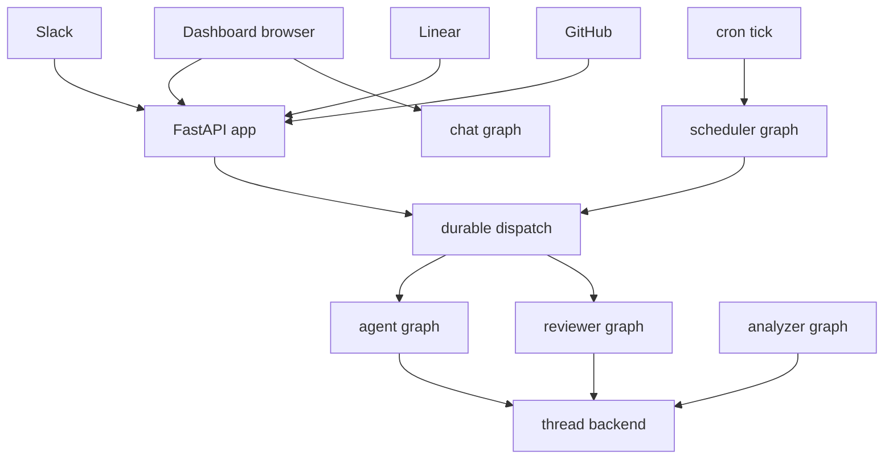
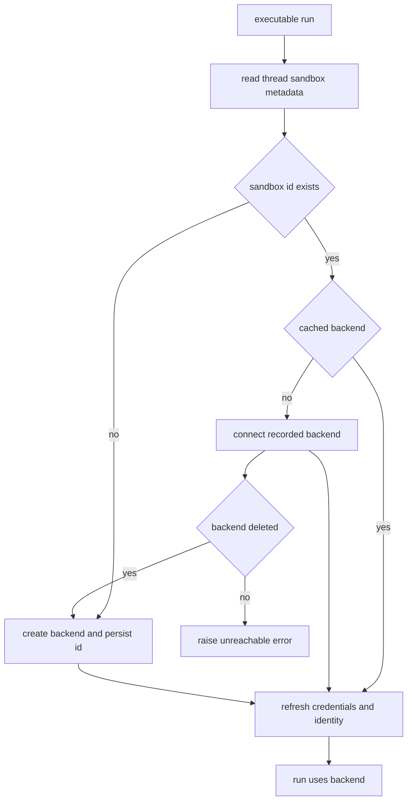

# Runtime and Product Architecture

Open SWE is a LangGraph deployment whose custom FastAPI application receives browser and integration traffic. Durable LangGraph runs hold conversational graph state; the agent factories construct the runnable for an execution, while thread metadata and the sandbox lifecycle own the long-lived execution context. This separation is important: creating a graph is not the same thing as creating or replacing a working tree.

## Deployment and graph boundary

`langgraph.json` is the cloud manifest. It uses Python 3.14, points HTTP serving to `agent.webapp:app`, loads `.env`, and configures a deleting checkpointer TTL with a 60-minute sweep and a 43,200-minute default. The Docker instructions build the dashboard as best effort, so a failed UI build does not prevent a backend deployment.

Six named graph entrypoints are registered through stable `agent.graphs.*` modules:

| Graph | Entrypoint | Architectural role |
|---|---|---|
| `agent` | `agent.graphs.agent:traced_agent` | Coding-agent factory for an executable thread. |
| `reviewer` | `agent.graphs.reviewer:traced_reviewer_agent` | PR review and finding publication. |
| `analyzer` | `agent.graphs.analyzer:traced_analyzer` | Per-repository review-style learning. |
| `review-scout` | `agent.graphs.review_scout:traced_review_scout` | Review-scout workflow. |
| `chat` | `agent.graphs.chat:traced_chat_agent` | Read-only discussion of a pull request. |
| `scheduler` | `agent.graphs.scheduler:get_scheduler` | Cron-tick routing for maintenance and scheduled work. |

This shows the ingress and execution boundaries: durable dispatch is shared by agent and reviewer launches, whereas chat, analysis, and scheduler are independently registered graphs.

## Factories, state, and sandboxes

`agent.server:get_agent` delegates to the main factory and measures the per-thread factory phase. For an executable run it resolves the triggering GitHub identity, obtains a cached or reconnectable backend, starts it, resolves workspace, profile, and thread model settings, persists normalized thread settings when needed, and builds a fresh deep agent with its tools and middleware. When no `thread_id` is present or a graph is loaded outside execution, it returns an empty deep agent and deliberately does not provision a sandbox. This makes graph discovery and non-execution loading safe. See [Agent Graph & get_agent Factory](./agent-graph.md).

The reviewer shares the lifecycle but is intentionally review-only: its documented core tools are `add_finding`, `update_finding`, `list_findings`, and `publish_review`, without commit, push, or PR-opening tools. It prepares the repository and computes valid changed-file line locations before model work so findings can be checked when they are created. The analyzer uses a workspace-scoped sandbox and GitHub proxy access to mine historic human review feedback and finding outcomes, then exposes `save_review_style_prompt` to store learned repository guidance. See [Reviewer & Review-Style Analyzer Graphs](./reviewer-and-analyzer.md).

The chat graph has no sandbox. The dashboard chat proxy provides diff, findings, and overview as virtual `/pr/` files in the `files` state channel; the graph excludes execution and filesystem mutation tools. Its GitHub-backed read tools receive a repository-scoped GitHub App installation token rather than a user credential.

A graph factory is ephemeral, but the thread is not: checkpoints retain graph state and thread metadata records the sandbox identity. The process-local backend cache is keyed by `thread_id`; a new worker reconnects from persisted metadata. If a recorded sandbox is deleted it is recreated, but an existing unreachable coding sandbox raises rather than being silently replaced, since replacement would lose uncommitted work. Callers whose checkout is re-derivable, such as review, can explicitly allow replacement. A backend is only made reusable after its initialization and metadata binding succeed. See [Sandbox Lifecycle](./sandbox-lifecycle.md).

This lifecycle preserves a coding thread's working tree by distinguishing a deleted backend from an existing but unreachable one.

## FastAPI composition and lifecycle

`agent/webapp.py` is a compatibility shim that re-exports the `app` built in `agent/api/app.py`. The application pins one event loop before workers initialize, adds tracing and request-ID middleware, and mounts dashboard, plan, workflow-approval, Linear, Slack, health, GitHub, and sandbox-tool routers plus static dashboard UI. Credentialed CORS is configured from `DASHBOARD_ALLOWED_ORIGINS`; `*` is rejected when credentials are enabled.

The async lifespan pins the loop again, validates GitHub-login allowlisting, sandbox startup configuration, and local-development LLM configuration, requires and migrates the database, attempts legacy user and automation migrations, synchronizes configured admins, and starts analytics, transcript, and sandbox-bridge listeners. Analytics and the listeners are best-effort: failures are logged and selected cross-process behavior falls back to in-process notifications. Shutdown stops those listeners and analytics and closes the database.

The dashboard aggregate router is rooted at `/dashboard/api` and attaches the same-origin mutation dependency. It composes browser-facing authentication, profiles and preferences, workspace and repository settings, reviews, schedules, threads and transcripts, integrations, skills, analytics, incidents, API keys, and bridge APIs. Importing `agent.dashboard` does not eagerly import this surface: its PEP 562 `__getattr__` only loads `routes.router` when the web app asks for it.

GitHub and Linear endpoints authenticate webhook signatures, record event-log references, and reject or ignore unsupported input before deferring accepted work. The GitHub route also declines repositories not assigned to a workspace and returns 503 when workspace ownership cannot be read so GitHub retries. Slack normalizes a request to a stable channel/thread target; code channels and opted-in concierge DMs deliberately collapse messages onto a shared agent thread instead of inventing a new session.

## Durable run dispatch

`dispatch_agent_run` is the common creation contract for agent and reviewer triggers from integrations and product surfaces. `assistant_id` identifies the selected graph, while `source` selects input identity and is retained for logging and metadata rather than graph selection. It refuses an ambiguous mixture of a prebuilt input and content or identity arguments.

Its creation defaults make interruption and recovery intentional:

- `multitask_strategy="interrupt"` interrupts an active run for a follow-up; background callers can choose `enqueue`.
- `durability="sync"` checkpoints before steps, enabling recovery from the last checkpoint.
- Creation requests all v3-compatible stream modes, subgraph streaming, and resumable streams. The `__event_streaming_v2` configuration marker makes externally initiated runs observable and replayable in the dashboard.
- The completion webhook is attached only if `RUN_COMPLETE_WEBHOOK_SECRET` is set and `COMPLETION_WEBHOOK_URL` is absolute and non-loopback. Invalid or absent completion configuration therefore does not block run creation.

The scheduler is a one-node compiled `StateGraph`. Its launch node dispatches reconciliation, watch evaluation, legacy expedited-review cleanup, background-task monitoring, workspace refresh, session and agent cost refresh, thread-feedback prompting, or a scheduled agent launch. It returns structured missing-key statuses for absent watch keys, thread IDs, or schedule IDs, retries transient sandbox errors, and converts exhausted transient errors to `sandbox_unavailable`.

## Cloud and desktop product surfaces

The separate `langgraph.desktop.json` registers only the agent graph, supplies `agent.local_auth:auth`, uses a local checkpointer, disables Studio auth, and disables the bundled UI. Desktop mode is selected by `configurable.source == "desktop"`; it uses `LocalShellBackend`, not a managed sandbox. `local_project_path` must resolve to an existing allowlisted project or a descendant of `OPEN_SWE_LOCAL_WORKTREES_DIR`. The backend forwards only a limited shell environment, and offloaded tool output and conversation history are routed outside the project to avoid accidental inclusion in `git add -A`.

The `ui/` product client is a TanStack Router React application. Its generated route tree includes agent and local-agent sessions, reviews, administration, integrations, usage, workspace settings, incidents, and assistant views. The agents layout requires login except for eligible local desktop routes; the router derives its base path from Vite's build base so the bundle can operate under a mount prefix. See [Dashboard UI](../integrations/dashboard-ui.md).

## Safe extension and verification

- Export and register a stable `agent.graphs.*` entrypoint to add a deployable graph; do not assume it becomes eligible for the agent/reviewer dispatch contract.
- Add browser APIs by composing them through `create_app` and preserve the router's origin protections.
- Treat an unreachable coding sandbox as an operator recovery decision, not a cache miss.
- When changing dispatch protocol fields, exercise durable creation and externally initiated event replay. `agent/test_dispatch.py` is the focused unit-test area, and `e2e/tests/dispatched_run_events.spec.ts` covers dispatched-run event behavior.
- Keep desktop real-path validation and artifact routing when changing local-run support.

Related pages: [Agent Graph & get_agent Factory](./agent-graph.md), [Reviewer & Review-Style Analyzer Graphs](./reviewer-and-analyzer.md), [Sandbox Lifecycle](./sandbox-lifecycle.md), [Dashboard UI](../integrations/dashboard-ui.md), and [Invocation](../workflows/invocation.md).
