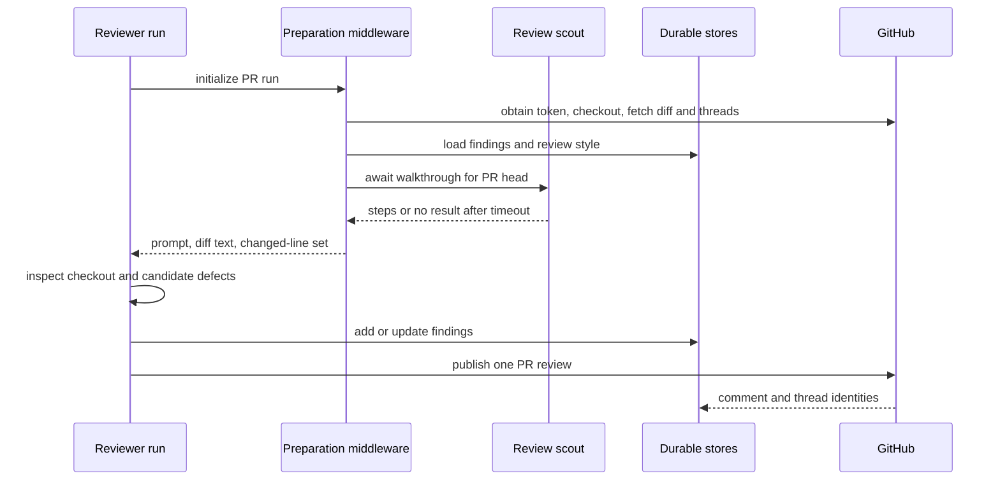
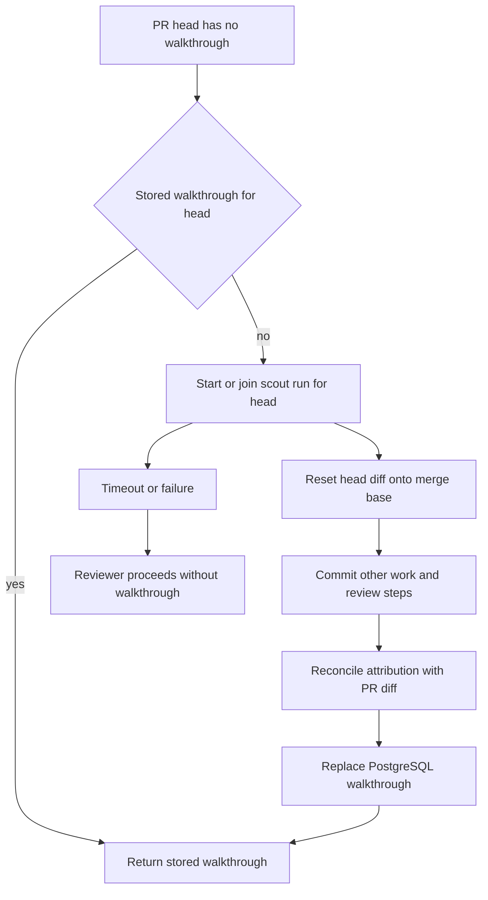
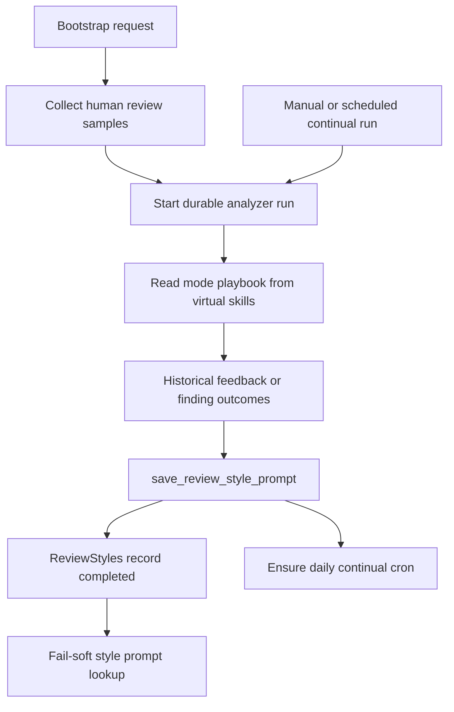

# Reviewer, Review Scout, and Style Analyzer

Open SWE exposes three specialized LangGraph deep-agent graphs: `reviewer`, `review-scout`, and `analyzer`. The reviewer is the only graph that assesses and publishes a PR review. Before it reviews, it can obtain a per-head walkthrough from the scout. The analyzer is a separate feedback loop that learns a repository-specific supplement to the review policy; it does not review a particular PR.

For trigger routing, see [PR Review Workflow](../workflows/pr-review.md). For sandbox creation and recovery, see [Sandbox Lifecycle](sandbox-lifecycle.md). For the general tool model, see [Tools](../concepts/tools.md).

## Reviewer: read-only assessment with controlled publication

### Authority and factory boundary

The reviewer is read-only with respect to the checkout: its prompt forbids commits, pushes, and direct GitHub-review API calls, and its explicit tools contain no code-editing, commit, push, or PR-opening operation. GitHub review mutation is concentrated in `publish_review` and the finding-thread tools.

`get_reviewer_agent(config)` constructs an agent per invocation. It copies both the outer configuration and `configurable` mapping before setting a default recursion limit, so a caller's configuration is not mutated. A missing `thread_id`, or a graph unavailable for execution, produces an empty agent without sandbox provisioning. Otherwise the factory chooses configured or workspace-default parent and subagent models, applies the Fable gate, and installs a cached sandbox reconnect closure.

The parent has review-lifecycle tools—`fetch_review_diff`, `add_finding`, `update_finding`, `list_findings`, `publish_review`, `resolve_finding_thread`, and `reply_to_finding_thread`—plus `web_search`, `fetch_url`, and `http_request`. Its one `reviewer` subagent receives a disjoint file partition and may return candidate defects, but cannot create findings or publish; the parent validates, persists, ranks, and publishes them.

### Preparation and review context

`PrepareReviewerRunMiddleware` performs deterministic work before the first model call. For a source-backed repository it mints a repo-scoped GitHub App installation token, caches it for the reviewer thread as a bot token, ensures a replaceable sandbox, and checks out the PR head. It materializes trusted skills from the base revision, not from the untrusted PR head.

It computes a full or delta re-review diff and a `(file, side, line)` set, then puts `diff_text` and `diff_line_set` into run state. In parallel it fetches the PR overview, GitHub review threads, saved style guidance, base-ref instructions, organization guidance, approval policy, and API standards. Existing threads are reconciled before prompt rendering; scoped instructions are selected only after the changed files are known.

Reviewer preparation waits up to the scout limit for a matching walkthrough, but a scout failure or timeout degrades to an ordinary review rather than blocking publication.

An unreachable sandbox is replaceable because it contains only a checkout rebuilt on every run; durable PR state is elsewhere. If replacement also fails, preparation posts a typed unreachable-sandbox notification and fails rather than silently leaving the PR unreviewed.

Author-controlled PR title/body, GitHub thread comments, finding replies, and walkthrough material are rendered as data, not instructions. The renderer validates GitHub login attributes and neutralizes closing XML wrapper tags, preventing supplied content from escaping its data block.

### Findings, reconciliation, and publication

A reviewer thread remains the addressing and metadata boundary: it carries PR identity, reviewed head, watch state, and `kind: "reviewer"`. Findings themselves now live in PostgreSQL under their pull request, with a one-time migration path for legacy findings in LangGraph thread metadata. This makes findings survive sandbox eviction and separates durable review records from execution state.

A `Finding` captures severity, confidence, category, title, location and side, diff membership and hunk, status and SHAs, GitHub publication IDs, monotonic surface state, reply/reconciliation data, fingerprint, interactions, and rank. `add_finding` validates its inputs and rejects an anchor range absent from the current diff with `success: false` and `in_diff: false`; the model is explicitly told not to re-anchor or retry. It resolves diff context from run state first, then configuration, then a fresh authenticated PR-diff fetch. Suggestions longer than four lines are dropped while preserving the finding.

Before a normal run, reconciliation locates a finding by embedded marker first and recorded GitHub IDs second. It backfills identities and surface state, resolves a finding only when all matched threads are resolved, and stores the latest human reply as a `needs_reassessment` interaction. Surface states only move forward, which lets legacy normalization choose the furthest durable state when fields disagree.

`publish_review` first requires a complete, unique best-first `ranking` of publishable findings. It selects open, in-diff, unpublished findings at or above the threshold (default `medium`) and applies `REVIEW_FINDING_CAP`. The tool posts one GitHub PR review with one inline comment per renderable finding; each comment carries an `open-swe-review-comment` JSON marker, and a small suggestion is rendered as a fenced `suggestion` block. On re-review it does not repost findings already associated with a GitHub comment.

After a post, the tool writes review/comment/thread identities, resolves threads for resolved findings through GraphQL `resolveReviewThread`, advances `last_reviewed_sha`, and completes review bookkeeping. A `success: true` result still needs interpretation: `review_id: null` with `skipped_empty_re_review: true` means a deliberate no-post result, and `dry_run: true` is evaluation simulation. If GitHub rejects anchors, the tool filters invalid anchors and retries once when valid comments remain; otherwise it returns the unresolvable finding IDs and a remediation hint rather than encouraging repeated identical publishes.

## Review scout: a walkthrough, not a second reviewer

The `review-scout` graph runs on its own deterministic PR thread and produces an ordered walkthrough for a specific PR head. It has only `commit_walkthrough_step` and `record_human_input`: it does not add findings or publish reviews. Preparation requires a complete PR identity, gets an App token and replaceable sandbox, checks out the PR, and resets its working tree so the head tree appears as unstaged changes on the merge base.

The scout model partitions that mechanical diff into commits in reading order. A non-`other` step cannot be committed until an `other: true` pass exists; this convention lets the walkthrough present meaningful review steps first and consolidate residual changes last. Finalization guarantees the resulting final tree exactly matches the PR head, uses Git blame plus the PR's own zero-context diff to attribute added head lines and deleted merge-base lines, and places unowned, binary, rename, mode, or residual work in **Other changes**. It refuses to save an empty meaningful walkthrough.

Human steering history is made available to the scout when present. Only then is `record_human_input` available; it stores a bounded summary in state. Once finalized, the scout replaces the PostgreSQL walkthrough for that PR and head with ordered steps, line ranges, scout-thread ID, merge base, and the human-input summary. The reviewer renders matching steps and human context as untrusted data blocks.

The scout joins an active run for the same head, interrupts obsolete-head work, and the reviewer polls for at most 600 seconds before falling back.

## Analyzer: per-repository review-style feedback loop

The analyzer learns a review-style prompt from historical human PR feedback and the reviewer's own recorded outcomes. `analyzer_mode` selects the authoritative bundled playbook: `bootstrap` collects historical merged-PR examples for a cold start, while `continual` uses `read_finding_outcomes` to promote recurring useful patterns and demote false positives. The analyzer itself has only `read_finding_outcomes` and `save_review_style_prompt`, an 80-call limit, and sanitization, tool-error, timeout, and response-sanitization middleware.

Like the reviewer, `get_analyzer` returns an empty graph when there is no thread or execution is disabled. A live analyzer uses a sandbox backend plus a `StateBackend` mounted at `/skills/`; launchers seed bundled playbooks in the input `files` channel, so those procedures are read as virtual files rather than written to the checkout. It resolves workspace identity and configures the sandbox GitHub proxy for the target repository.

`REVIEW_STYLES` is a typed `review_styles` store keyed by `owner/repo`. Its `ReviewStyle` record holds status, editable prompt, summary and sample metadata, analysis thread/run IDs, scheduled cron ID, error, and timestamps. The reviewer fetches `custom_prompt` fail-soft: a style-store failure omits this supplemental guidance rather than failing the PR review. A saved prompt applies only when consistent with the global review bar.

The analyzer turns bootstrap samples or continual finding outcomes into a stored prompt that the next reviewer preparation can consume.

`start_bootstrap_analysis` collects samples before marking the record running and launching a durable run on the deterministic review-style thread; collection and startup failures mark it failed. `save_review_style_prompt` rejects an empty prompt, persists the completed record, and then best-effort registers a daily continual cron. Registration is idempotent and hashes the repo name to schedule between 05:00 and 08:59 UTC.

The nightly cron is threadless in LangGraph scheduling terms, but its configurable explicitly supplies the deterministic review-style thread ID; otherwise `get_analyzer` would return an empty graph. The input carries no accumulating conversation history, seeds virtual skill files, selects `continual`, and obtains GitHub App authentication during analyzer preparation when no fresh user token is supplied.

## Focused tests and safe-change guidance

`tests/reviewer/test_factory_config_isolation.py` protects the reviewer's copy-before-default invariant. Reviewer tool, publication, reconciliation, diff, session, and watch tests cover changed-line validation, marker recovery, publication retry behavior, and trigger state. `tests/reviewer/test_review_scout_git.py` uses a local Git repository to verify that finalized steps cover exactly the PR diff, preserve path handling, put **Other changes** last, and end on the PR head tree.

When changing this area, preserve three boundaries: the reviewer must remain read-only except through controlled review tools; scout output is optional, head-specific context rather than finding authority; and analyzer guidance is durable, repository-scoped advice that must not override the global quality bar.
