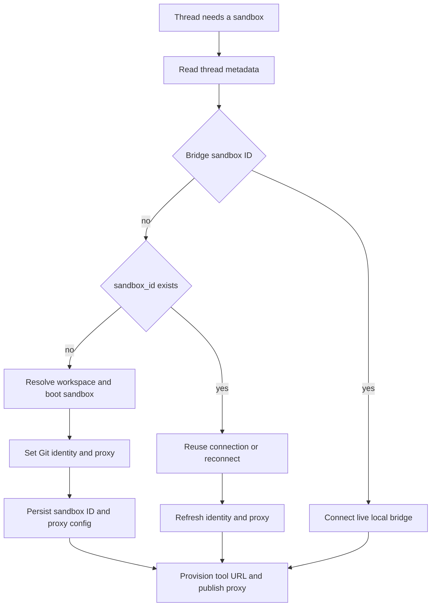
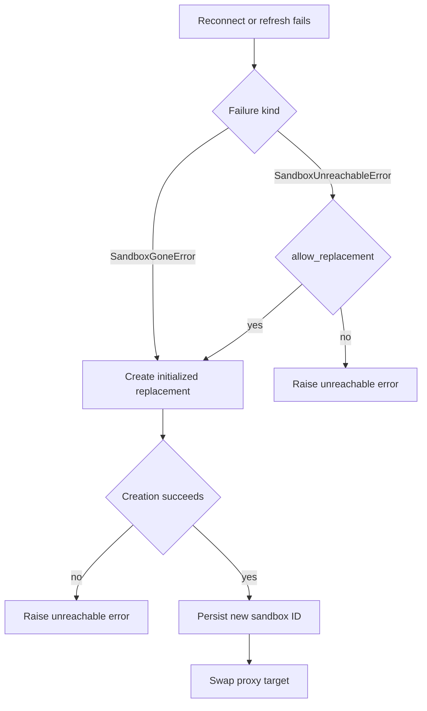

# Thread Sandbox Lifecycle

A normal agent thread is bound to one persistent sandbox, which retains its checkout and uncommitted working tree across runs. The design separates that durable binding from worker-local connections so a later run can reconnect without publishing a partially initialized backend.

Related: [Agent graph](agent-graph.md), [Threads and state](../concepts/threads-and-state.md), [Sandbox providers](../integrations/sandbox-providers.md), and [Configuration](../operations/configuration.md).

## Binding, cache, and stable handles

`thread.metadata["sandbox_id"]` is the durable binding. `get_sandbox_metadata` accepts inline run metadata only when it contains a string ID; otherwise it reads the live thread. A failed live-thread read propagates rather than being interpreted as unbound, preventing an outage from rebinding a thread over its real working tree.

`SANDBOX_BACKENDS` maps a thread ID to a worker-local `SandboxBackendProxy`; `SANDBOX_CONNECTIONS` maps a sandbox ID to its live provider connection. The latter is keyed by sandbox, not thread, so a thread rebound on another worker cannot receive a connection left behind for a different binding. `set_sandbox_backend` preserves an existing proxy and swaps its target, allowing already assembled tools and middleware to follow a replacement.

The proxy is async-only and delegates its `a*` operations after resolving a backend. It can use the run's reconnect callback or fall back to reading the metadata ID and calling `create_sandbox`. A lock, one shared startup task, and `asyncio.shield` coalesce simultaneous callers and ensure cancellation of one waiter does not cancel startup for the others. Failed startup is cleared so a subsequent call can retry. The proxy subclasses `BaseSandbox`, retaining filesystem middleware's capture-at-source behavior; `aexecute_with_offload` delegates when available and otherwise explicitly executes normally.

## Provisioning a hosted sandbox

`create_sandbox` is the provider-neutral factory and reconnect boundary. `SANDBOX_TYPE` selects a lazily imported provider: `langsmith`, `daytona`, `modal`, `runloop`, `e2b`, or `local`. Optional third-party provider extras are diagnosed at startup; native async factories are awaited and synchronous wrappers run in a worker thread. Only LangSmith receives snapshot, resource, and raw create parameters.

`SandboxCreateConfig.resolve` loads the selected workspace unless the caller explicitly requests `source="base"`. A workspace supplies its ready snapshot, resource settings, and create parameters; without one, the provider uses its base snapshot. An owner's preference can add `preserve_memory_on_stop`. After boot, provisioning configures bot Git identity concurrently with LangSmith proxy credentials, optionally runs a stale-workspace update script before the first model call, and triggers future snapshot refresh in the background. Update-script failure costs freshness, not the run.

LangSmith startup validation checks configured integer sizing and retention values, rejects negative idle/delete retention, and parses extra create JSON before the first creation. Its command retry is deliberately narrow: only `SandboxRetryableConnectionError`—a rejected WebSocket upgrade before a command frame was sent—is retryable. The retry helper makes at most four attempts by default, using capped exponential backoff with jitter, avoiding a duplicate command after uncertain execution.

The local provider is not isolated: it executes on the host. It scopes sandbox Git settings through a project `.gitconfig-sandbox`, rather than rewriting the developer's global identity, and removes model/provider API keys from the child environment.

*Hosted provisioning persists a completed binding before publishing it, while bridge bindings connect directly to the user's machine.*

## Normal get-or-create and safe recovery

`ensure_sandbox_for_thread` is the normal lifecycle entrypoint. Agent construction creates a per-thread proxy early and starts it with `ensure_sandbox_for_thread` as its reconnect callback. Dispatch uses `multitask_strategy="interrupt"`, so the system relies on per-thread interruption rather than a cross-process `__creating__` sentinel.

For a hosted binding, the entrypoint first narrows requested GitHub repositories against the scope permanently recorded on the live thread. It then reuses an in-process connection for that sandbox ID or reconnects through the provider, refreshes proxy credentials, and reapplies Git identity. There is no preliminary ping: proxy refresh must reach the sandbox anyway. A newly created backend is bound in thread metadata only after initialization; the base proxy configuration is persisted with it. The backend is published last, after tool URL provisioning, so failures do not expose a half-built target through the proxy.

`SandboxGoneError` and `SandboxUnreachableError` have deliberately different meanings. Gone means the provider confirmed the box no longer exists, so the stale ID is always replaced. Unreachable means this run cannot connect, not that the box or its uncommitted working tree is gone; ordinary agent runs raise rather than silently continue in an empty replacement. A caller that opts into replacement still receives `SandboxUnreachableError` if creation of the replacement fails.

*Replacement is automatic only for provider-confirmed deletion; unreachable working trees are preserved by default.*

The reviewer is the intentional exception: it passes `allow_replacement=True` because its repository is re-derived by `prepare_review_repo` on every run. Reviewer threads persist per PR across pushes, so refusing replacement could permanently block future reviews. Preparation clone-or-fetches the repository, force-checks out and verifies the requested PR head, and is best-effort. Reviewer skills are instead extracted from the trusted base reference to `.review-skills` outside the PR checkout, so PR-head content cannot inject reviewer instructions.

A command error is not automatically a sandbox failure. Retryable pre-command gateway errors can be returned to the model as retryable; command error frames remain ordinary tool errors. Non-transient connection errors notify the user and terminate the run instead of repeatedly operating against a dead backend.

## GitHub access and LangSmith proxy configuration

The GitHub proxy applies only to LangSmith sandboxes. Lifecycle provisioning mints workspace access and configures the provider proxy rather than placing the real token in the sandbox. The `api.github.com` rule injects `Authorization: Bearer`; `github.com` and `*.github.com` use Basic authentication for `x-access-token:<token>`. `GH_TOKEN=proxy-injected` is only a placeholder needed by `gh`.

A workspace's proxy configuration is retained as a base configuration and persisted as `sandbox_base_proxy_config` with newly created bindings. Reconfiguration removes and regenerates managed GitHub and tool rules while preserving unrelated custom rules. PATCH retries configured transport and retryable status failures; if the proxy API says the sandbox is not ready, it best-effort starts the stopped sandbox and retries. A stopped sandbox retains its filesystem, so it is not treated as deleted.

GitHub proxy-token records are worker-local and include expiry, record time, repository scope, permission scope, workspace, and base proxy configuration. Before-model middleware refreshes LangSmith proxy tokens within five minutes of known expiry or after 50 minutes when expiry is unknown. Refresh uses the recorded scope (or an intersection with an explicitly requested scope), preventing a later refresh from broadening repository access; a middleware refresh failure is logged without blocking the model call.

## Explicit recreation

`recreate_sandbox_for_thread` is the deliberate hosted replacement operation. It requires a bound sandbox, rejects bridge bindings, and requires a provider-created ID different from the old one. It creates and initializes the new box from either the workspace or explicit base source, writes its metadata before changing the cached proxy, and does not delete the old sandbox. Thus a metadata-write failure leaves the stable proxy pointed at the old box, although a detached new provider resource may remain.

## Local-machine bridge backend

A thread can instead bind its ordinary `sandbox_id` key to a prefixed bridge ID plus `sandbox_kind="bridge"`. `ensure_sandbox_for_thread` recognizes that ID and connects `BridgeSandboxBackend`; it does not boot a cloud box, configure managed proxy credentials, or rewrite the user's global Git identity. A disconnected bridge raises `SandboxUnreachableError` and is never silently replaced.

The backend implements execution and file transfer by queueing a request in PostgreSQL for the CLI's long poll. It subscribes before enqueueing, then rereads the persisted request outcome on notification and every liveness tick; missed notifications therefore add latency rather than losing correctness. Bridge requests transition `pending → claimed → done | failed`; row locking prevents duplicate claims and conditional completion makes replies at most once. Heartbeats establish liveness, while the listener's prune loop closes stale bridges and fails outstanding requests.

Bridge HTTP routes require PostgreSQL and scope every operation to the authenticated owner. An unknown or another owner's bridge returns 404; a bridge already served by another CLI cannot be reopened. The CLI long-polls to claim work, reports exactly one of a result or error, and can close the bridge explicitly.

## Paths and focused verification

Provider filesystem roots vary. `resolve_sandbox_work_dir` tries provider work directories, shell `pwd`, provider home/root paths, and `$HOME`; it verifies each candidate is writable and caches the winner. Repository operations append a validated nonempty repository name.

Focused sandbox tests cover proxy lazy startup and cancellation, publish ordering, gone versus unreachable recovery, reviewer replacement, recreate handoff, proxy authentication, retry safety, path resolution, workspace token scope, and provider behavior. Bridge behavior is separately exercised around persisted request state, ownership, long polling, heartbeat closure, and backend liveness.
