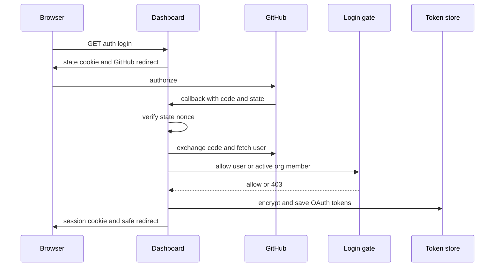
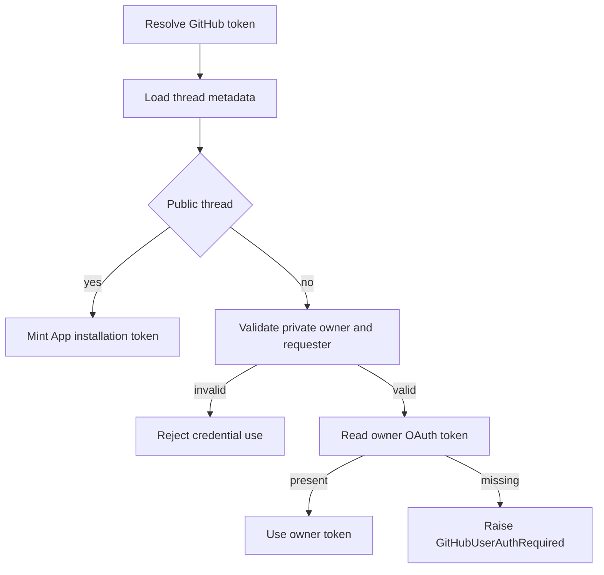

# Authentication, Credentials, and Security Boundaries

Open SWE separates browser identity, GitHub authority for an agent run, inbound-webhook authenticity, and sandbox network authority. The important boundary is that a successful dashboard login does not automatically make a personal credential available to every run: thread metadata and the current requester decide whether the agent may use it. Related material: [tools](./tools.md), [dashboard UI](../integrations/dashboard-ui.md), [sandbox providers](../integrations/sandbox-providers.md), and [configuration](../operations/configuration.md).

## Dashboard login and identity admission

The dashboard API is mounted below `/dashboard/api`. Browser login is GitHub App OAuth followed by an HS256 `osw_session` JWT signed by `DASHBOARD_JWT_SECRET`; its lifetime is seven days. `require_session` decodes that cookie, and `/me` returns its identity with an admin determination. A local `langgraph dev` fallback can use the `gh` CLI, but it is still subject to the same admission gate.

At startup, `validate_github_login_allowlist` requires at least one of `ALLOWED_GITHUB_USERS`, `ALLOWED_GITHUB_ORGS`, or the local-auth token. Login admission first constant-time matches a configured user login; otherwise it checks each allowed organization. Organization membership is queried with an App installation token restricted to `members: read`; unavailable tokens, API errors, malformed responses, non-active memberships, and non-members all deny access. This is deliberately fail-closed rather than the former empty-organization allow-open behavior.

The browser OAuth callback verifies the nonce HMAC in signed `state` against the raw nonce cookie with a constant-time comparison before exchanging the code. `sanitize_redirect_to` permits a relative non-`//` path or an absolute origin in `DASHBOARD_BASE_URL` plus `DASHBOARD_ALLOWED_ORIGINS`, and rejects authentication/API paths, preventing external and loop redirects.

Session cookies are `HttpOnly`. When the API is HTTPS and the dashboard is split-origin, they are `Secure; SameSite=None`; otherwise they use `SameSite=Lax` (and `Secure` only when applicable). The OAuth state cookie is `HttpOnly`, `SameSite=Lax`, restricted to `/dashboard/api/auth`, and expires with the 10-minute state TTL. Desktop login does not leave a session on its loopback callback: it passes a 120-second signed handoff code bound to the desktop PKCE S256 verifier, and only the verifier-holder can redeem it for a session. Cloud-terminal tickets are a separate 60-second JWT audience, bound to one `thread_id`.

### Cross-origin and identity-link protections

Every dashboard route has `require_same_origin_for_mutations`. Safe HTTP methods are exempt. With configured dashboard origins, unsafe cookie-authenticated requests need an allowed `Origin` or `Referer`; an explicit bearer GitHub token with no session cookie is exempt because it is not an ambient browser credential. With neither dashboard base nor allowed origins configured, this is intentionally a local-development fail-open. `create_app` installs credentialed CORS only for explicit `DASHBOARD_ALLOWED_ORIGINS` values and rejects `*`.

Slack linking uses Slack OpenID Connect claims (`openid email profile`) rather than a caller-supplied Slack identity. If `SLACK_TEAM_ID` is configured, `verify_team` rejects a different workspace, including a Slack Connect identity. Auth failure notices in shared Slack threads use only the token-free dashboard settings URL, never a per-user GitHub authorization URL.

## Credential scope and GitHub authority

`resolve_github_token` first loads authoritative thread metadata. Public threads always receive a GitHub App installation token. A private thread may resolve the dashboard OAuth token only when the current run's `github_login` matches the saved `owner_login`; a private thread with no owner, unknown visibility/owner type, a system-owned private thread, or another requester fails rather than borrowing a credential. If the permitted owner has no valid stored token, `GitHubUserAuthRequired` is raised; there is no silent bot fallback for that private request.

This diagram shows the scope gate that selects public App authority or private personal authority.

For pull-request authorship, a private thread remains pinned to its owner. In a shared user-owned thread, the authenticated requester may be used, or may nominate only a login that has participated in that thread; system threads use the App. Background completion cannot publish under saved user identity because it cannot identify the requester.

Resolved tokens are in-memory only, indexed by `(thread_id, principal)`, with case-folded `login:`/`email:` principals and a separate `bot` principal. The cache refuses an unbound personal token. Personal entries expire at their token expiry with a 60-second skew or at 24 hours; expired bot entries are retained only until the 24-hour cap so they can be reminted with their recorded repository scope. Resolving a token invalidates the thread cache first.

GitHub App installation tokens are cached in process by installation, repository IDs/names, and permissions. They are minted via the App authentication strategy and exchange endpoint and reused only until ten minutes before the reported expiry. If App configuration is missing, local development may use the `gh` CLI token; otherwise token acquisition returns no token.

### Sandbox secret boundary

LangSmith sandbox GitHub access is proxy-mediated. The real installation token is placed in opaque proxy `Authorization` headers—Bearer for `api.github.com` and Basic `x-access-token` for `github.com`—while the sandbox sees only the `GH_TOKEN=proxy-injected` placeholder required by `gh`. Proxy refresh records repository and permission scope, preserving or narrowing it on refresh rather than widening it. Before-model middleware refreshes a near-expiry token; refresh is relevant only to LangSmith sandboxes and failures are logged rather than crashing the model hook.

## Stored credentials and administration

Dashboard OAuth records encrypt GitHub access and refresh tokens before persistence. `TOKEN_ENCRYPTION_KEY` accepts a newest-first comma- or newline-separated key list; `MultiFernet` encrypts with the first and can decrypt with any listed key, enabling rotation. Invalid ciphertext or missing key yields an empty result. Near-expiry OAuth access tokens are refreshed under a per-login lock. GitHub `bad_refresh_token` or `unauthorized_client` errors remove the failed authorization—unless a concurrent OAuth callback replaced it—so the caller must reauthenticate rather than reuse a known-stale credential.

`CONFIGURED_ADMINS` is a case-insensitive comma-separated set of login/email identities. `require_admin` re-evaluates the current run actor (or an authorized scheduled run) at tool-call time instead of trusting an `admin_thread` marker alone. This keeps an admin-stamped thread from granting privileges to a non-admin requester.

## Inbound and untrusted content boundaries

Webhook routes validate raw request bytes before processing: GitHub checks `sha256=` HMAC-SHA256 in `X-Hub-Signature-256`; Slack checks `v0:timestamp:body` and rejects timestamps more than 300 seconds away; Linear compares raw-body HMAC-SHA256 with `Linear-Signature`. All fail closed when their shared secret is unavailable. The public `/webhooks/run-complete` route similarly compares its query token to `RUN_COMPLETE_WEBHOOK_SECRET` in constant time and rejects every call when unset.

GitHub comment text is treated as external input. Reserved `<dangerous-external-untrusted-users-comment>` delimiters are replaced in raw content before unregistered authors' comments are wrapped in those delimiters, so a commenter cannot forge the trust boundary in an agent prompt.

## Verification and operational checks

Focused tests cover redirect allowlisting, OAuth state binding, desktop PKCE exchange, and cookies in `tests/dashboard/test_dashboard_oauth_redirect.py`; private/public thread credential and PR-author scope in `tests/auth/test_thread_credential_scope.py`; proxy rule injection in `tests/sandbox/test_proxy_auth.py`; and proxy expiry/refresh middleware in `tests/github/test_github_proxy_refresh.py`. Before deployment, configure an admission allowlist and `DASHBOARD_JWT_SECRET`, configure `TOKEN_ENCRYPTION_KEY` before persisting OAuth credentials, grant the GitHub App organization members-read permission when using organization admission, and set every webhook secret needed by the enabled integration.
