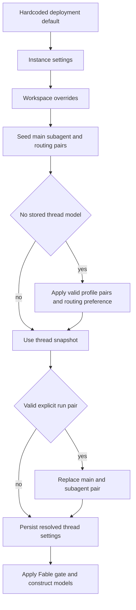

# Models, Profiles, and Instructions

A hosted run separates **thread-stable operating choices** from **person-specific context**. The factory snapshots model choices, routing choices, and repository custom instructions on the thread; it reloads the participants' identities, PR preferences, and standing instructions while preparing each run. This makes a long-lived, multi-party thread stable without treating one participant's preferences as another's. See [Agent graph](../architecture/agent-graph.md), [Authentication and security](auth-and-security.md), [Configuration](../operations/configuration.md), and [Context engineering](../workflows/context-engineering.md).

## Model registry, validity, and recovery

`SUPPORTED_MODELS` is the curated selectable registry. A `ModelOption` specifies a provider-prefixed id, label, allowed efforts, default effort, image support, and optional default eligibility. `SUPPORTED_MODEL_IDS` is the membership set used by resolution. Effort is deliberately model-specific: Kimi K3 accepts `low`, `high`, and `max`, while the Gemini option has `minimal` through `high`. Validate a selected pair with `model_supports_effort`, and validate image capability separately with `model_supports_images`.

`default_model_pair()` is the deployment terminal fallback. It reads `LLM_MODEL_ID` and `LLM_REASONING_EFFORT`, falls back to a credential-sensitive built-in default and a compatible effort, and rejects unsupported, non-default-eligible, or invalid-effort configuration with `ValueError`. In localhost development, `validate_local_dev_llm_config()` also checks that credentials exist for the configured default.

Persisted selections can outlive the registry. A non-deprecated unknown id recovers to the first supported model from its provider, preferring the same Claude family and preserving effort where possible; Gemini maps historical `none` to `minimal`. An explicitly deprecated id does **not** recover this way: `canonical_model_pair()` currently returns `None`, so it defers to a lower-priority default. Workspace default resolvers always try a valid pair, provider recovery, then the global default, preserving the invariant that a factory receives a constructible pair.

The `/options` endpoint is workspace-aware. It returns copies enriched with context-window metadata—explicit Codex overrides first, then LangChain model profiles, then fallback values—and removes Fable models when Fable is disabled. The endpoint also gates returned defaults so the picker cannot advertise a disabled Fable selection.

## Workspace, profile, and thread precedence

Settings have an instance-to-workspace inheritance layer. The legacy instance record remains `['team_settings']` / `"default"`; sparse per-workspace overrides live in `['workspace_settings']` under the workspace slug. Missing or `None` values inherit downward, and reads fail soft to hardcoded defaults if the store is unavailable. A workspace supplies agent, reviewer, review-chat, subagent, title, gateway, Fable, and adaptive-routing defaults. Review chat inherits the agent default when unset; title selection has a separate default and switches from OpenAI to Anthropic only when neither a usable gateway/OpenAI credential nor desktop OAuth is available.

Profiles in `['profiles']` hold a main pair, optional subagent pair, repository and branch preferences, PR preferences, and a tri-state adaptive-routing preference. OAuth tokens live separately in `['oauth_tokens']`, so profile writes cannot clobber a concurrent token refresh. Run-start profile lookup is intentionally fail-soft; dashboard profile reads are not. Profile pairs must be valid and default-eligible, but a stale non-deprecated provider selection can use provider recovery.

*Caption: workspace inheritance seeds a new thread; stored settings dominate later runs until a valid explicit override replaces the snapshot.*

For hosted runs, `build_agent` seeds main/subagent defaults and routing tiers from the resolved workspace. It loads the sender profile for model selection only when no thread model was stored; a valid profile main pair becomes the subagent pair unless a valid profile-specific subagent pair exists. A stored `agent_settings` model pair then wins. A valid `configurable.agent_model_id` plus `agent_effort` is the explicit mechanism that replaces main and subagent pairs, and the resolved values are persisted.

`agent_settings` is typed thread metadata cached for five minutes. It holds main/subagent pairs, the routing toggle and route pairs, and repository instructions; malformed metadata becomes an empty snapshot, while load and write failures are logged without aborting the run. Changing an admin workspace default therefore affects new threads, but not a thread with a stored snapshot. The Fable gate runs after resolution for main, subagent, and title models, so a disabled Fable model cannot be constructed from stale data.

Adaptive routing is also snapshotted. The workspace defines `fast`, `balanced`, and `performance` pairs; a profile's boolean preference overrides the workspace toggle, while `None` inherits it. Stored thread routing settings then take precedence. Dashboard `model_selection` can select `auto` or `explicit`; `/oswe` question runs disable adaptive routing. When enabled, `ModelSelectionMiddleware` selects among the constructed route models and records the attributed route/model for the run.

Dashboard creation resolves a complete pair in the order workspace default, valid profile override, valid request override. A deprecated request intentionally prevents profile/request selection and leaves the workspace pair in effect. Image-bearing dashboard requests substitute `default_vision_model_pair()` if this result is text-only; direct image construction rejects a missing or text-only model with HTTP 422.

## Provider construction, gateway, and fallback

`provider_model_kwargs` translates a resolved effort at the provider boundary: OpenAI gets `reasoning` (with `summary: "auto"` except at `none`), Anthropic gets adaptive summarized thinking and `effort`, Gemini 3 gets `thinking_level`, Fireworks gets `model_kwargs.reasoning_effort`, and Baseten accepts `reasoning_effort` for `low`, `high`, or `max`.

`make_model` calls `init_chat_model` with six retries and a 600-second request timeout for shipped provider prefixes. OpenAI defaults to Responses API settings (`store=False`, `output_version="responses/v1"`, and encrypted reasoning content); without gateway routing or `OPENAI_API_KEY`, desktop OAuth may provide the model. Baseten uses the OpenAI-compatible path and requires `BASETEN_API_KEY` plus its base URL when not gateway-routed. Codex context-window variants receive a profile override before construction.

Gateway configuration is tri-state: `True` or `False` in workspace settings is authoritative, while `None` inherits `LANGSMITH_GATEWAY_ENABLED`, or the presence of `LANGSMITH_GATEWAY_API_KEY` when the flag is unset. For routable providers with a LangSmith key, gateway overrides replace direct base URL and API key and choose OpenAI Responses versus Chat Completions. An unsupported provider or missing gateway key is logged and continues direct rather than failing the run.

Provider routing is distinct from runtime failure fallback. The factory installs `ModelFallbackMiddleware` with `LLM_FALLBACK_MODEL_ID` when set; otherwise Anthropic primaries fall back to OpenAI and OpenAI primaries to Anthropic. Google and other non-Anthropic/OpenAI providers have no automatic cross-provider fallback.

## Prompt-rendered instructions and authority

Repository custom instructions are records in `['agent_instructions']`, keyed by `owner/name`. The factory resolves the effective repository's instructions when a thread has no model snapshot, stores the text in `agent_settings`, and renders it into the shared system prompt as **Repository-specific Custom Instructions**. Lookup failure omits the section rather than stopping a run. Workspace instructions are separately rendered in the system prompt for the active workspace; they yield to repository instructions and `AGENTS.md`.

Personal instructions are separate `['user_instructions']` records keyed by GitHub login and capped at 20,000 characters. The Profile endpoint and `save_user_instructions` are independent writers, so this namespace avoids a profile-save race. During run preparation, each thread participant is resolved with their current instructions into a `person` dynamic-context block. The prompt identifies the sender through the message envelope and directs the agent to apply that person's standing instructions only when acting on that person's request; participant blocks are content-deduplicated and re-sent when their data changes.

Instruction authority is explicit:

1. `AGENTS.md` overrides prompt defaults and repository custom instructions.
2. Repository custom instructions are mandatory at system-prompt authority and override workspace instructions/default behavior.
3. Workspace instructions yield to repository instructions and `AGENTS.md`.
4. A person's standing instructions yield to repository instructions and `AGENTS.md`, and must never be carried from one participant to another.

## Focused change checks

When changing registry or stale-selection behavior, run `tests/models/test_model_fallback_resolution.py`. For workspace inheritance and routing defaults, use `tests/dashboard/test_workspace_settings_tiers.py` and `tests/dashboard/test_workspace_settings_routing.py`. `tests/agent/test_agent_assembly_context.py` exercises factory snapshot behavior and routing, while `tests/agent/test_thread_settings.py` covers strict snapshot normalization. Dashboard thread tests cover workspace selection, precedence, image fallback, and 422 validation.
