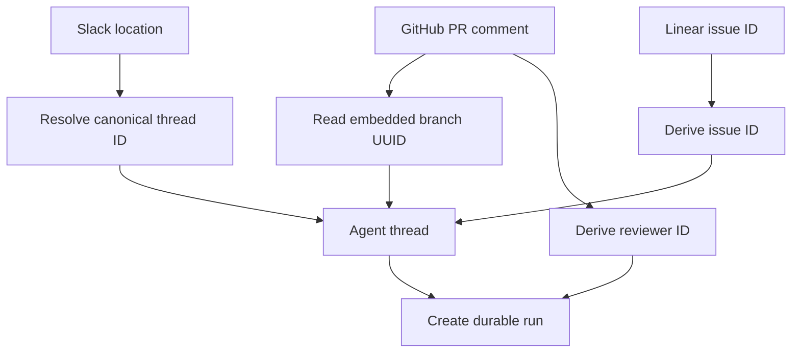
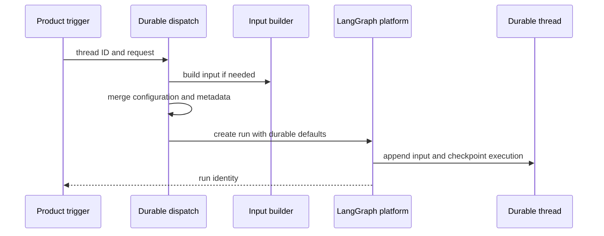

A LangGraph thread is the unit of conversational continuity. Its stable `thread_id` selects checkpointed graph state and history; a run appends normalized input to that thread rather than replacing it. Thread metadata is the small, durable cross-surface index for the conversation, while the LangGraph Store is a separately namespaced key/value facility.

The distinction is operationally important: an integration must route a follow-up to the established thread and provide a fresh input. It must not generate a new random ID, treat a Store failure as missing data, or repoint a conversation's opening source context.

## Canonical identities are persisted routing contracts

`agent/thread_ids.py` is the single home for deterministic IDs. Webhooks, dashboard features, and review workflows independently derive an ID from external identifiers to find the same thread. Therefore the exact namespace and key format are persisted data-model contracts: changing one makes existing work unreachable through its normal entrypoint.

| Purpose | Stable key and derivation |
| --- | --- |
| Slack location | UUIDv5 URL namespace of `slack:{channel}:{timestamp}:{nonce}` |
| PR comments | UUIDv5 URL namespace of `{owner}/{repo}/pr/{pr_number}` |
| PR reviewer | UUIDv5 URL namespace of `{owner}/{repo}/pr/{pr_number}/reviewer` |
| PR review scout | UUIDv5 URL namespace of `{owner}/{repo}/pr/{pr_number}/review-scout` |
| Per-user PR review chat | UUIDv5 URL namespace of `{owner}/{repo}/pr/{pr_number}/chat/{login.lower()}` |
| Review style | UUIDv5 URL namespace of `{owner}/{repo}/review-style` |
| Baby-sit lock | UUIDv5 URL namespace of `open-swe:baby-sit-lock:{key}` |
| Linear or GitHub issue | SHA-256-derived UUID of `linear-issue:{issue_id}` or `github-issue:{issue_id}` |

The reviewer key is deliberately distinct from the PR-comment key, preventing an autonomous reviewer from colliding with the agent conversation for the same PR. A GitHub PR-comment path can instead recover the UUID embedded in an Open SWE-created branch; it falls back to the PR key only when that branch contains no UUID. Linear redeliveries derive the same issue ID.

Thread identities let independently delivered work converge on the intended durable conversation.

### Slack mapping, detachment, and code channels

Slack additionally maintains an explicit Store mapping in the `slack_thread_map` namespace per channel, keyed by thread timestamp. Resolution first uses that mapping; otherwise it searches thread metadata for matching `source_context`, rejects more than one match, then binds either the matched ID or the deterministic Slack fallback. Binding validates the location, refuses to overwrite a different thread ID, and reads the mapping back after writing. A Slack location consequently cannot silently acquire two Open SWE threads.

Detaching a Slack association writes a fresh nonce rather than merely deleting the mapping. The next fallback derivation changes, so a reused location cannot collide with the retired thread. A code channel is one agent session for the entire channel, represented by `CODE_CHANNEL_SESSION_TS = "0"`. That sentinel selects `conversations.history` without a thread timestamp; ordinary conversations use `conversations.replies` for the timestamp. Its Slack session status (`processing`, `active`, `suspended`, or `closed`) is UI lifecycle state, not LangGraph thread status.

## State owners and consumers

Thread metadata holds durable, queryable facts about a conversation: for example, `source_context`, participant indexes, `agent_settings`, reviewer kind, and sandbox association. `SourceContext` preserves unknown supplied fields, excludes fields that were not supplied when dumping, and converts malformed historical metadata to an empty context rather than failing the run. This supports forward-compatible metadata while callers can retain the opening source context and title instead of repointing a conversation on later activity.

Participant logins and emails are key-per-person objects, not lists, so JSONB containment can find threads containing an individual participant. Reviewer threads use `kind = "reviewer"` as a metadata discriminator, enabling metadata searches and reviewer-specific completion behavior.

Thread settings are a separate `agent_settings` snapshot. Model and repository-level settings are resolved for the first run; sender identity, personal instructions, and PR preferences are per-message. A later profile edit does not alter the thread unless an explicit update writes the snapshot. Settings are strictly normalized, cached for five minutes, and read/write failures fail soft so this convenience metadata does not stop a run.

The Store is not thread metadata. `agent/store.py` is the sanctioned wrapper for namespaced records: a missing item is `None`, while every other failure raises. This keeps outage distinct from absence; a caller that can safely degrade must make that choice in its own `try`/`except`. `TypedStore` validates records on read: a requested unreadable record raises, while listings log and skip malformed records so one legacy record does not fail an entire listing.

## Normalized run input and `configurable`

Each run supplies only its new input; LangGraph provides prior thread state. `build_run_input` serializes authored content in an escaped `<input-message>` envelope with validated namespaced sender ID, surface, kind, optional channel, and optional structured data. A malformed entity ID or structured field name raises rather than producing ambiguous markup. When dispatch constructs an input itself, it derives canonical sender and channel identities from `RunConfig`; absent human identity becomes a system sender.

`build_input_messages` may prepend channel and system `<dynamic-context>` messages. Their canonical content hash avoids reinjecting context already recorded as injected. Summarization may hide earlier messages from the model while retaining them in state, so `visible_dynamic_context_hashes` excludes blocks before the summarization cutoff and permits necessary context to be reintroduced.

`configurable` is a per-run transport contract, not durable thread state. `RunConfig` accepts unknown keys, emits only supplied fields, and drops only invalid fields while parsing, preserving useful valid fields and forward-compatible extras across the many webhook, dashboard, and graph hops.

## Durable dispatch: interrupt versus enqueue

`dispatch_agent_run` is the common entrypoint for agent and reviewer runs. It rejects a prebuilt input combined with raw content or identity arguments, constructs input when needed, records feedback activity for interactive agent surfaces, and delegates to `create_durable_run`. The latter optionally ensures a titled thread exists, merges caller metadata, assigns/propagates an invocation ID and start time in both `configurable` and metadata, and marks the run for the v3 event-stream path.

Dispatch creates a configured execution on an existing durable thread rather than replacing its state.

The defaults are `multitask_strategy="interrupt"`, `durability="sync"`, `if_not_exists="create"`, resumable streaming, all v3 stream modes, and subgraph streaming. Interrupt halts an active run with the sync checkpoint retained and executes the new input with thread history; an idle thread simply starts. Background callers may opt into `enqueue` instead. Webhook triggers therefore do not need an in-process busy lock.

A distinct Store FIFO remains for deliberate dashboard follow-up injection and Slack message edits. It de-duplicates queue payloads carrying the same `queue_id`, caps `pending_messages` at `MAX_QUEUED_MESSAGES` (100), and drops oldest records beyond that cap. It is not the normal webhook concurrency mechanism.

The completion webhook is attached only when `RUN_COMPLETE_WEBHOOK_SECRET` is set and `COMPLETION_WEBHOOK_URL` is an absolute non-loopback HTTP(S) URL. Invalid deployment configuration logs a warning and disables the webhook rather than making every `runs.create` fail. `stream_resumable=True` retains event streams for clients that attach later, including the dashboard. Deployment checkpointer TTL uses delete strategy, a 43,200-minute default, and a 60-minute sweep interval, so dormant checkpoint state eventually expires.

### Local desktop durability

The desktop `langgraph dev` server uses `agent/local_checkpointer.py` to commit checkpoints to SQLite on each write instead of relying on the dev server's delayed in-memory pickle persistence. `create_checkpointer` uses `OPEN_SWE_LOCAL_CHECKPOINT_DB` or `.langgraph_api/checkpoints.sqlite`, initializes the saver, and imports legacy pickle checkpoints once per database. The completion marker is written only after a successful import; an interrupted import is retried and is safe because the SQLite saver upserts.

## Sandbox association boundary

A thread's `sandbox_id` metadata connects graph continuity to a working tree. `ensure_sandbox_for_thread` first reuses a cached backend or reconnects to the bound ID; it creates a sandbox only if none is bound. An unreachable existing agent sandbox raises rather than being silently replaced, avoiding loss of uncommitted work. A deleted sandbox is replaced; `allow_replacement` also permits replacing an unreachable re-derivable reviewer sandbox.

For a newly created or replacement sandbox, the ID is persisted only after creation and initialization; the backend is published to the thread-keyed proxy cache last. A failure before either boundary therefore leaves no half-built ID or prematurely usable backend for a subsequent run to adopt. See [Sandbox Lifecycle](../architecture/sandbox-lifecycle.md).

## Safe change and test focus

- Treat ID formulas, key strings, and mapping namespaces as migrations, not refactors; test redelivery and the Open SWE branch-ID recovery path.
- Exercise Slack mapping conflict, metadata fallback, duplicate-match failure, nonce detachment, and the code-channel sentinel.
- Test dispatch defaults, invalid completion-webhook degradation, interrupt versus enqueue, and resumable v3 event configuration.
- Test envelope escaping and validation plus dynamic-context de-duplication and post-summarization reintroduction.
- Test Store absence versus transport failure, and the sandbox distinction between unreachable and gone.

For adjacent flows, see [Invocation](../workflows/invocation.md), [Follow-up Messages](../workflows/follow-up-messages.md), and [Models, Profiles, and Instructions](./models-profiles-instructions.md).
