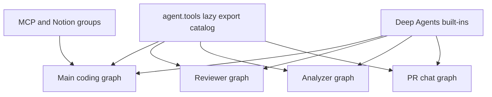
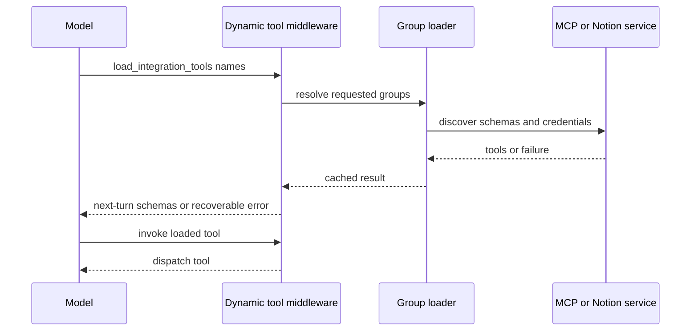

# Tool Surfaces and Authorization

A tool is not a universal capability grant. `agent.tools` is an import catalog; each agent factory deliberately selects an executable surface, and sensitive tools must validate trusted runtime context again at invocation. This separation limits which graph can invoke a tool, which integrations are exposed, and whose credentials can be used.

## Catalogs, graphs, and built-ins

`agent.tools` is a lazy facade over the curated tool modules. `_TOOL_MODULES` maps public names to implementation modules, and `_LazyToolsModule` caches the resolved export while ensuring an imported submodule cannot shadow an export with the same name. Exporting a name does **not** add it to an agent: graph factories pass their own `tools` lists to `create_deep_agent`.

Deep Agents contributes the filesystem and delegation names `read_file`, `write_file`, `edit_file`, `delete`, `ls`, `glob`, `grep`, `execute`, and `task`. The main factory reserves these names when constructing dynamic integrations, preventing collision. It normally removes `grep`; stop-summary runs also remove `delete`, `edit_file`, `execute`, `task`, and `write_file`.

This diagram distinguishes importable curated tools from each graph's executable surface; integrations are a main-agent capability.

## Main-agent surface and contextual exclusion

`get_agent` builds a broad static surface: web access, background execution, plans and personal settings/skills, thread and baby-sit controls, PR operations, sandbox helpers when enabled, scheduling, platform reporting, Slack actions, feedback, and selected admin tools. The initial list is narrowed by trusted run context:

- Admin-thread tools—automation, workspace, and organization-skill management—are included only when `actor_has_admin_context` confirms both the admin-thread stamp and the current actor. A private admin surface additionally unlocks SQL and feature/review-approval management.
- When personal credential scope is unknown, personal settings and skill tools are removed. Channel-history reading is only offered on private threads; Slack tools are removed when Slack is disabled, and concierge DMs lose reactions.
- Desktop local runs are reduced to `http_request`, `fetch_url`, and `web_search`. Stop-summary runs are reduced to Slack thread reading and reply. Neither mode loads integration tools.
- An automatic incident session adds incident tools but strips a defined set of potentially disruptive tools, including delegation, HTTP mutation, PR, sandbox, Slack, workspace, and automation operations. A Slack `/oswe` ask only excludes tools that require a Slack thread.

`ExcludeToolsMiddleware` is installed with the resulting exclusion set. This is surface selection rather than a replacement for an individual mutating tool's authorization checks. The general-purpose subagent receives static tools but has its own middleware because compiled subagent graphs do not inherit the parent stack; `_SubagentToolGuard` rejects thread-, feedback-, settings-, incident-, and most Slack-bound operations there.

## Deferred integrations and sandbox invocation

For eligible non-local, non-summary runs with known credential scope, the factory discovers configured MCP tools and private Notion tools, then supplies them as `MCPs` and `Notion` groups to `DynamicToolMiddleware`. The model initially sees only `load_integration_tools` and its named catalog. It must load names before calling them; successful loading records `loaded_integration_tools`, making schemas available on the following model turn. Unknown, unloaded, unavailable, or failed groups produce recoverable tool errors rather than aborting the run.

This sequence shows the explicit-load gate and the non-fatal failure path for integration tools.

The middleware rejects duplicate or reserved names, resets loaded names at the start of a run, serializes resolution per group, and caches both successes and failures for its instance. Provider-specific support can insert newly loaded schemas into the conversation at the load-result anchor; unsupported models receive them through the normal tool list.

Configured MCP connections are loaded in instance, workspace, then user precedence; a later connection with the same name replaces an earlier one. Only enabled connections with an allowlist contribute tools, and discovery failure yields no tools. Workspace connection settings constrain URLs to HTTPS and validate/redact configuration errors.

The sandbox tool API is a separate execution surface. `ToolSurface.prepare` takes the graph's tool node, resolves integration schemas for authenticated discovery, then removes the configured exclusions and `load_integration_tools` itself. It validates requested argument names and invokes a one-node tool graph. For a discovered integration it marks that name loaded in state before execution, while returning only a tool result status and JSON-safe content.

## Credential-scoped access

Personal credentials are scoped from saved thread metadata, not model-supplied identity. Private threads require the recorded owner to start the run; system threads cannot use private credentials. PR authorship permits a named author only when that login is a thread participant on an eligible shared user-owned thread; private threads remain pinned to the owner, system threads use the App, and background completion cannot publish as an unidentified user.

Notion is available only to the private credential owner. Its wrappers add required `on_behalf_of`, resolve it as a verified thread participant, then fetch a fresh owner token and rebuild the requested MCP tool at call time. This prevents a token captured during schema discovery from becoming an invocation credential.

`read_user_settings` likewise uses verified scope: in a private run it returns the owner's settings and preferences; otherwise it resolves verified participants. Its response contains selected profile settings, instructions, connection status, and an unresolved-participant count—not connection tokens.

## Specialist surfaces

| Graph | Purpose-built tool surface |
| --- | --- |
| Reviewer | `fetch_review_diff`, finding create/update/list/publish/resolve/reply tools, plus `web_search`, `fetch_url`, and `http_request`; it does not wire `open_pull_request`. |
| Analyzer | Only `save_review_style_prompt` and `read_finding_outcomes` for review-style guidance. |
| PR chat | Repository reads, review findings, web tools, and proposal tools `propose_review_comment` and `propose_pr_review`. It has no sandbox. |

PR chat excludes write, delete, and shell built-ins; its delegated subagent allows only `read_file`, `ls`, `glob`, and `grep`. The review API seeds overview, diff, and findings as virtual `/pr/` files, while the preparation middleware obtains a repository-scoped GitHub App token for GitHub-backed reads rather than passing a user credential.

## Mutations: defense at the tool boundary

Wiring is least privilege, not authorization. Automation functions first call `require_admin`, which rechecks either the current configured admin or the saved authorization of a scheduled run. They return structured errors for failed authorization and schedule-service exceptions. Creation records the verified actor identity; updates reject contradictory clear/set pairs for the repository and Slack destination; deletion and triggering use the same gate.

Network-capable tools also enforce a runtime guardrail: `http_request` and `fetch_url` use the shared safe-redirect path, which blocks unsafe destinations before the request. `http_request` returns structured timeout and HTTP errors and offloads oversized response data to sandbox output rather than placing it inline.

When adding a mutation, wire it only where needed, account for local/summary/Slack/incident/subagent filters, reserve its name against built-ins and integrations, and enforce identity and resource scope inside the tool. Add focused tests for the authorization denial, contextual surface, success/failure response, and any credential or network boundary.

## Related pages

- [Agent graph](../architecture/agent-graph.md) — graph factories and runtime assembly.
- [Middleware stack](../architecture/middleware-stack.md) — ordering and behavior of graph middleware.
- [Observability and MCP](../integrations/observability-and-mcp.md) — MCP configuration and operations.
- [PR creation](../workflows/pr-creation.md) — publishing behavior and authorship.
