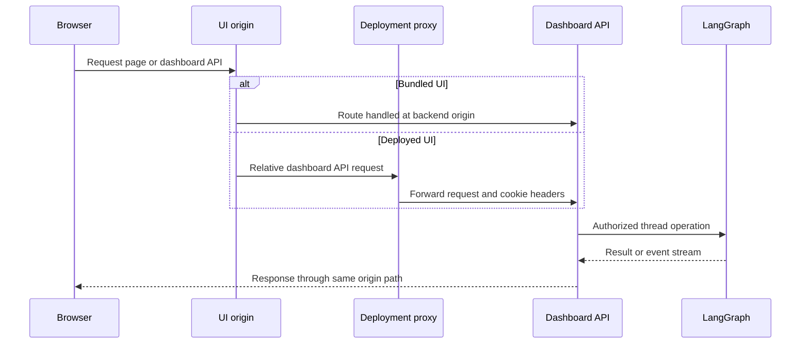
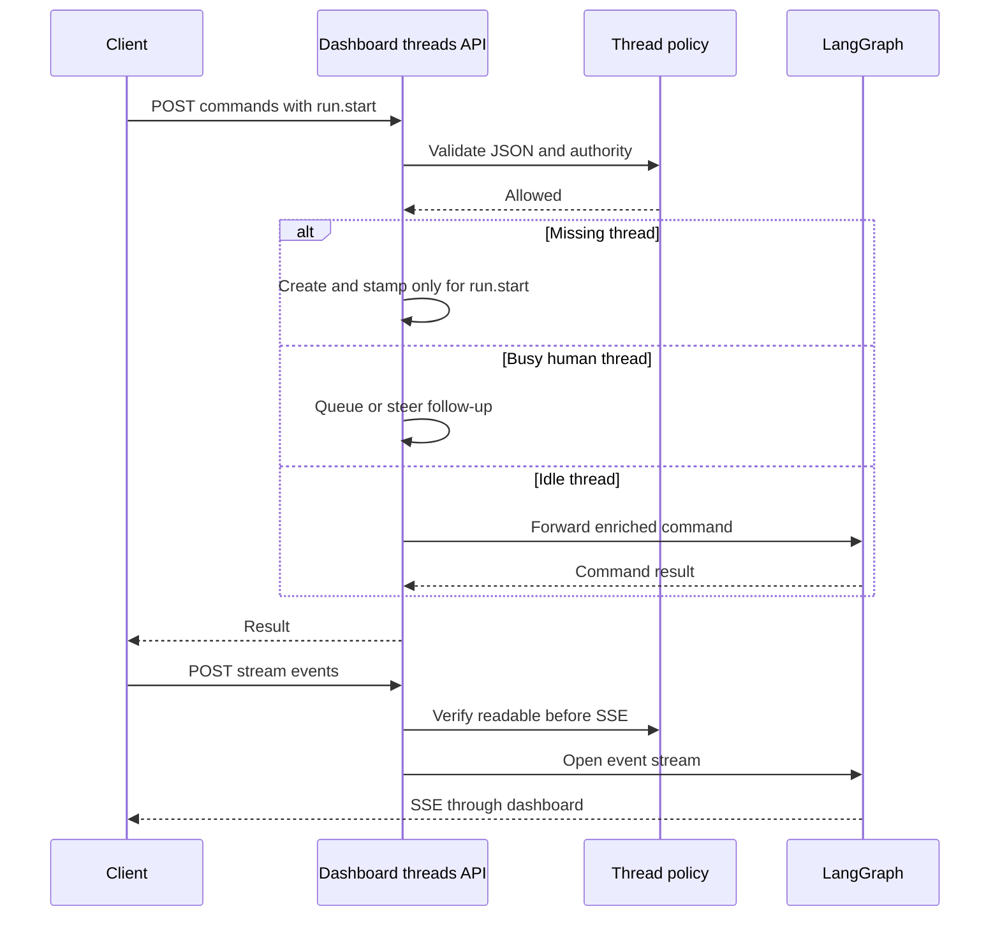
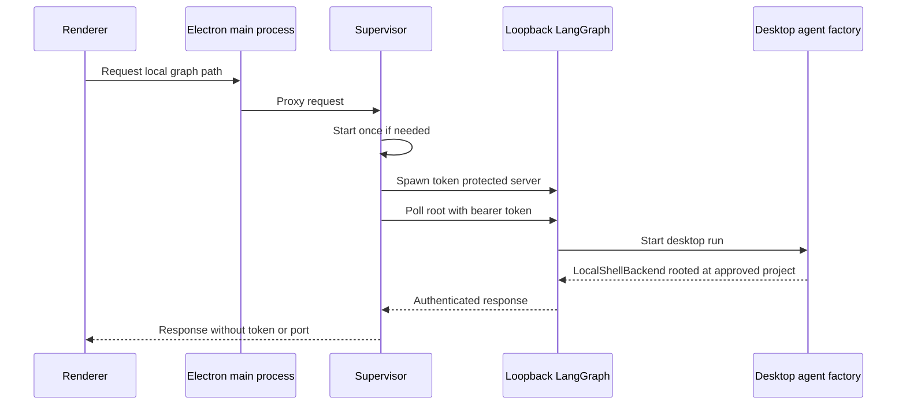

# Dashboard and Desktop Clients

The dashboard is the human-facing boundary around the agent. Its FastAPI router owns dashboard sessions, authorization checks, and curated access to thread and LangGraph operations. The TanStack Start UI and the experimental Electron app use that boundary or a private local equivalent rather than giving a renderer direct deployment credentials.

## API composition and same-origin serving

`create_app()` includes the lazily imported dashboard router under `/dashboard/api`, includes the other backend routers, then calls `mount_dashboard_ui(app)`. The dashboard router is an aggregator for auth, threads, review, schedules, skills, repositories, workspaces, and other product routers, and applies the mutation-origin dependency to all of them. The lazy `agent.dashboard.router` export matters: ordinary dashboard-submodule imports do not load FastAPI and every route/job module.

At construction, `DASHBOARD_ALLOWED_ORIGINS` enables credentialed CORS. A wildcard is rejected because it cannot safely be combined with credentials. This setting is for a deliberately split UI/API deployment; the normal bundled and backend-fronted development arrangements keep the browser on the backend origin.

`mount_dashboard_ui()` serves either a configured `DASHBOARD_STATIC_DIR` build or `ui/.output/public`. It serves immutable cached hashed assets and a no-cache `_shell.html` for HTML navigations. The catch-all declines API, webhook, health, LangGraph, docs, metrics, and asset prefixes, and also declines unknown non-HTML paths so they remain real server 404s. `DASHBOARD_DEV_SERVER_URL` replaces the static build with a reverse proxy to Vite while retaining the backend origin. Register this catch-all last; call `keep_dashboard_ui_last()` after adding routes later. A build deployed beneath a LangGraph mount prefix needs the corresponding `DASHBOARD_BASE_PATH`; the TanStack router uses Vite's `BASE_URL` as its base path.

Diagram: the browser uses relative dashboard paths; deployed builds proxy them while bundled builds share the backend origin.

## Login, sessions, and mutation protection

GitHub login signs state containing a hash of a nonce held in a short-lived state cookie, then redirects to GitHub. The normal callback verifies that cookie, exchanges the code, enforces the GitHub login gate, persists the access-token response, signs in the user, and issues the browser session cookie. Desktop login carries a PKCE challenge and loopback port in state instead: after the same identity checks, the callback redirects a short-lived handoff code to the fixed `127.0.0.1` loopback callback without setting a browser session. The desktop app exchanges that code at `POST /auth/desktop/exchange` using the PKCE verifier.

Cookie flags follow API/UI topology: HTTP uses non-secure `SameSite=Lax`; same-origin HTTPS uses `Secure; SameSite=Lax`; split-origin HTTPS uses `Secure; SameSite=None`. `require_session` returns `401` for a missing session, and routes opt into `ADMIN_DEP` where administration is required.

The router-level CSRF control admits safe HTTP methods and a bearer-token-only mutation, but requires an allowed `Origin` or `Referer` for cookie-authenticated mutations. It always applies the origin check to WebSockets. This is only the ambient-cookie defense: thread and feature handlers must independently enforce repository, administrator, or thread authority.

## Threads: controlled reads, commands, and streaming

The thread API exposes discovery, summaries, pins, diffs/files, lifecycle changes, messages, and LangGraph-compatible read/stream endpoints beneath `/dashboard/api/threads`. Listing is participant scoped unless an administrator requests `all`; page requests validate repository filtering before reaching the listing service. The listing service filters metadata before summary generation and limits concurrent refreshes of possibly active latest runs to eight. A thread detail is a metadata-derived summary, not a converted transcript: the client SDK hydrates the messages through `GET /threads/{id}/state`.

A readable thread must have a surfaced source. Posting is stricter: `run.start`, input commands, and messages are checked against the thread policy, including admin-only threads. The commands proxy is the primary mutation protocol. It accepts JSON only, lazily creates and stamps a missing thread **only** for `run.start`, enriches commands with trusted identity/configuration, and forwards them to LangGraph using the server-side API key. On a busy human thread it either queues a follow-up when the requested multitask strategy is `enqueue` or steers the running thread; machines receive a conflict instead. Successful starts stamp latest-run metadata and start a best-effort time-to-first-text observer.

`POST /threads/{id}/stream/events` preflights JSON content and readability before returning SSE, then proxies the LangGraph event stream. The run list, enqueue, cancel, and history routes likewise provide controlled compatible access instead of exposing the raw backend. The enqueue route tolerates the brief race while a just-started thread is being created, but cannot become a shortcut around command authorization; cancellation restricts a queued follow-up to its sender or owner. Detail reads refresh status, do not mark a running thread viewed, and treat a failed viewed-metadata write as non-fatal.

Diagram: the dashboard performs authorization and command enrichment before it proxies a thread action or stream.

Cloud terminal access is also split into a ticket issue and WebSocket connection. `POST /threads/{id}/terminal/connect` checks that the caller may prompt the thread and that its sandbox is ready, then returns a no-store URL, `open-swe-terminal` subprotocol, and a thread-bound ticket. The WebSocket validates the ticket before accepting, requires a LangSmith sandbox, rechecks promptability, limits sessions with a semaphore of 20, and bridges bounded input/resize messages to a PTY. Capacity exhaustion closes with `1013`; the shell handle is killed on cleanup.

## TanStack UI and deployment proxy

The `ui/` application uses TanStack Router, React Query, and TanStack Start/Nitro. Its browser fetch layer constructs relative `/dashboard/api` URLs, so browser credentials remain same-origin. For server rendering, it targets `DASHBOARD_API_URL` directly and explicitly copies the incoming `cookie` header because server-side `credentials: "include"` does not forward it.

In development, Vite proxies configured backend prefixes to `DASHBOARD_API_URL` or `http://localhost:2024`; its production Nitro configuration instead registers `ui/server/backend-proxy.ts` for `/dashboard/api/**` and `/webhooks/**`. The runtime proxy requires `DASHBOARD_API_URL`, preserves OAuth 3xx responses with `redirect: "manual"`, streams method/body/headers, removes hop-by-hop and reframed response headers, and emits every upstream `Set-Cookie` as a separate header. Do not add a production fallback backend or follow OAuth redirects in this layer.

The Agents layout normally requires a session. An unauthenticated desktop-local-only session is permitted only on `/agents` and `/agents/local/...` when local mode is enabled. The root route resolves the session during server-side route loading and supplies the shared React Query client; the router is configured with Vite's base path, scroll restoration, intent preload, and SSR query integration.

## Electron and supervised local execution

The experimental Electron package packages the compiled UI and a local backend runtime. Electron registers the secure `open-swe` scheme; its privileged main process—not the renderer—owns filesystem, IPC, desktop session, and backend concerns. The preload exposes a deliberately selected `window.openSweDesktop` API for project, local-thread, local-file, terminal, update, and login actions rather than exposing Node APIs directly.

`BackendSupervisor` starts the local graph lazily and coalesces concurrent callers onto one readiness promise. It reserves a loopback `127.0.0.1` port, creates a random bearer token, requires a projects allowlist and worktree directory, and launches either `uv run langgraph dev` using `langgraph.desktop.json` in development or the packaged Python/LangGraph runtime in a distribution. It passes the bearer token, project/worktree paths, and state-backed artifact/checkpoint locations through environment variables. It polls the authenticated loopback root for up to 60 seconds; an early exit or timeout closes the child and includes retained logs in the error.

The renderer sees only `{ apiUrl: "/local-graph", graphId: "agent" }`. Requests through that prefix start the supervisor as necessary, strip renderer `cookie` and `host` headers, inject the bearer token, and keep redirects manual, so the actual port and token never enter renderer JavaScript. Shutdown clears the supervisor state, sends `SIGTERM`, and escalates to `SIGKILL` after five seconds.

Diagram: Electron main process mediates all local-graph traffic and keeps the loopback credential outside the renderer.

A run with `source == "desktop"` uses `LocalShellBackend`, not a cloud sandbox. Its `local_project_path` must resolve to an existing allowlisted project or a desktop-managed worktree. Scratch `large_tool_results` and conversation history use sanitized per-thread filesystem routes outside the project, preventing agent artifacts from becoming unintentional working-tree changes.

## Change and test guidance

Keep the security boundary intact when modifying clients: frontend code may call the dashboard-relative API but must not obtain the LangGraph or loopback bearer credentials. New dashboard mutations inherit the origin dependency but still need feature-specific authorization. Preserve the static catch-all ordering and distinguish browser same-origin fetches from SSR forwarding.

Focused Python thread tests cover workspace/model resolution, client-configurable sanitization, surfaced-source privacy, admin posting, recovery-patch size limits, command creation rules, pagination, and activity/viewed behavior. `desktop/test/backend-supervisor.test.cjs` covers development and packaged launch targets, credential detection, coalesced starts, local-thread creation, and activity mapping. Run the relevant targeted tests after changing thread policy, proxy framing, or local supervisor lifecycle.

## Related

- [Auth and security](../concepts/auth-and-security.md)
- [Models, profiles, and instructions](../concepts/models-profiles-instructions.md)
- [Deployment](../operations/deployment.md)
- [Invocation](../workflows/invocation.md)
