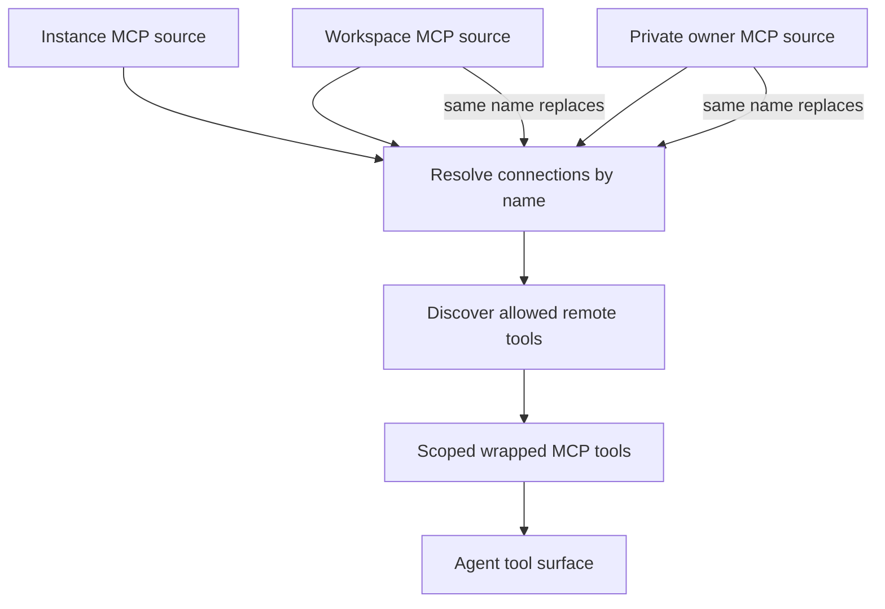
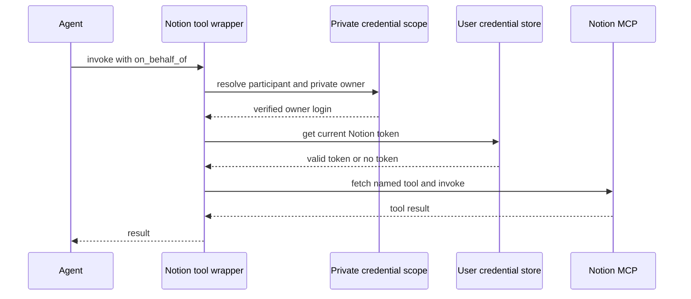

# MCP, Observability, and External Tool Integrations

External integrations are optional server-side tool surfaces. The current runtime provides administrator-managed MCP connections at instance and workspace scope, personal MCP connections, and a private-thread Notion MCP integration. It also supports the LangSmith LLM Gateway as a model-routing and observability layer; the gateway is distinct from agent tools. A failure to load an optional MCP catalog produces no tools for that connection rather than failing the agent run.

This page focuses on integration boundaries. See [Authentication and security](../concepts/auth-and-security.md) for the broader access model, [Tools](../concepts/tools.md) for dynamic tool availability, [Agent graph](../architecture/agent-graph.md) for agent construction, and [Configuration](../operations/configuration.md) for deployment settings.

## Connection scopes and precedence

An MCP connection has a lowercase name, HTTPS URL, `streamable_http` or `sse` transport, enabled flag, an explicit `allowed_tools` allowlist, optional headers, and optional OAuth client-credentials settings. Connections are persisted independently by scope:

- **Instance** connections are stored under `instance_mcps` and are inherited by every workspace and user. Flat legacy records formerly held in `workspace_mcps` are adopted into this tier once, then removed from the old namespace.
- **Workspace** connections are stored under `workspace_mcps/<workspace-slug>` and are managed by administrators.
- **Personal** connections are stored under `user_mcps/<login>` and are managed through the signed-in user's `/my-mcps` API.

At run construction, the server loads these sources in that order: instance, selected workspace, then the private credential owner's personal scope when one is available. A later scope completely replaces an earlier connection with the same name—including when the later connection is disabled or has an empty allowlist—so a personal override can deliberately revoke a shared connection. Connection catalog cache keys include the source namespace, connection name, and revision; catalogs therefore cannot cross users or workspaces.

The source order is instance, workspace, then private owner; each later same-named record wins.

The graph factory attempts this loading only for executable, non-desktop, non-summary runs after it has resolved the thread's credential scope. If that scope cannot be determined, it omits MCP tools rather than guessing which user's connections to expose. Personal credentials require a private thread whose saved owner matches the GitHub login starting the run; public and system threads receive no personal MCP or Notion credentials.

## Credential storage and dashboard administration

`MCPConnectionPublic` deliberately excludes encrypted header values and OAuth client secrets. Header values are JSON-encrypted at rest; OAuth client secrets are encrypted separately. The public connection record exposes only header names, OAuth settings without the secret, a revision, and update timestamp. Updating a connection may retain credentials only from the existing record in the *same scope*. Changing a server URL requires headers to be replaced or cleared, and changing the MCP URL, OAuth token URL, or client ID requires a new OAuth secret.

The dashboard exposes list, save, delete, header-reveal, and discovery endpoints for instance, workspace, and personal scopes. Instance and workspace operations require an administrator; personal operations derive their scope from the signed-in session. Header reveal is scoped the same way and returns `Cache-Control: no-store`. Validation routes redact submitted input so an invalid header or secret is not reflected in an error response.

Connection input is intentionally restrictive:

- URLs and OAuth token URLs must be HTTPS, have no embedded credentials or fragment, and cannot include query parameters whose names look like secrets.
- Connection names, header count and names, header contents, and tool names are bounded and validated. Hop-by-hop, `Host`, and proxy-authorization headers are blocked.
- OAuth uses only the `client_credentials` grant with either `client_secret_post` or `client_secret_basic`; it cannot be combined with an `Authorization` header.
- A newly saved connection exposes nothing until an administrator has discovered the server catalog and added selected names to `allowed_tools`.

## MCP discovery, execution, and revocation

Discovery initializes an MCP session and walks all `tools/list` pages. Repeated cursors and duplicate remote tool names reject that catalog. Discovery is limited to 30 seconds, and its user-facing errors reduce provider status failures to actionable, non-secret hints. The runtime caches catalog definitions with stale-while-revalidate behavior: they are fresh for 10 minutes and may be served while refresh happens for up to 24 hours. A connection revision changes on save, giving altered records a new cache key.

Only definitions present in `allowed_tools` become LangChain tools. Their generated names include the connection name, sanitized remote name, and a hash, avoiding collisions between providers and unusual remote names. Each wrapper re-resolves the named connection at invocation time and refuses execution if it was removed, disabled, moved to a different winning scope, pointed at a different URL or transport, or no longer allows that tool. It then constructs a fresh MCP tool with current headers and executes it with a 30-second deadline. Unexpected provider errors are logged without provider details and return a generic tool error.

This revalidation is an important lifecycle invariant: a tool already placed in an agent's tool surface cannot continue to use a connection after an administrator changes or revokes its authorization.

## Network and OAuth containment

MCP requests use a dedicated HTTP transport rather than ambient proxy settings. It accepts requests only to the configured HTTPS origin, disables redirects, resolves the host to public addresses, and pins the checked address while retaining the original host and SNI. This prevents an MCP server or DNS rebinding from redirecting credentials to a private address or another origin.

For an OAuth-enabled connection, the runtime decrypts the client secret only while acquiring a bearer token from the configured token endpoint through the same safe transport. Tokens are cached per scope, connection name, settings, and encrypted secret; the cache refreshes before expiry and is protected by a lock. A 401 causes one token refresh and one retry. Token endpoints and MCP requests therefore remain subject to the same public-address, origin-pinning, and no-redirect rules. OAuth failures are converted to safe errors and do not include response bodies, access tokens, or client secrets.

## Notion OAuth and private MCP tools

Notion is a separately managed personal integration at `https://mcp.notion.com/mcp`. Its OAuth helpers discover protected-resource and authorization-server metadata, dynamically register the deployment as a client, and use PKCE with `S256`. Every Notion OAuth endpoint accepted by this flow is pinned to HTTPS `mcp.notion.com`; the temporary authorization flow stores the code verifier and any dynamic client secret encrypted under `notion_oauth_flows/<login>`, and `pop_notion_oauth_flow` consumes it.

A completed authorization is stored under `user_credentials/<login>/notion`. Access tokens, refresh tokens, and client secrets are encrypted; status reveals only connection state, expiry, and update time. Credential lookup is intentionally fail-soft because it gates an optional tool group. Expiring credentials are refreshed under a per-login lock. If a refresh response requires reauthorization, the stored connection is dropped so future calls require a new connection rather than retaining a known-dead grant.

The loader reads the Notion catalog with the private thread owner's current access token and wraps every returned definition. The public wrapper schema adds required `on_behalf_of`; at call time it resolves the participant, verifies again that the current private owner matches that login, fetches a current access token, rebuilds the named MCP tool, and invokes it. Consequently, catalog discovery does not create a durable bearer capability: missing or revoked credentials fail the particular call with a reconnect instruction.

Each Notion call rechecks private ownership and obtains a current token before contacting the hosted MCP server.

## LangSmith Gateway observability

The LangSmith LLM Gateway is not an MCP tool provider. `make_model` centrally applies it while constructing supported chat models. When enabled, the client authenticates to the gateway with a LangSmith key, while the gateway resolves actual provider secrets from workspace Provider Secrets and can apply spend, PII, and secret policies and trace each call.

A workspace's `gateway_enabled` setting is authoritative when boolean; otherwise `LANGSMITH_GATEWAY_ENABLED` determines the deployment default. In the absence of that explicit environment setting, configuring `LANGSMITH_GATEWAY_API_KEY` enables gateway routing by default. `LANGSMITH_GATEWAY_API_KEY` takes precedence over `LANGSMITH_API_KEY`, and `LANGSMITH_GATEWAY_BASE_URL` overrides the default `https://gateway.smith.langchain.com`.

Routing is implemented only for `openai`, `anthropic`, `baseten`, `fireworks`, and `google_genai` model prefixes. It chooses the provider-specific gateway path and, for OpenAI, retains the Responses API unless `LANGSMITH_GATEWAY_OPENAI_USE_RESPONSES=false`. If the provider is unsupported or no usable LangSmith key exists, the code logs a warning and constructs a direct provider client instead of failing the run.

## Focused verification

The MCP test suite verifies scope isolation and replacement, loaded-tool revocation, catalog caching and refresh, pagination and duplicate-catalog failure isolation, argument forwarding, and safe behavior when a source becomes unavailable. Transport tests exercise public-IP pinning, TLS hostname preservation, cross-origin rejection, no redirects, and private-address blocking. OAuth tests cover both client-secret authentication methods, token caching and rotation, one 401 retry, owner isolation, and secret redaction. Dashboard tests cover encrypted persistence, same-scope credential reuse, administration and session access boundaries, and redacted validation. Notion tests cover OAuth PKCE and host pinning plus loader behavior that refreshes the token at call time.
