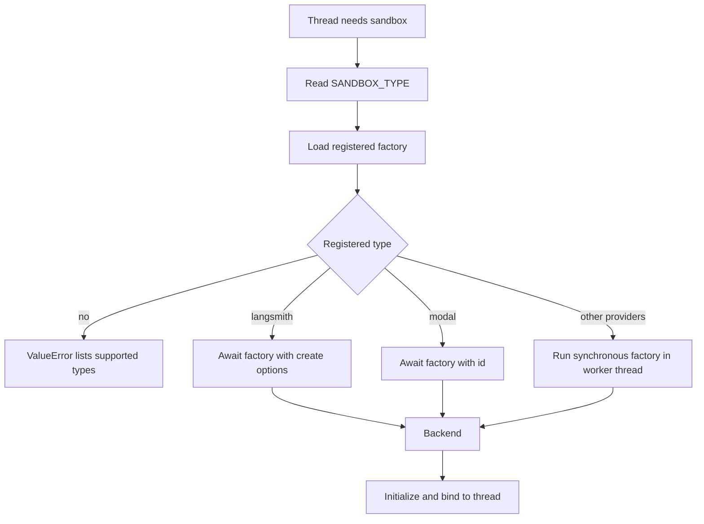
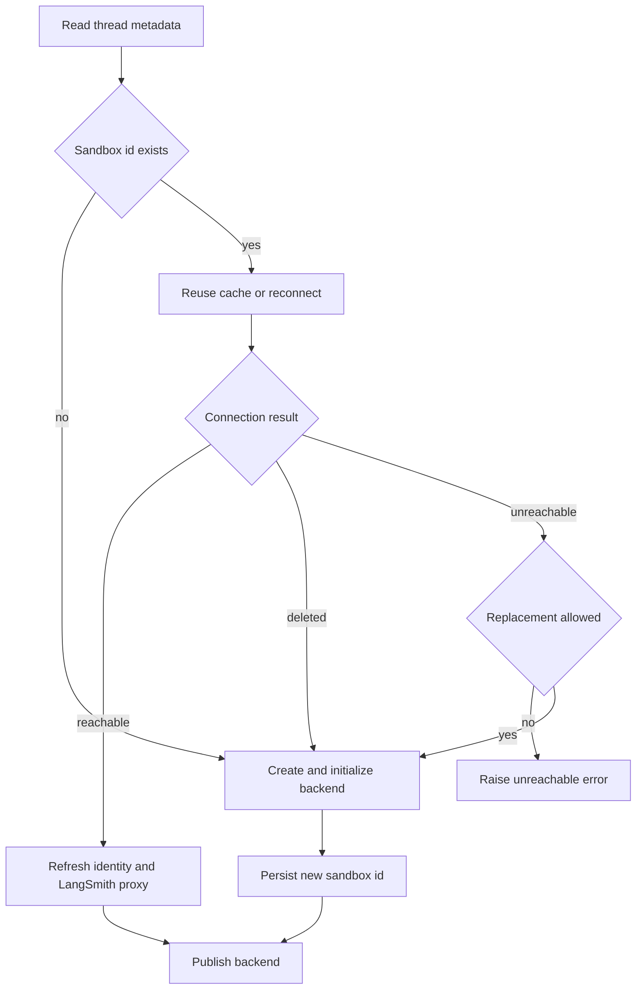

# Sandbox Provider Integrations

Open SWE obtains a `SandboxBackendProtocol` through a provider registry; the sandbox lifecycle, rather than a provider, owns binding that backend to a thread. This separation lets operators change `SANDBOX_TYPE` without changing the agent graph, while keeping reconnection and working-tree safety rules consistent. See [sandbox lifecycle](../architecture/sandbox-lifecycle.md) for the wider thread lifecycle, [configuration](../operations/configuration.md) for environment management, and [auth and security](../concepts/auth-and-security.md) for credential policy.

## Selection, dependencies, and boot validation

`SANDBOX_TYPE` defaults to `langsmith`. The registry lazily resolves one of `langsmith`, `daytona`, `modal`, `runloop`, `e2b`, or `local`; an unknown value fails with `ValueError` and the supported names. All factories accept an optional `sandbox_id`: it means reconnect when supplied and create when absent.

Provider resolution and dispatch before lifecycle binding.

Only LangSmith receives `snapshot_id`, resource overrides, and `create_params`; all other factories receive only the id. LangSmith and Modal are awaited directly. Daytona, Runloop, E2B, and Local factories run in `asyncio.to_thread`, so their synchronous SDK or filesystem setup does not block the event loop.

Daytona, Modal, Runloop, and E2B are optional extras, not base-install dependencies. Install a selected provider with `uv sync --extra sandbox-<provider>` or install all four with `uv sync --extra sandbox-providers`. When a selected provider's own SDK import is missing, registry loading raises an actionable `ValueError`; an unrelated import error is not masked. Startup eagerly performs that import for optional providers, so a missing extra fails at boot rather than on the first sandbox request.

The FastAPI lifespan calls `validate_sandbox_startup_config()` before database migration and worker start. For `langsmith`, validation also requires configured resource and TTL values to be integers, requires the TTLs to be non-negative, and verifies that `SANDBOX_CREATE_EXTRA_JSON` is a JSON object. Provider credentials such as `DAYTONA_API_KEY` are otherwise checked by their factories when a sandbox is created or reconnected.

## Built-in provider differences

| Provider | Reconnect / create behavior | Configuration and operational distinction |
|---|---|---|
| `langsmith` | Gets an existing box or provisions asynchronously and returns a timeout-aware backend | Default provider; supports snapshot, resource, TTL, and arbitrary create-body options; uses `LANGSMITH_API_KEY` and `LANGSMITH_ENDPOINT` |
| `daytona` | Gets an id or creates from a snapshot | Requires `DAYTONA_API_KEY`; `DAYTONA_SANDBOX_SNAPSHOT` defaults to `daytonaio/sandbox:0.6.0` |
| `modal` | Reattaches with `modal.Sandbox.from_id.aio` or creates in an app | Uses Modal credentials and `MODAL_APP_NAME`, default `open-swe` |
| `runloop` | Retrieves an id or creates a devbox | Requires `RUNLOOP_API_KEY` |
| `e2b` | Connects by id or creates a sandbox | Requires `E2B_API_KEY`; optional `E2B_TEMPLATE`; connection and creation use a one-hour timeout |
| `local` | Creates a `LocalShellBackend` and deliberately ignores ids | Runs commands on the host with no isolation; intended only for local development with human oversight |

The Local backend creates `LOCAL_SANDBOX_ROOT_DIR` (or uses the current directory), passes an explicit environment with selected model, LangSmith, and OAuth-broker secrets excluded, and sets `inherit_env=False`. Unless `GIT_CONFIG_GLOBAL` is explicitly set, it uses a root-local `.gitconfig-sandbox` which includes the host Git config. Thus bot identity updates do not overwrite `~/.gitconfig`, while host aliases and credential helpers remain available.

## LangSmith provisioning and retention

LangSmith sandbox operations use the deployment-wide `LANGSMITH_API_KEY` and `LANGSMITH_ENDPOINT`; the SDK endpoint is normalized to `<endpoint>/v2/sandboxes`. A missing API key prevents construction of `LangSmithProvider`.

For a new box, omitting `snapshot_id` causes the create payload to omit that field, which selects the platform root snapshot. Defaults are 4 vCPUs, 16 GiB memory, 128 GiB filesystem capacity, a two-hour idle TTL, and a 30-day delete-after-stop TTL. If either CPU or memory is explicitly overridden, the other is left unset rather than combined with a default. `0` is permitted for either TTL; negative values are invalid at startup.

`SANDBOX_CREATE_EXTRA_JSON` provides deployment-level fields and call-specific `create_params` override conflicts. Because the SDK lacks arbitrary create-field support, the provider wraps its transport only to merge extra fields into `POST .../boxes`; other posts are unchanged. Retriable creation errors make at most three attempts. The provider abstraction intentionally has no sandbox delete operation: a sandbox may be the only copy of a working tree, so platform idle and delete-after-stop TTLs perform reclamation.

## Thread binding, recovery, and proxy credentials

`ensure_sandbox_for_thread()` reads thread metadata and either reuses a cached backend, reconnects to its saved id, or creates a new backend from the workspace-ready snapshot and workspace resource/create settings. It reapplies the bot Git identity on reuse. A new or replacement backend is initialized—including LangSmith proxy setup and the non-fatal workspace update script—before its id is written to thread metadata; it is published to the in-memory backend registry last.

Thread recovery preserves a possibly working sandbox instead of silently replacing it.

A LangSmith `ResourceNotFoundError` becomes `SandboxGoneError`, so a deleted backend is recreated. Other reconnect or proxy-refresh failures become `SandboxUnreachableError` and normally fail the run: replacement could discard uncommitted files. `allow_replacement=True` is the explicit exception for callers whose checkout can be regenerated. The persistence-before-publication ordering ensures a failure cannot leave later work using a half-initialized backend.

For LangSmith only, the lifecycle mints a workspace-scoped GitHub access token and configures sandbox proxy rules. The proxy sends Bearer authentication to `api.github.com`, Basic authentication to `github.com` and `*.github.com`, and supplies `GH_TOKEN=proxy-injected` for `gh`; the real token is proxy configuration rather than a sandbox environment value. Custom proxy rules are preserved after managed rules are refreshed. If a proxy update receives the not-ready status, the provider best-effort starts the stopped box and retries; transient proxy update failures are retried up to three attempts.

## Execution safety and extension contract

`TimeoutLangSmithSandbox` uses a nonblocking LangSmith command handle when there is an effective command timeout. It waits for that timeout plus `SANDBOX_EXECUTE_CLIENT_GRACE_SECONDS` (30 seconds by default), returns exit code 124 for both server-side and client-side timeout, and best-effort kills a command that exceeded the client deadline. Connection/setup and supported stream failures fall back to the base execution path; without an effective timeout it delegates directly to that path.

Command retries are intentionally narrow. Only `SandboxRetryableConnectionError` is retried because it denotes a rejected WebSocket upgrade before the execute frame was sent, so retrying cannot double-run a command. The standard policy uses at most four attempts with jittered exponential backoff (or can use an elapsed-time budget where a caller requests it).

To add a provider, implement `create_<name>_sandbox(sandbox_id: str | None = None)` returning `SandboxBackendProtocol`, then add its module and function to `SANDBOX_FACTORIES`. The factory may be synchronous or asynchronous. It should make reconnect-versus-create behavior explicit and preserve the distinction between deleted and unreachable persistent sandboxes; also decide whether LangSmith-only capabilities—workspace snapshots, resource overrides, proxy refresh, and timeout behavior—need equivalents or are unsupported.

## Focused verification

`tests/sandbox/test_langsmith_sandbox_config.py` covers partial resource overrides, retrying create, extra-field injection limited to box creation, deleted-box classification, and workspace service URLs. Complementary sandbox tests cover optional-extra install hints, proxy update retries and stopped-box recovery, publish ordering, lifecycle recovery, and transient command retry classification.
