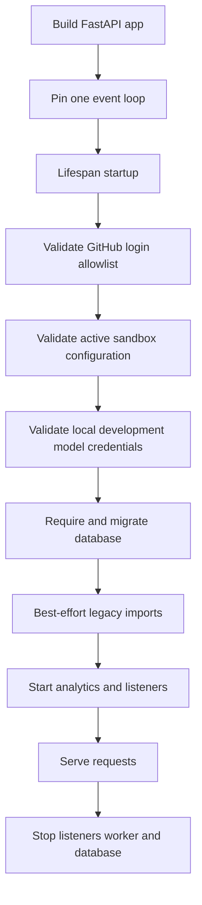
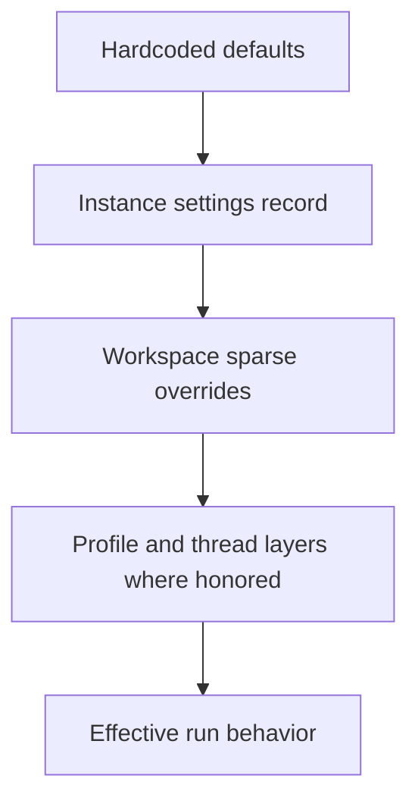

# Configuration and Startup Validation

Open SWE has two configuration planes:

- **Deployment configuration** is the lazy environment-variable schema in `agent/config.py`. It supplies credentials, endpoints, provider selection, limits, and deployment-wide defaults. `langgraph.json` names `.env` as its environment file.
- **Persisted settings** are administrator-managed records. The instance settings record establishes defaults for every workspace; each workspace can store sparse overrides. Workspace definitions separately carry sandbox snapshot, resource, and setup data. Persisted settings are not a replacement for credentials or other deployment secrets.

This page describes the operational model rather than every variable. `agent/config.py` is the authoritative catalog. See [deployment](deployment.md), [authentication and security](../concepts/auth-and-security.md), [models, profiles, and instructions](../concepts/models-profiles-instructions.md), and [sandbox providers](../integrations/sandbox-providers.md) for related procedures and concepts.

## Environment configuration

`ENV` is the sole registry for application environment variables. `EnvVar` reads `os.environ` lazily rather than taking an import-time snapshot, so test monkeypatches and secrets hydrated after import are visible. Empty and whitespace-only values are unset. A variable may specify a default, aliases, a secret classification, and deprecation metadata.

The canonical variable name wins over aliases. `require()` raises for an unset required value; integer conversion raises for malformed input; list values are comma-separated, trimmed, and omit empty entries. Boolean access recognizes `1`, `true`, `yes`, and `on` and their false counterparts; an unrecognized value returns the caller's default. An undeclared `ENV.NAME` or `ENV["NAME"]` is an error, making a new variable an explicit schema change. `deprecated_in_use()` reports deprecated names and aliases, while suppressing a deprecated-name warning when its replacement is configured.

`langgraph.json` registers six graphs—`agent`, `reviewer`, `analyzer`, `review-scout`, `chat`, and `scheduler`—and mounts `agent.webapp:app` as the HTTP application. Its checkpointer has delete-based TTL cleanup, with a 60-minute sweep and a default TTL of 43,200 minutes (30 days).

## Startup lifecycle and failure boundaries

`agent.api.app:create_app` builds the FastAPI application and routes dashboard, plan, approval, webhook, health, and sandbox-tool traffic. It pins one event loop before queue workers are constructed and repeats that guard in lifespan startup. If `DASHBOARD_ALLOWED_ORIGINS` contains `*`, application construction fails: credentialed CORS is only installed for explicit nonempty origins.

The diagram shows the ordered FastAPI startup checks and best-effort service initialization.

Lifespan validation happens before the database migration. A GitHub-login allowlist error, invalid active sandbox configuration, missing local-development model credential, missing database configuration, or failed migration prevents service. Legacy user/concierge and automation migrations instead log failures and allow startup to continue. Analytics initialization and the transcript and sandbox-bridge listeners are also best effort; their failures are warned about, with documented degraded cross-process behavior. Shutdown stops bridge and transcript listeners, stops analytics work, and closes the database.

The model credential check is intentionally narrow. It runs only when an explicitly set `DASHBOARD_BASE_URL` begins with `http://localhost`; it checks the deployment default model (`LLM_MODEL_ID` or `DEFAULT_MODEL_ID`) and accepts desktop OpenAI OAuth as an alternative to `OPENAI_API_KEY`. It does not validate models selected later by workspace, profile, or thread configuration.

## Sandbox configuration and workspace snapshots

`SANDBOX_TYPE` defaults to `langsmith`. The lazy factory registry supports `langsmith`, `daytona`, `modal`, `runloop`, `e2b`, and `local`; an unknown value raises `ValueError` listing the supported types. Third-party Daytona, Modal, Runloop, and E2B integrations are optional dependency groups. Startup eagerly imports a selected optional provider, so a missing provider extra fails at boot with the `uv sync --extra sandbox-<provider>` remediation rather than on the first run.

`create_sandbox()` reconnects or creates through the selected provider. `snapshot_id`, CPU, memory, filesystem, and arbitrary create parameters are forwarded only to the LangSmith factory; other providers receive only a possible existing sandbox ID. A non-async provider factory is invoked in a worker thread. The local provider has no isolation and is for local development, not untrusted workloads.

For `SANDBOX_TYPE=langsmith`, sandbox operations use `LANGSMITH_API_KEY` and `LANGSMITH_ENDPOINT`. New sandboxes use LangSmith's root snapshot unless their caller supplies a snapshot. Deployment resource defaults are 128 GiB filesystem, 4 vCPUs, 16 GiB memory, 7,200 seconds idle TTL, and 2,592,000 seconds delete-after-stop TTL. Setting either TTL to `0` disables that expiration behavior. At boot, LangSmith validation rejects non-integer resource/TTL values, negative TTLs, and invalid or non-object `SANDBOX_CREATE_EXTRA_JSON`.

A workspace definition can carry a `base_snapshot_id`, per-workspace CPU/memory/filesystem overrides, create parameters, and setup/update scripts. Its snapshot ID is trimmed and empty input becomes unset. During a full workspace refresh the builder boots from `base_snapshot_id`; an update refresh instead boots from the last ready snapshot. Refresh status is returned rather than raised so an administrator, scheduled task, or background run can inspect failure state. The system stops a builder when done and relies on platform TTL reclamation rather than deleting sandboxes by ID, protecting a running working tree.

## Persisted instance and workspace settings

Settings are exposed beneath the `/dashboard/api` router, whose mutation requests require same-origin validation. `GET /dashboard/api/settings` reads the instance record and `PUT /dashboard/api/settings` changes it for an administrator; the legacy `/team-settings` paths remain as hidden aliases. `GET` and `PUT /dashboard/api/workspaces/{workspace}/settings` respectively return and update settings for an existing workspace. Workspace reads return both the effective settings and that workspace's explicit overrides.

Settings resolve in tiers:

The diagram shows the settings precedence from deployment-independent defaults through caller-specific selection.

The instance record is in LangGraph Store namespace `team_settings` under key `default`, retaining the old location for compatibility. Workspace records are in `workspace_settings` by slug; a legacy workspace record in the old namespace remains readable until resaved. `None` means inherit at the relevant tier, and clearing a workspace override restores the instance value. Store reads are deliberately fail-soft: if the Store is unavailable, the agent uses hardcoded defaults rather than failing every run. Graph factories cache resolved workspace settings for 60 seconds with the workspace slug in the cache key, so values cannot leak between workspaces.

Settings include review feature flags and guidelines, gateway and model-routing toggles, Fable and expedited-review controls, a default repository, and main/subagent model-and-effort pairs for agent and reviewer plus chat, title, and routing tiers. Guidelines are normalized and limited to 10,000 characters. Model settings reject an effort without a model, unsupported models, and unsupported effort/model pairs; deprecated IDs are cleared and canonical pairs normalized. Fable-only defaults are rejected when Fable is enabled as applicable, and when Fable is disabled stored Fable choices are converted to safe fallbacks.

Runtime resolution protects against old or invalid persisted values: it prefers a valid pair, then a supported same-provider pair, then the global default. Chat inherits the agent default if it has no usable chat-specific pair. A workspace's `gateway_enabled` value is tri-state: true or false overrides the deployment choice, while unset inherits it.

## Models, fallbacks, and Gateway routing

`LLM_MODEL_ID` and `LLM_REASONING_EFFORT` establish the deployment model pair underneath persisted selections. Defaults are resolved against the supported-model catalog, so unsupported defaults or an incompatible effort are configuration errors when resolved. `DEFAULT_LLM_MAX_TOKENS` is 64,000 and is an output/completion budget rather than a context-window limit.

`make_model()` centralizes provider client construction. It applies six retries to every model and a 600-second request timeout to OpenAI, Anthropic, Baseten, Google GenAI, and Fireworks models. OpenAI uses the Responses API by default. `LLM_FALLBACK_MODEL_ID` explicitly selects a fallback; when it is unset, Anthropic and OpenAI primaries have cross-provider fallback IDs, while other providers do not. The agent attaches `ModelFallbackMiddleware` only if the resolved fallback exists and differs from the primary.

The LangSmith LLM Gateway is controlled first by `LANGSMITH_GATEWAY_ENABLED`; when that is unset, presence of `LANGSMITH_GATEWAY_API_KEY` enables it. A workspace's tri-state setting then overrides or inherits that default. Gateway authentication prefers the gateway-specific key and falls back to `LANGSMITH_API_KEY`; the base URL and OpenAI Responses behavior are configurable with `LANGSMITH_GATEWAY_BASE_URL` and `LANGSMITH_GATEWAY_OPENAI_USE_RESPONSES`.

OpenAI, Anthropic, Baseten, Fireworks, and Google GenAI can route through the Gateway. If the provider is not routable or no LangSmith key is available, routing logs a warning and the call proceeds directly. Direct Baseten calls require `BASETEN_API_KEY` when the Gateway did not apply.

## Secrets, encryption, and completion callbacks

Keep provider credentials, signing keys, and callback secrets in deployment configuration. The registry classifies secret variables, including provider keys, GitHub App private key and webhook secret, Slack credentials, dashboard signing secret, and encryption/callback keys. LangSmith sandbox GitHub access should use the runtime proxy mechanism rather than a deployment-scoped user access token.

`TOKEN_ENCRYPTION_KEY` is one Fernet key or a comma/newline-separated list ordered newest first. Encryption uses the first key; `MultiFernet` tries all listed keys for decryption, which supports key rotation. Encryption with no key raises `EncryptionKeyMissingError`; decryption of invalid ciphertext or with no key logs a warning and returns an empty string. Rotate by prepending the new valid key, retaining old keys until encrypted records have been renewed or retired.

`RUN_COMPLETE_WEBHOOK_SECRET` protects `/webhooks/run-complete` with a constant-time shared-token comparison. With no secret, verification rejects every callback and completion/failure replies are disabled. Dispatch attaches a completion webhook only when a secret is configured and `COMPLETION_WEBHOOK_URL` is an absolute non-loopback HTTP(S) URL; relative and loopback URLs are omitted because the platform would reject them at run creation. The dispatched URL receives `?token=<secret>` unless the configured URL already contains a query string.

## Operational checklist and focused tests

1. Declare a new environment variable in `agent/config.py`; consume it through `ENV`, and record its secret, alias, or deprecation semantics there.
2. Select and install the sandbox provider extra before deployment. Exercise lifespan startup with the exact LangSmith sizing and JSON parameters when using LangSmith.
3. Manage behavioral defaults through instance and workspace settings, not environment secrets. Remember Store reads can fall back to hardcoded defaults during an outage and settings cache for up to 60 seconds.
4. For local development, explicitly set an `http://localhost...` `DASHBOARD_BASE_URL` to activate default-model credential validation.
5. Configure a public `COMPLETION_WEBHOOK_URL` and `RUN_COMPLETE_WEBHOOK_SECRET` together if completion replies are required.

Focused coverage exists for environment alias, typed parsing, and undeclared-variable failures; workspace tiering and workspace-keyed cache isolation; sandbox configuration and lifecycle behavior; and model/settings fallback paths. Changes should add focused tests for the new precedence or startup failure boundary rather than relying only on end-to-end startup.

## See also

- [Deployment](deployment.md)
- [Authentication and security](../concepts/auth-and-security.md)
- [Models, profiles, and instructions](../concepts/models-profiles-instructions.md)
- [Sandbox providers](../integrations/sandbox-providers.md)
