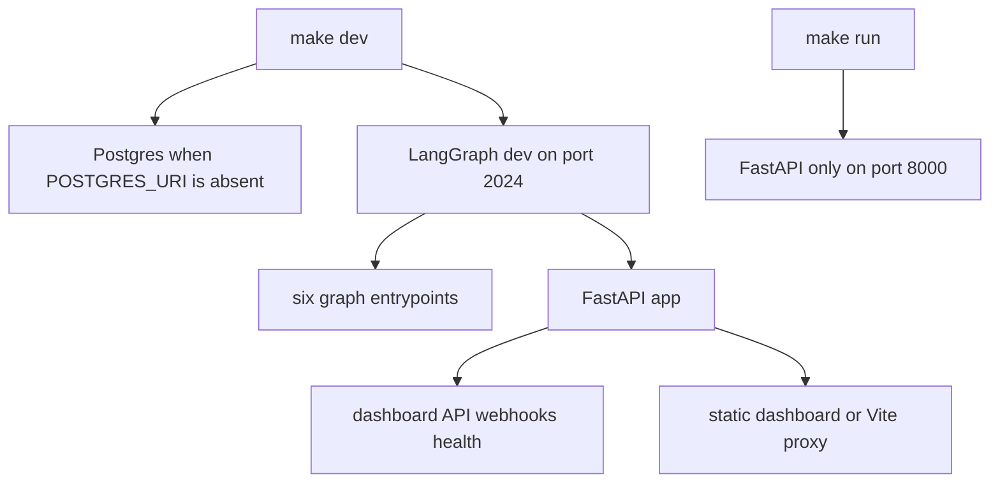
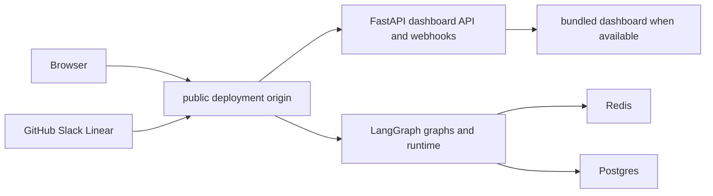

# Development, Deployment, and Packaging

Open SWE normally runs as a single LangGraph deployment. The deployment manifest registers six graphs (`agent`, `reviewer`, `analyzer`, `review-scout`, `chat`, and `scheduler`) and the FastAPI application `agent.webapp:app`; that application provides the dashboard API, webhooks, health endpoints, and optional dashboard serving. The manifest loads `.env` locally and defines a deleting checkpointer TTL: a 60-minute sweep and a 43,200-minute default retention period.

The preferred web topology is same-origin: the dashboard is served at `/` and calls `/dashboard/api/*` relatively. That keeps the dashboard session cookie out of a browser CORS arrangement. See [Configuration](configuration.md) for the environment contract, [Dashboard UI](../integrations/dashboard-ui.md) for UI behavior, and [Testing overview](../testing/overview.md) for broader test guidance.

## Local development

Install Python development dependencies with `make install` (`uv sync --extra dev`). `make dev` is the full local backend:

```bash
make dev
```

It starts `uv run langgraph dev --no-browser --port 2024 --n-jobs-per-worker 10`. When `POSTGRES_URI` is absent from the environment or `.env`, it first starts the Compose `postgres:16` service. Compose publishes it only on `127.0.0.1:5433`, waits for `pg_isready`, and retains data in the named `open-swe-postgres` volume. Supplying `POSTGRES_URI` skips that container. `make dev` also rejects an occupied port 2024 rather than accidentally starting beside a stale backend.

Build the dashboard before starting the backend if it should serve a static UI:

```bash
make build-dashboard
make dev
```

The build is written to `ui/.output/public`. The backend first honors `DASHBOARD_STATIC_DIR`; otherwise it serves that in-repository build when `_shell.html` exists. `make run` is deliberately narrower: it runs `uvicorn agent.webapp:app --reload --port 8000` without the LangGraph runtime, so dashboard flows that create runs require `make dev` instead.



The full development command hosts LangGraph and FastAPI together; the Uvicorn command does not host graph runtime routes.

### Dashboard hot reload and serving boundaries

`make dev-ui` runs `make web` and `make dev` concurrently, setting `DASHBOARD_DEV_SERVER_URL=http://localhost:3000`. The backend then reverse-proxies non-reserved UI requests to Vite, while the browser stays at `http://localhost:2024`; Vite's HMR WebSocket connects directly to its own port. `make web` by itself invokes the workspace dashboard dev task, and Vite proxies backend prefixes to `DASHBOARD_API_URL`, defaulting to `http://localhost:2024`.

The backend catch-all never handles `/dashboard/api`, `/webhooks`, `/health`, or LangGraph/server paths such as `/threads`, `/runs`, `/assistants`, `/store`, `/docs`, and `/ok`. It only returns the dashboard shell for HTML navigation; unrecognized API-like requests retain a normal 404. Hashed dashboard assets receive immutable one-year cache headers, while the shell is served with `no-cache` so it can reference a newly deployed asset set.

`DASHBOARD_BASE_PATH` must match the LangGraph `http.mount_prefix` at which the build is served, including the trailing slash convention used by the build. It controls client router and asset paths. The platform image build derives it from the manifest mount prefix; local prefixed builds must set it explicitly, for example `DASHBOARD_BASE_PATH=/<prefix>/ make build-dashboard`.

FastAPI permits credentialed cross-origin dashboard calls only for the configured `DASHBOARD_ALLOWED_ORIGINS`, and rejects `*` because credentials are enabled. Directly opening Vite on `http://localhost:3000` therefore needs dashboard base/API URLs and a GitHub callback registered for that origin; using `make dev-ui` avoids this by retaining the backend origin.

### Local webhook tunnel

Do not publish local port 2024 wholesale: `langgraph dev` does not authenticate raw LangGraph routes. `make tunnel NGROK_DOMAIN=<name>.ngrok-free.dev` targets port 2024 with `examples/ngrok/webhooks-only.yml`, whose policy returns 404 for every path outside `/webhooks/*`. This allows public GitHub, Slack, and Linear delivery without exposing dashboard or runtime routes. A different tunnel is safe only if it enforces an equivalent allowlist. For Slack OAuth, the documented local workflow additionally requires a callback relay that redirects the tunnel callback to localhost without dropping its query string.

## Production backend

Two supported backend paths are available:

- **LangGraph Platform:** connect the repository as a LangSmith deployment. `langgraph.json` builds a dashboard during image construction, stamps build information, sets `DASHBOARD_STATIC_DIR=/opt/open-swe-dashboard`, and continues the backend deployment if the dashboard build fails.
- **Standalone Docker:** `docker build -t open-swe .` builds a LangGraph API server image, not a sandbox image. It uses `langchain/langgraph-api:0.13.3-py3.14`, installs this repository, registers the same six graphs, FastAPI app, and checkpointer policy through environment variables, and exposes port 8000. It does not build the dashboard; build it before the Docker build or supply `DASHBOARD_STATIC_DIR`.

A standalone Agent Server needs `DATABASE_URI`, `REDIS_URI`, `LANGSMITH_API_KEY`, `LANGGRAPH_CLOUD_LICENSE_KEY`, and a public `LANGGRAPH_URL`; application analytics additionally reads `POSTGRES_URI`. Keep workers available rather than using scale-to-zero hosting, because background work relies on Redis- and Postgres-backed services. Update `LANGGRAPH_URL`, webhook destinations, and OAuth callback settings whenever the public origin changes.



A same-origin deployment combines browser traffic, webhook delivery, the dashboard API, and LangGraph runtime at one public URL.

The standalone image defaults to `LANGGRAPH_AUTH_TYPE=noop`, leaving raw `/threads`, `/runs`, `/assistants`, and `/store` routes open to network clients. Use LangSmith authentication (`LANGGRAPH_AUTH_TYPE=langsmith` with `LANGSMITH_AUTH_ENDPOINT` and `LANGSMITH_TENANT_ID`) or put the service behind private networking or an authenticated gateway. Dashboard sessions and webhook signatures protect custom routes only; they do not protect exposed runtime routes.

## Separate dashboard deployment

The optional `ui/Dockerfile` is built from the repository root with `docker build -f ui/Dockerfile .`. It performs a frozen pnpm workspace install, builds the dashboard into Nitro `.output`, and runs the Node 24 server on port 8080. Its `DASHBOARD_API_URL` is read per request—not embedded in the image—so one image may front different backends; startup proxy handling throws rather than guessing a backend when it is missing.

In production the Nitro handler forwards the original path, query, method, request body, and non-hop-by-hop headers to that backend. It preserves individual `Set-Cookie` headers and returns OAuth redirects to the browser rather than following them server-side. Configure the backend's dashboard base/API URLs as the dashboard origin to use the same-origin proxy for `/dashboard/api/*` and `/webhooks/*`. The alternative is a client build with `VITE_DASHBOARD_API_BASE_URL` pointing to the backend and that frontend origin in `DASHBOARD_ALLOWED_ORIGINS`; do not put secrets in `VITE_*` variables.

The pnpm workspace includes `ui`, `desktop`, `cli`, and `tests/e2e`. Root `pnpm run build`, `typecheck`, `test`, and `check` use Turborepo; root lint and formatting use oxlint and oxfmt directly. Turbo does not cache the persistent `dev` task, caches build outputs, and makes build cache keys sensitive to `DASHBOARD_API_URL`, `SOURCE_COMMIT`, `VERCEL`, `E2E_HARNESS`, and `VITE_*` values.

## Desktop packaging

The experimental Electron client packages the compiled dashboard UI and a local backend. Packaged users choose and persist a compatible organization backend URL rather than using a maintainer-hosted default. At the internal `open-swe://app` origin, Electron proxies dashboard API requests to that selected backend; cloud features and GitHub sign-in use it. **This Mac** runs a private loopback LangGraph server that Electron owns and stops with the application, supporting local-project threads without GitHub login.

For source development, run `make dev` and `make desktop`; the desktop process defaults to `http://localhost:2024`. `--backend-url` or `OPEN_SWE_BACKEND_URL` overrides it, ahead of saved configuration, while legacy names remain compatible. Package an unpacked app with `pnpm --dir desktop run pack` or an installer with `pnpm --dir desktop run dist`; both build the UI and include local-backend and CLI resources, but do not deploy the web application.

The desktop-specific manifest is intentionally smaller than the server manifest: it exposes only the agent graph, disables the built-in UI, uses `agent.local_auth:auth`, disables Studio auth, and supplies a local checkpointer. On macOS, `make install-desktop` requires a clean tree, fast-forwards `main`, then runs `scripts/install_desktop.sh`; `make install-checkout` runs the same installer without changing Git state. The script is macOS-only, checks Node, `ditto`, uv, Bun, and a pnpm/Corepack launcher, builds an unpacked app, stages it, stops the old app, and replaces it in `/Applications` or `~/Applications`.

## Operational helpers and focused checks

- `make test` and `make integration_tests` run pytest through uv and skip a requested missing path; `make lint`, `make format`, `make format-check`, and `make typecheck` run Ruff or `ty check agent tests`.
- `scripts/create_sandbox_snapshot.py` creates a LangSmith sandbox snapshot using `SandboxClient`. It accepts name, Docker image, filesystem capacity, and API key overrides, then prints the snapshot ID; assign that snapshot to a workspace from the dashboard.
- `scripts/purge_wakeup_crons.py` is a one-time cleanup for expired `thread_wakeup` crons. Run it with `--dry-run` first; it resolves the deployment from `--url` or `LANGGRAPH_URL` and credentials from `LANGGRAPH_API_KEY` or `LANGSMITH_API_KEY`.
