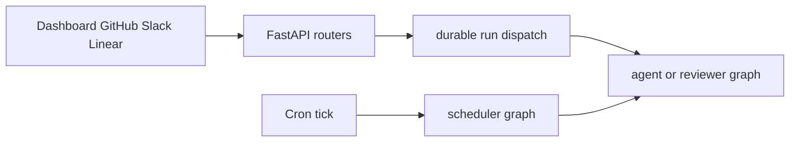

# Open SWE Codebase Guide

Open SWE is an asynchronous coding agent and software factory. It runs coding work in an isolated sandbox per thread, with separate read-only reviewer, review-scout, and review-style analyzer graphs. Use this page to find the narrow owner and workflow before changing code; source and focused tests remain authoritative.

## Local loop

Use Python 3.14+ and `uv` for the backend. The `ui`, `desktop`, and `tests/e2e` workspace uses Node 22.22.2+ and `pnpm`.

```bash
make install            # uv sync --extra dev
make build-dashboard    # build ui/.output/public
make dev                # LangGraph graphs, FastAPI, and built dashboard on :2024
make dev-ui             # Vite on :3000 plus the backend on :2024
make run                # FastAPI only on :8000
make desktop            # Electron; start the backend separately
```

`make dev` starts a loopback PostgreSQL container unless `POSTGRES_URI` is set, rejects an occupied port 2024, and serves the registered graphs and HTTP app. Use it for any change that creates or executes a LangGraph run. `make run` does not include the LangGraph runtime, so run creation cannot work there. See [Development, Deployment, and Packaging](operations/deployment.md) for worktrees, UI/desktop packaging, and deployment; see [Configuration and Startup Validation](operations/configuration.md) before adding settings or credentials.

For local GitHub or Slack webhooks, use `make tunnel NGROK_DOMAIN=<name>.ngrok-free.dev`. Its supplied traffic policy exposes only `/webhooks/*`; do not publish the unauthenticated LangGraph development API. Follow `docs/DEVELOPMENT.md` for the ordered app, credential, database, and tunnel setup.

**Repository conventions that affect a safe change**

- Implement async paths only. If an interface mandates a synchronous method, raise `NotImplementedError` rather than maintain a second implementation.
- Keep strong Python and TypeScript types; do not use `Any` or `any` to suppress a type error. Use absolute imports except for same-package imports, and do not discard exceptions without propagating or logging them.
- Put model-facing prompts in `agent/resources/prompts/` and load them through `prompt(...)`; route new dashboard endpoints through the feature package that owns them, not the aggregate router.

## Public entrypoints and ownership

`langgraph.json` is the deployed registration boundary. It registers six graph entrypoints and `agent.webapp:app`; each graph entrypoint is a thin `agent/graphs/` re-export, so normally change its implementation rather than the shim.

| Entrypoint | Owner | Route to |
| --- | --- | --- |
| `agent.graphs.agent:traced_agent` | `agent/server.py` | [Coding Agent Assembly](architecture/agent-graph.md), then [Agent Middleware and Failure Boundaries](architecture/middleware-stack.md) for order-sensitive behavior. |
| `agent.graphs.reviewer:traced_reviewer_agent` | `agent/reviewer.py` | [Reviewer, Review Scout, and Style Analyzer](architecture/reviewer-and-analyzer.md) and [Pull Request Review Workflow](workflows/pr-review.md). |
| `agent.graphs.analyzer:traced_analyzer` | `agent/analyzer.py` | [Reviewer, Review Scout, and Style Analyzer](architecture/reviewer-and-analyzer.md). |
| `agent.graphs.review_scout:traced_review_scout` | `agent/review_scout/graph.py` | [Reviewer, Review Scout, and Style Analyzer](architecture/reviewer-and-analyzer.md). |
| `agent.graphs.chat:traced_chat_agent` | `agent/chat.py` | PR-chat handling in [Dashboard and Desktop Clients](integrations/dashboard-ui.md) and the review architecture guide. |
| `agent.graphs.scheduler:get_scheduler` | `agent/scheduler.py` | [Schedules, Background Tasks, and Baby-Sit](workflows/scheduling-and-baby-sit.md). |
| `agent.webapp:app` | `agent/api/app.py` | [Runtime and Product Architecture](architecture/overview.md), [Inbound Invocation to Durable Run](workflows/invocation.md), or [Dashboard and Desktop Clients](integrations/dashboard-ui.md). |



This shows the primary routing boundary: interactive ingress creates durable graph work, while a cron invocation first selects maintenance work or a scheduled coding run.

The FastAPI lifespan pins the event loop; validates login allowlists, sandbox configuration, local model configuration, and database configuration; migrates the database; then starts best-effort analytics, transcript, and bridge listeners. The composition function adds dashboard, plan, workflow-approval, Linear, Slack, health, GitHub webhook, and sandbox-tool routers and mounts the dashboard UI. Credentialed CORS is enabled only for explicitly configured origins and rejects `*`.

## Change-routing map

### Agent, state, and sandbox

- Change graph construction, model/profile resolution, skills, tools, or prompts: [Coding Agent Assembly](architecture/agent-graph.md), [Models, Profiles, and Instructions](concepts/models-profiles-instructions.md), and [Tool Surfaces and Authorization](concepts/tools.md).
- Change queueing, errors, timeouts, model fallbacks, push guards, or tool availability: [Agent Middleware and Failure Boundaries](architecture/middleware-stack.md).
- Change sandbox creation, reconnect/recreate behavior, provider registration, checkout state, or proxy credentials: [Thread Sandbox Lifecycle](architecture/sandbox-lifecycle.md) and [Sandbox Provider Integrations](integrations/sandbox-providers.md). Do not silently replace an unreachable coding sandbox: it can contain uncommitted work. The reviewer may recreate its checkout because it prepares a fresh review workspace.
- Change thread identity, persisted run input/configuration, interrupts, or durable state: [Threads, Run State, and Durable Dispatch](concepts/threads-and-state.md) and [Follow-up Messages, Interrupts, and Queue Drain](workflows/follow-up-messages.md).

The main agent factory is stateless; per-thread continuity belongs in its sandbox and thread metadata. `dispatch_agent_run` is the common dashboard, Slack, Linear, and GitHub contract for `agent` or `reviewer` runs. It defaults to an interrupt multitask strategy; pass either a complete prebuilt input or content/context/source identities, never both.

### Product ingress and integrations

- Change webhook admission, identity/context normalization, dispatch, streaming, or completion behavior: [Inbound Invocation to Durable Run](workflows/invocation.md).
- Change a pull request, workflow-file approval, push, or CI handoff: [Pull Request Creation and Approval](workflows/pr-creation.md).
- Change review eligibility, findings, publication, settlement, or PR chat: [Pull Request Review Workflow](workflows/pr-review.md). The reviewer has finding and publication tools but no commit, push, or PR-opening tools. PR chat is sandbox-less and read-only: it uses seeded `/pr/` virtual files and repository-scoped GitHub App access.
- Change dashboard APIs, the TanStack UI, Vite proxy, Electron, or client streaming: [Dashboard and Desktop Clients](integrations/dashboard-ui.md).
- Change OAuth, webhook signatures, roles, tokens, same-origin rules, or sandbox credential scope: [Authentication, Credentials, and Security Boundaries](concepts/auth-and-security.md).
- Change MCP, browser, observability, or third-party tool loading: [MCP, Observability, and External Tool Integrations](integrations/observability-and-mcp.md).

### Background work and operations

The scheduler has one launch node. It routes ticks to stale-run reconciliation, baby-sit evaluation, legacy-review cleanup, background-task monitoring, workspace refresh, session/thread/agent cost or feedback work, or a scheduled agent run; missing required identifiers become explicit result statuses. Start in [Schedules, Background Tasks, and Baby-Sit](workflows/scheduling-and-baby-sit.md).

The deployed checkpointer uses delete-based TTL cleanup, sweeping every 60 minutes with a default retention of 43,200 minutes. Configuration, startup checks, database requirements, and local/deployed persistence are covered by [Configuration and Startup Validation](operations/configuration.md).

## Focused validation

**Never run the full test suite locally.** Run the narrowest test owning the observable behavior, then the applicable quality check.

```bash
make test TEST_FILE=tests/github/test_open_pull_request.py
uv run pytest -vvv tests/path/to_test.py::test_name
make lint
make format-check
make typecheck
```

`make test` runs an existing file or directory through pytest; direct pytest is appropriate for a node id. Pytest uses asyncio auto mode. Shared fixtures route store access through an in-memory SDK-shaped store so production serialization is exercised, clear global caches and sandbox registries around each case, hide local bundled dashboard output, and enable automatic review by default unless a test overrides its gate.

Choose the family closest to the changed boundary—such as `tests/agent/`, `tests/middleware/`, `tests/sandbox/`, `tests/reviewer/`, `tests/webhooks/`, `tests/dashboard/`, `tests/github/`, `tests/slack/`, or `tests/tools/`. See [Focused Validation Strategy](testing/overview.md) for fixtures and frontend checks.

Use a single Playwright spec only for a real cross-boundary contract:

```bash
pnpm install --frozen-lockfile
pnpm run test:e2e:install
pnpm exec playwright test tests/full_flow.spec.ts
```

The E2E harness runs real agent code, LangGraph development server, local sandbox, local git, real dashboard, and Electron paths while faking the LLM and external SaaS HTTP boundaries. Browser tests are serial with one worker; the desktop configuration selects only `desktop.spec.ts`. The root scripts provide the browser and desktop E2E commands.
