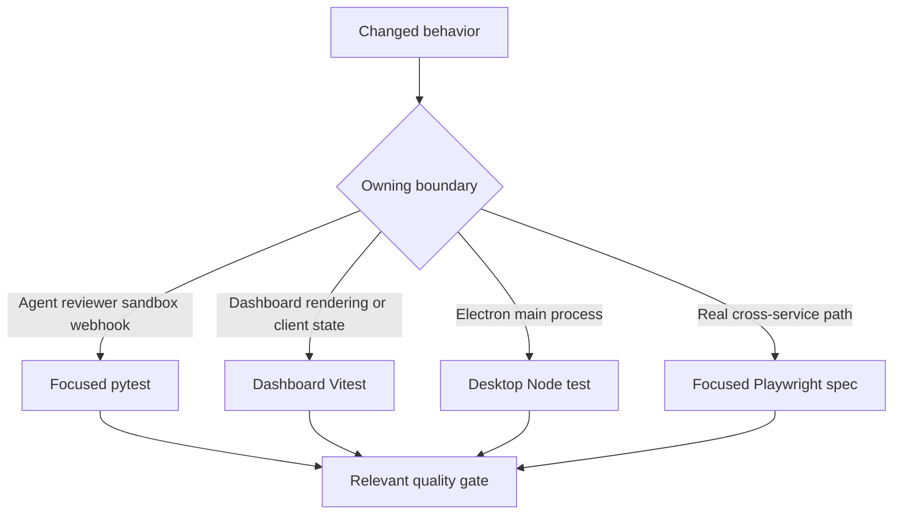
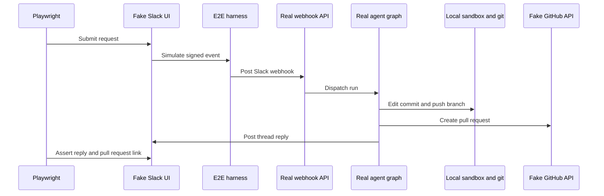

# Focused Validation Strategy

Validate at the lowest layer that owns the changed observable contract. Use focused pytest for agent assembly, reviewer, sandbox, webhook, API, and tool behavior; dashboard Vitest for React rendering and client state; and desktop Node tests for Electron main-process code. Escalate to Playwright only when the behavior crosses the real webhook, authenticated dashboard, sandbox/git, or Electron boundary. **Never run the full suite locally**: start with the owning file or node id, keep tests deterministic, and add coverage only for observable behavior rather than source structure, prompts, constants, or incidental call order.



This routing keeps feedback narrow while preserving an end-to-end proof where stateful or independently deployed pieces meet.

## Python: contract-focused tests

Pytest collects `tests/` and uses asyncio auto mode, so asynchronous tests and fixtures need no per-test asyncio marker. Choose the test family carrying the failure semantics being changed, rather than adding a snapshot of implementation details.

| Change | Focused location and protected behavior |
| --- | --- |
| Main-agent construction, source/scope authorization, skills, tools, middleware, model selection, or backend wiring | `tests/agent/test_agent_assembly_context.py`. It captures `create_deep_agent` arguments and protects the initialized sandbox backend needed for deepagents context eviction and summarization, source-sensitive skills and tools, and parent/subagent privilege boundaries. |
| Reviewer publishing, reconciliation, checks, approvals, review chat, or outcome learning | `tests/reviewer/`. In particular, `test_reviewer_outcomes.py` checks the finding-outcome payload and that an already-existing dataset example is updated after a create conflict. |
| Lazy sandbox reconnection or sandbox identity recovery | `tests/sandbox/test_sandbox_state.py`. It requires a proxy to share one reconnect, survive a cancelled waiter, retry failed startup, recover the sandbox ID from thread metadata, and delegate file deletion after lazy startup. |
| Completion failure, follow-up pickup, or Slack and GitHub cleanup | `tests/webhooks/test_completion_webhook.py`. It protects settlement of a pending reviewer check, Slack failure replies even if reviewer cleanup fails, and run-specific failure-reply deduplication. |

### Shared isolation and fakes

`tests/conftest.py` deliberately isolates ordinary tests from a running LangGraph Store, a bundled dashboard, and process-global state:

- `fake_store` routes `agent.store` through an in-memory `FakeStore`, retaining the production `model_dump`/`model_validate` round trip. Seed it only when persisted state is part of the contract.
- Autouse fixtures point `DASHBOARD_STATIC_DIR` at a missing temporary directory, clear the TTL and in-process LangGraph caches before and after each case, and clear both sandbox registries. A local `ui/.output`, cached settings, MCP catalog, or leaked sandbox handle therefore cannot affect another test.
- The auto-review fixture enables every repository because the dashboard opt-in list is empty without a live Store. A test of the opt-in gate must override it with the intended policy.
- PostgreSQL regressions should request `registry_db`; it skips when `TEST_ANALYTICS_POSTGRES_URI` is not configured. Use `registry_db_if_available` only when the behavior being tested explicitly supports both configured and unconfigured database modes.

## Focused commands and independent gates

Install Python development dependencies with `make install`, which runs `uv sync --extra dev`. The dev extra supplies `pytest`, `pytest-asyncio`, `pytest-xdist`, `Ruff`, and `ty`; Pygments is a regular runtime dependency. Target a path with `TEST_FILE`, pass focused options through `PYTEST_ARGS`, and use direct pytest for one node id because the Makefile existence guard accepts paths, not a `file.py::test_name` node id.

```bash
make install
make test TEST_FILE=tests/sandbox/test_sandbox_state.py
uv run pytest -vvv tests/sandbox/test_sandbox_state.py::test_sandbox_proxy_retries_failed_startup
make lint
make typecheck
```

`make test` and `make tests` execute `uv run pytest -vvv $(PYTEST_ARGS) $(TEST_FILE)` only when the target path exists; otherwise they print a skip message. Do not use the default `TEST_FILE=tests/` locally, because that is the full Python suite. Quality gates are separate: `make lint` runs Ruff checking and a format diff, `make format` applies Ruff formatting and fixes, and `make typecheck` runs `ty check agent tests`.

For frontend changes, target the owning workspace rather than root `pnpm test`, which delegates all workspace test tasks to Turbo:

```bash
pnpm --filter open-swe-dashboard run test
pnpm --dir desktop run test
```

The dashboard command is `vitest run`; use it for component rendering, client state, stream transformation, terminal state, or API-client behavior. The desktop command builds the main bundle and then runs `node --test test/*.test.cjs`. Use either before browser e2e when the contract does not require a real process boundary.

## Playwright: real paths with controlled external seams

The E2E harness proves production integration without live SaaS. It overlays the real `agent.webapp` with fake GitHub and Slack HTTP endpoints, mock UIs, and control endpoints; it sends signed simulated Slack and GitHub deliveries to the real webhook routes. The primary agent path still runs its real graph, middleware, tools, local temp-directory sandbox, and git operations against a seeded local bare remote. A scripted `BaseChatModel`, SaaS APIs and credentials, snapshot service, and the review-scout sandbox seam are controlled substitutes. Fake Slack and GitHub stores are the source of truth rendered by the mock UIs, so browser assertions observe what the real agent wrote.



The diagram shows the focused happy path while retaining the real webhook, graph, sandbox, and git execution paths.

The browser suite drives the built `ui/` dashboard, not a mock. Global setup builds it with the harness as its server-side API and E2E proxy target, then starts the Nitro server. This exercises SSR, the session gate and redirects, hydration, and same-origin `/dashboard/api/*` proxy calls with a genuine signed session cookie. `E2E_FORCE_UI_BUILD=1` forces a rebuild after UI or port changes; otherwise the existing build is reused.

Use the spec closest to the changed boundary. `full_flow.spec.ts` proves a Slack request becomes a local implementation, pull request, and same-thread reply. Other browser specs focus on dashboard, reviews, SSR, Slack delivery behavior, threads, workspaces, and sandbox identity. The desktop spec is separate: it resets harness state, clones the seeded remote into an isolated temporary project, installs a harness-issued `osw_session` cookie, runs a local-agent request, and verifies both the local edit and fake-GitHub pull request.

```bash
pnpm install --frozen-lockfile
pnpm run test:e2e:install
pnpm exec playwright test tests/full_flow.spec.ts
pnpm run test:e2e:desktop
```

Install Chromium before the first browser run. The browser configuration is serial with one worker, excludes `desktop.spec.ts`, and uses a 90-second test timeout. The desktop configuration selects only `desktop.spec.ts`, uses longer test and expectation timeouts, and writes separate results. The E2E backend requires `POSTGRES_URI`; configure it before running a focused browser or desktop spec.

## Failures and diagnostics

Browser runs retain screenshots on failure and retain trace/video on failed attempts locally or on the first retry in CI. Set `E2E_ARTIFACTS=1` when a passing scenario needs inspection; artifacts are written below `test-results/` and `playwright-report/`. The desktop configuration turns off automatic Playwright media because its spec explicitly records an Electron trace and attaches screenshots; temporary desktop state is removed unless `E2E_KEEP_TMP` is set.

```bash
pnpm exec playwright show-report
pnpm exec playwright show-trace test-results/<test>/trace.zip
SLOW_MO=700 pnpm exec playwright test --headed
```

Inspect the trace, screenshot, and fake-boundary state before raising a timeout or weakening an assertion.

## Related pages

- [Agent graph](/openwiki/architecture/agent-graph.md)
- [Sandbox lifecycle](/openwiki/architecture/sandbox-lifecycle.md)
- [Dashboard UI](/openwiki/integrations/dashboard-ui.md)
- [Quickstart](/openwiki/quickstart.md)
- [PR review workflow](/openwiki/workflows/pr-review.md)
