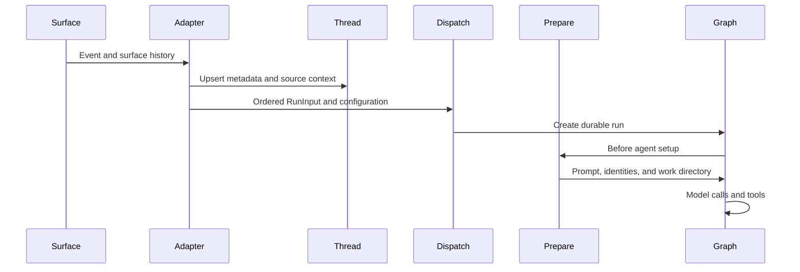
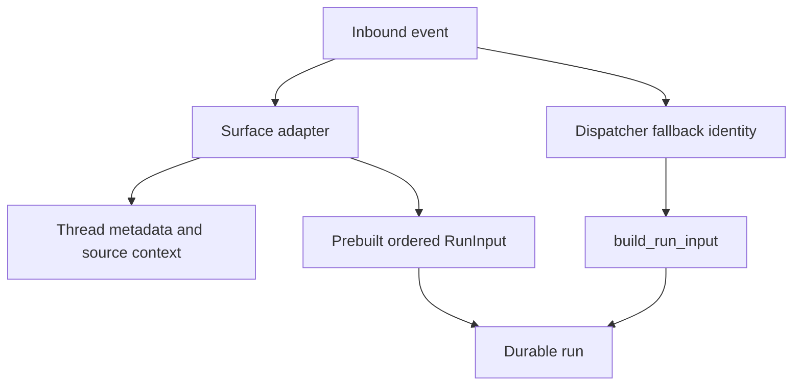

# Context Engineering and Prompt Assembly

Open SWE does not pass a webhook payload straight to a model. It first turns surface data into a `RunInput` transcript with attributed, escaped messages; separately persists routing provenance on the thread; and then performs run-specific preparation before the graph calls a model. This division keeps untrusted conversation material distinct from system instructions and allows a resumed run to reuse its checkpoint without freezing credentials or contextual preparation for later turns.

This shows the two context boundaries: adapters normalize inbound data, while middleware assembles fresh execution context.

## From inbound data to a transcript

`RunInput` contains `messages` and optionally `files`. Each authored item becomes an `<input-message>` envelope with a namespaced sender ID, surface, kind, optional channel, and optional structured data. Text and XML attributes are escaped; for multimodal input, text blocks are enveloped while non-text blocks retain their original placement. IDs must be nonempty namespaced identifiers and may not contain whitespace or XML-delimiting characters.

Entity descriptions are separate user-role `<dynamic-context>` messages. They describe people, channels, or systems once per content version rather than repeating identity data on every turn. The canonical XML is SHA-256 hashed; injection state is represented by hashes. When conversation summarization has removed the portion of history containing an introduction, only messages after its cutoff are considered visible, so the missing introduction can be added again.

The dispatcher can make a generic input when an adapter has not constructed a complete transcript. It derives a Slack sender and channel from `RunConfig`, otherwise uses GitHub login or Linear email, canonicalizes a person when possible, and falls back to a named system sender. A caller that needs precise history order—such as a Slack, Linear, or GitHub adapter—can provide a prebuilt `RunInput`. It may not combine that input with raw content, context, channels, or systems; doing so raises `ValueError` rather than silently merging incompatible attribution.

Adapters use prebuilt input for source-specific history; the dispatcher provides a safe fallback for simpler callers.

### Trust and provenance

The XML envelope is structure, not a trust promotion. In particular, a channel identity carries `topic` and `purpose` as ordinary escaped context. Prompt authority comes from the system prompt and repository conventions, not from event-controlled text.

`SourceContext` is a different data channel from `RunInput`: it records Slack-thread, Linear-issue, GitHub-issue, and PR provenance in thread metadata for routing and lifecycle actions. Slack, Linear, and GitHub adapters upsert it when they create or update their agent thread. The models tolerate metadata written by older or other integrations: declared models permit extra fields, `dump()` excludes unset defaults, and `parse()` returns an empty context after invalid input rather than failing the run.

## Run preparation and prompt assembly

The main graph starts with `system_prompt=""`. `PrepareAgentRunMiddleware` constructs the meaningful prompt after it has attached to the sandbox and resolved the working directory. For hosted runs it concurrently resolves the triggering identity and sandbox, then loads workspace data, eligible recent-thread context, and participants; it also records chosen model metadata best-effort. Desktop runs attach to the local backend and use a desktop prompt instead.

Preparation is checkpoint-aware. `BasePrepareRunMiddleware` hashes the latest message plus a subclass configuration fingerprint. If `run_prepared` is already set for that hash, a resumed attempt skips `_prepare`; a new invocation has a changed configuration or message and prepares again. `_prepare` must therefore be idempotent: a failure before the checkpoint can execute setup again. Sandbox attachment failures are re-raised, with the agent middleware notifying the user when the failure is a known sandbox connectivity condition.

The middleware keeps sender and participant context out of rewritten historical messages. It emits new person introductions only when their hashes are not visible, and chooses a sender subject from the current sender or the latest human envelope. This preserves cached history while allowing up-to-date participant data to reach the graph. Recent-thread context is further restricted to an eligible private owner or shared Slack audience; background completions and bot-triggered Slack runs are excluded.

`construct_system_prompt` renders the main system prompt from the working directory, source-specific guidance, default prompt material, repository scope, collaboration text, repository custom instructions, optional recent-thread context, and workspace instructions. It is called during preparation and stored as `rendered_system_prompt`; `BasePrepareRunMiddleware.awrap_model_call` prepends that rendered text to an existing system message immediately before every model call.

## Repository and workspace instructions

Repository custom instructions and workspace instructions are explicit sections in the rendered prompt. The system prompt also directs the agent to read root `AGENTS.md` after repository setup; repository instructions take precedence over custom, environment, and sender-level standing instructions when they conflict.

`SubdirAgentsReadMiddleware` handles scope that the model discovers while reading files. Only after a successful string `read_file` result does it look for unread ancestor `AGENTS.md` files. It appends their contents as a `<system-reminder>` from shallow to deep and tells the agent that deeper instructions win. A direct read of an `AGENTS.md` marks it loaded. Each thread tracks loaded paths, and candidate reads are capped at 1,000 lines and 64 KiB. Missing backends, read errors, non-UTF-8 content, empty content, and oversized candidates do not make the requested file read fail.

The reviewer has a complementary non-sandbox path. Before assembling a review prompt, it fetches root conventions from GitHub Contents at the PR base SHA, preferring `AGENTS.md` and trying `CLAUDE.md` only when the former is absent (404). Content is capped at 64 KiB; network errors, other HTTP statuses, and oversize content yield no root convention rather than fallback to potentially stale rules. Once the diff is available, it derives changed-file ancestor paths and fetches applicable scoped documents concurrently with bounded concurrency. Each path can independently fail, and the resulting shallow-to-deep ordering supports nested overrides.

## Skills are readable virtual files

Skills are advertised to deepagents as paths and read on demand, rather than copied wholesale into the system prompt. The main graph uses a `CompositeBackend`: the sandbox remains its default backend and skill prefixes route to read-only specialized backends. Bundled skills are mounted from the application filesystem at `BUNDLED_SKILLS_ROUTE`. Hosted runs mount organization skills from a store namespace and, when a credential login is present, user skills from that login's namespace; the user route is listed first. Desktop runs instead expose state-backed user skills and separate artifact routes so agent scratch files do not land in the user project.

The style analyzer has its own isolated `/skills/` route backed by `StateBackend`. Its launchers seed `RunInput.files` with bundled playbooks using prefix-stripped paths, because `CompositeBackend` removes `/skills/` before delegating. `skill_path_for_mode` selects the `bootstrap-repo-analysis` or `continual-learning` playbook, and analyzer preparation renders that selected path into its prompt.

## Safe changes and focused tests

When changing context assembly, preserve the separation between event content, durable provenance, and system instructions. Do not treat inbound channel metadata as trusted instructions, mutate cached user history to add current identity, or deduplicate an introduction that summarization removed. Keep preparation idempotent and make optional context loaders fail closed to absent context rather than changing the requested operation.

Focused coverage includes `tests/agent/test_input_messages.py` for escaping, multimodal preservation, and summarized-context visibility; `tests/agent/test_agents_md.py` and `tests/middleware/test_subdir_agents_middleware.py` for convention lookup and failure behavior; and the dispatch, source-context, and skills test suites for their respective boundaries.
