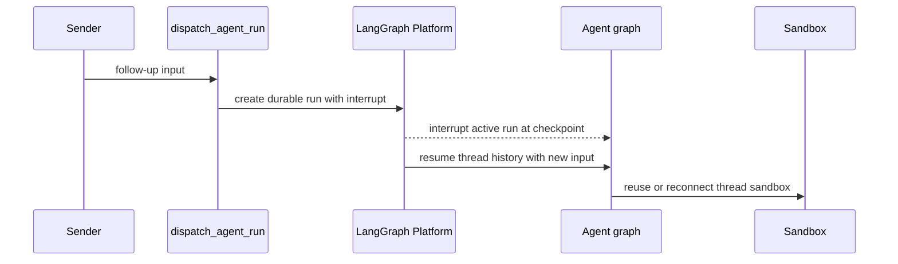
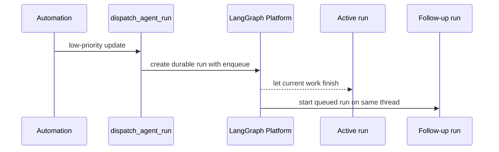
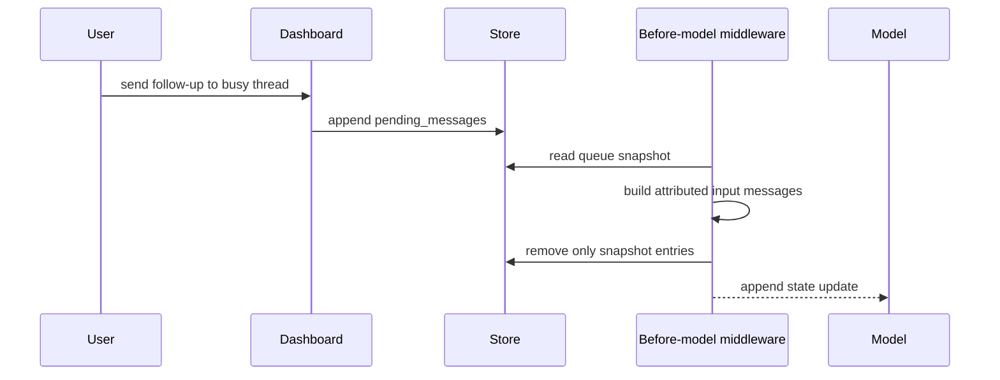

# Follow-up Messages, Interrupts, and Queue Drain

A thread is the continuity boundary for conversation state and its bound sandbox. A new request can therefore either create another durable run on that thread or be retained as data for the run already in progress. These are distinct mechanisms:

- A **run-level follow-up** is submitted through `dispatch_agent_run`. `"interrupt"` preempts active work while retaining its durable thread history; `"enqueue"` waits in the platform's run queue.
- A **message-level follow-up** is stored under the thread and injected before a later model call. It is intended for a live-run handoff or correction, not as a general replacement for dispatching a turn.

See [Invocation](invocation.md) for initial run creation, [Threads and state](../concepts/threads-and-state.md) for the state boundary, and [Scheduling and baby-sit](scheduling-and-baby-sit.md) for watcher-driven work.

## Durable follow-up dispatch

`dispatch_agent_run` is the shared contract for agent and reviewer triggers. Callers may provide a structured `RunInput`, or supply content and identity context for it to build one; it delegates to `create_durable_run`. The durable defaults are `durability="sync"`, `multitask_strategy="interrupt"`, resumable streaming, subgraph streaming, and the V3-compatible stream-mode set. `prepare_run_config` merges metadata, establishes an invocation ID and start time, and enables `__event_streaming_v2`, so externally triggered runs can be replayed by a dashboard client.

The completion webhook is attached only when `RUN_COMPLETE_WEBHOOK_SECRET` exists and `COMPLETION_WEBHOOK_URL` is absolute and non-loopback. This avoids a platform-rejected loopback webhook breaking run creation; the receiving endpoint is fail-closed when its token cannot be verified.

### Interrupt control flow

The interrupt path replaces active work while continuing from the thread's durable history and sandbox binding.

Sandbox acquisition is thread-bound. It reuses a cached backend or reconnects using persisted sandbox metadata; normal agent work does not replace an unreachable sandbox, because an empty replacement could hide uncommitted work. A deleted sandbox is recreated, and callers such as the read-only reviewer can explicitly allow replacement of one that is merely unreachable.

### Enqueue control flow

The enqueue path preserves interactive-run ordering before automation work begins.

Slack chooses between these policies per message: an explicit tag dispatches with `"interrupt"`, while an untagged follow-up dispatches with `"enqueue"`. A Slack message edit is different again: it is written to the message queue, so an edit made while idle waits for a future run rather than starting one. `/baby-sit` terminal, ready, and failure wakeups, and completed sandbox background-task notifications, use `"enqueue"` to avoid preempting interactive work.

## Live-run message queue

`queue_message_for_thread` persists `{"content": ...}` entries at `("queue", thread_id) / "pending_messages"`. Entries retain FIFO order, are capped at the newest 100, and structured entries with an already-present `queue_id` are accepted without duplication. Queueing failure returns `False` after logging; a dashboard caller turns that into HTTP 502.

`send_dashboard_message` is specifically a busy-thread continuation endpoint. After post authorization, it checks the platform thread status: an indeterminate status returns 502 and an idle thread returns 409 with instructions to use the stream commands endpoint. For a live thread it updates participant, activity, and selected-model metadata, then queues text plus any non-text image blocks as a payload attributed to `github:<login>` on the web surface. If the thread was handed off from Slack, it best-effort updates the Slack trace reply.

### Queue-drain control flow

The drain converts a snapshot into model input, then preserves messages appended while conversion was awaiting.

`check_message_queue_before_model` runs before model calls in the agent and reviewer graphs; the agent omits it for `stop_summary` runs. It is a no-op without a thread ID or store. It first consumes the batched autofix event from `("autofix", thread_id) / "pending_event"` and turns it into a system instruction. It then reads a queue snapshot, builds messages in snapshot order, and removes only the consumed entries afterwards. This ordering is deliberate: model lookup or image fetch can await while another follow-up arrives, and replacing/deleting the entire record would lose that later entry. If construction fails, the queue remains for a later model call. If the queue read fails, already-built autofix content is still returned.

Queued blocks are reconstructed with `build_input_messages`, not appended as raw text. Ordinary blocks are attributed to `system:thread-queue`; dashboard content becomes an attributed web human message and switches the reply surface to web. A dashboard-handoff system message is added only when moving from Slack, avoiding repeated notices for later web messages. Dynamic context hashes prevent repeated visible context while respecting summarization cutoffs. The middleware resolves a model only when queued content has images: unsupported fetched image URLs are omitted with a warning, while supplied image blocks remain.

## Stop and continuation behavior

### Slack emergency stop

A `:x:` reaction resolves the Slack run mapping (or the root timestamp), finds the Open SWE thread, and validates that its metadata names the same Slack channel and thread. It requires an event ID and claims it only after validation, so missing IDs, duplicates, and mapping mismatches have no stop side effect. It enumerates all `pending` and `running` runs, cancels them with `action="interrupt"`, clears both `pending_messages` and the autofix event, and marks the thread interrupted.

Slack then dispatches a mapped stop-summary run. Its `stop_summary` configuration excludes queue middleware; its prompt is restricted to read-only inspection and a concise Slack summary rather than task continuation or workspace mutation. If cancellation or deferred-work cleanup fails, the handler does not report a successful summary outcome. A code-channel `agent_session_stopped` event performs the cancellation, cleanup, and interrupted update, returns the session to active, and does **not** dispatch a summary.

### Dashboard stop

The authorized dashboard stop likewise enumerates live runs instead of trusting `latest_run_id`, which lets it stop work started by Slack, GitHub, Linear, or CI. It normally cancels runs attributed to the stopping login, but deliberately retains a pending run attributed to someone else; that other participant's follow-up must not disappear because this user pressed Stop. It settles only actually cancelled transcript turns and writes an interrupted status.

The dashboard path preserves the store queue. Unless another participant's queued run was retained, it calls `dispatch_pending_follow_ups`; that helper starts an empty-input pickup run when queued content exists, and the pickup's first model call drains it. Failure to submit that continuation becomes HTTP 502 after cancellation has been requested. The machine and admin cancellation variants cancel all live runs and mark interruption but do not launch this pickup continuation.

A successful completion webhook also checks for message-level follow-ups that arrived after the last model boundary. Unless the completed run was itself a pickup, it attempts a `"reject"`-strategy pickup; `reject` prevents it from racing with a run someone has already started, since that run will drain the same store entry.

## Completion and operations

Completion treats `error` and `timeout`, but not `interrupted`, as terminal failures. It finalizes invocation telemetry for terminal statuses, closes transcript turns where appropriate, and posts a best-effort failure reply to the originating Slack, Linear, or GitHub location. Reply idempotence is scoped to a run ID when available, with a legacy thread-level fallback for payloads lacking one. Successful eligible Slack runs schedule a deduplicated session-cost refresh.

Operationally, configure an externally reachable absolute `COMPLETION_WEBHOOK_URL` and `RUN_COMPLETE_WEBHOOK_SECRET` to enable callbacks. Without the secret, completion requests are rejected and completion replies are disabled, but run dispatch remains available. Keep `"enqueue"` for automation whose update should not supersede interactive work; use the message queue only when a live run should observe a follow-up at its next model boundary.

## Focused regression coverage

`tests/middleware/test_check_message_queue.py` verifies that a web handoff notice is not repeated and, critically, that a follow-up appended during asynchronous image construction remains queued. `tests/test_thread_ops.py` verifies `queue_id` deduplication. Dashboard enqueue proxy tests cover posting authorization, missing run IDs, and brief thread-creation races. Slack stop tests cover mapped/root reactions, live-run cancellation, deferred-work cleanup, summary dispatch, idempotence, validation failures, and the no-summary session-stop path.
