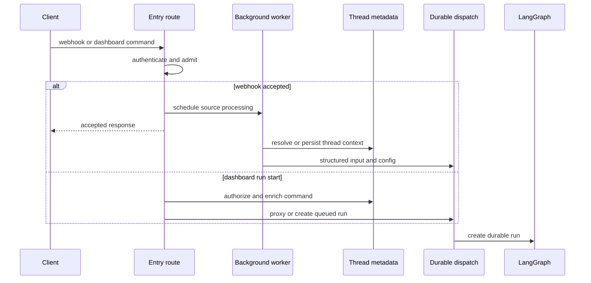
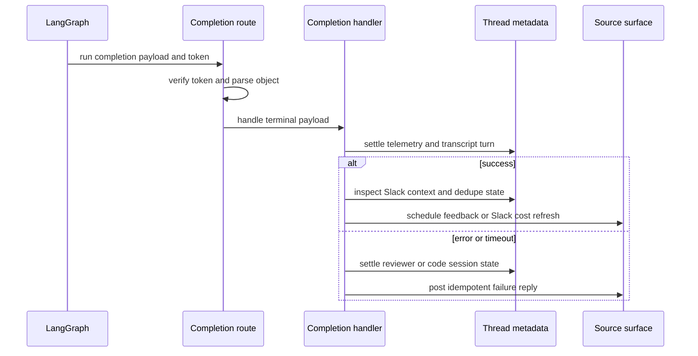

# Inbound Invocation to Durable Run

Open SWE accepts work through signed integration callbacks, authenticated dashboard commands including desktop-originated work, and scheduler ticks. Those surfaces retain their identity, repository, source context, and authorization semantics, but converge at durable LangGraph thread/run creation. See [Threads and state](../concepts/threads-and-state.md), [Dashboard UI](../integrations/dashboard-ui.md), and [Follow-up messages](follow-up-messages.md) for the related persistence and mid-run behavior.

## Boundary and shared path

`create_app` mounts the dashboard, plan/workflow approval, Linear, Slack, health/completion, GitHub, and sandbox-tool routers. It rejects wildcard dashboard CORS origins because credentials are enabled. Its lifespan validates GitHub login allowlisting, sandbox and local-model configuration, requires and migrates the database, and starts supporting listeners/workers before serving.

*Inbound sources perform surface-specific admission and normalization before durable execution on the selected thread.*

Webhook handlers verify signatures against the raw body before decoding JSON and respond with `401` when verification fails. Slack verification also receives the request timestamp, while each route records the raw delivery in the event log after authentication. HTTP acknowledgement is intentionally separated from slow remote API calls and run creation through `BackgroundTasks` for accepted GitHub, Linear, and Slack work.

## Admission and routing by surface

### Slack

Slack resolves channel eligibility before normal message dispatch. It blocks unverified or externally shared channels; an otherwise valid app mention in an external shared channel can claim the event and schedule exactly one refusal reply. It rejects its own/bot messages unless an allowed bot explicitly addresses it, validates edited-message identity and meaningful text changes, and admits ordinary work only when it is a mention, DM, code or kitchen channel turn, allowed-bot invocation, or permitted solo-thread follow-up.

A code channel is a single session: every message maps to `CODE_CHANNEL_SESSION_TS` and is directed to the agent. Normal Slack delivery first resolves the agent thread, resolves repository configuration, then calls `claim_slack_event`; only the claimant schedules `process_slack_mention`. Thread resolution prefers explicit stored location mapping, then matching metadata, then the deterministic Slack-derived ID. A conflict raises `SlackThreadMappingError`, and the route refuses to guess.

The worker loads the triggering user, conversation context, repository/workspace, and history. It records a `SourceContext` with Slack location and builds typed channel, person/system, and message envelopes. Human-originated Slack work requires a valid mapped GitHub token because it opens PRs as that user; missing or revoked credentials cause an account-link/re-login prompt instead of dispatch. Allowed bot requests follow a separate ownership check. Explicit requests use `multitask_strategy="interrupt"`; ordinary follow-ups use `"enqueue"`, and edits are processed as updates rather than independent conversations.

### Linear

Linear admits only non-bot `Comment` `create` events that mention Open SWE. It selects a repository from explicit comment text, then the comment author's dashboard default, then the workspace default, and rejects a missing or non-allowlisted result. The background processor derives the stable thread from the Linear issue ID, resolves the triggering author with creator/assignee fallback, persists Linear source context and repository metadata, and serializes the issue description plus relevant comments as typed system/human input. Images may select a vision fallback model before it dispatches.

### GitHub and reviewer work

GitHub first checks its signature, records the delivery, drops unsupported event types, and verifies that a repository is routed to a workspace. An ownership lookup failure returns `503` to request GitHub retry rather than discarding work. It handles PR state, review, push, CI, issue, and comment families with action filters, repository allowlisting where applicable, public-repository organization gates, registered-commenter checks, and mention requirements. Untagged comments on a known agent-opened PR and replies to review findings are explicit exceptions routed to their matching agent/reviewer paths.

For a coding PR-comment run, the worker uses an Open SWE UUID embedded in the branch when available, otherwise the deterministic PR thread ID. It resolves the author identity and thread token, retries once after a `401`, reacts with eyes, fetches the eligible comments, turns authors/comments into typed input, then triggers or queues the agent run. GitHub issues instead use their issue-ID thread and persist GitHub issue context before dispatch.

Reviewer work is isolated from coding work: automatic review, requested review, and re-review use `reviewer_thread_id(owner, repo, pr_number)` and `assistant_id="reviewer"`. The worker creates/updates reviewer metadata and check-run state, then dispatches the reviewer graph on that separate thread. A watched reviewer thread may be re-run for a changed PR head.

## Dashboard, desktop, schedules, and automations

The dashboard command proxy parses only JSON and authorizes the caller before forwarding a command. A missing thread is permitted only for `run.start`; that path creates and stamps the dashboard thread. Enrichment attributes typed web input to the authenticated user, resolves model/workspace/repository settings, validates images, records participants and dynamic-context hashes, and puts a new invocation ID and start time in configurable state and metadata.

When a dashboard `run.start` reaches a busy thread, it either steers the attributed follow-up into the active run or, when the caller requests `enqueue`, creates a durable queued run. Machine principals cannot take either busy-thread path. Cancellation is per run: only the queued run's sender or thread owner may withdraw a queued follow-up. This is distinct from an interrupting Slack explicit request.

Desktop is a dashboard source (`source == "desktop"`) and downstream local execution requires `local_project_path` to resolve to an existing allowed project or a descendant of `OPEN_SWE_LOCAL_WORKTREES_DIR`. This prevents a run configuration from selecting an arbitrary local directory.

Schedules are persistent records backed by LangGraph crons targeting the `scheduler` assistant. On a tick, the scheduler graph calls `launch_scheduled_agent_run`; launch checks that the schedule remains enabled, its workspace exists, and its repository is accessible to that workspace. It creates a fresh UUID agent thread and typed system input. If the schedule always notifies Slack, it creates and binds the Slack root message before dispatch; inability to establish that response location aborts the launch.

GitHub issue-opened automations reuse the schedule launch machinery but are launched from the GitHub route's background task. Delivery claims make an individual schedule/delivery launch idempotent while failures before durable creation release the claim for retry.

## Thread identity and input invariants

Thread-ID formulas are persisted cross-process routing contracts. Slack locations, Linear and GitHub issues, PR comments, and reviewer threads must generate the same ID in routes, workers, and UI. Changing a namespace or stable input string orphans live state. `thread_id_from_branch` extracts only a UUID, so GitHub falls back to the canonical PR ID when a branch has no embedded agent ID.

Inputs are structured rather than raw prompts. `human_input` and `system_input` enforce kind alignment and serialize authored text into XML-escaped `<input-message>` envelopes. Entity introductions are `<dynamic-context>` blocks whose canonical content is SHA-256 hashed, allowing only context not visible to the model to be resent; dynamic context lost to summarization is reintroduced. Sender and channel identifiers must be nonempty namespaced identifiers, and source-provided Slack topic/purpose content is serialized as ordinary escaped channel fields, not executable configuration.

## Durable dispatch and streaming

`dispatch_agent_run` is the common agent/reviewer dispatch contract. It rejects a prebuilt `input` combined with raw content or source identity arguments; otherwise it builds a structured input and calls `create_durable_run`. The latter can title a system-owned thread, merges metadata/configuration, assigns or propagates an invocation ID and `invocation_started_at`, and defaults to `interrupt`, synchronous durability, and resumable streaming. Callers may select `enqueue` when preserving the active run is required.

Synchronous durability checkpoints before each step. Every dispatched run has the v3 streaming compatibility marker, the `values`, `updates`, `messages`, `custom`, `tasks`, and `checkpoints` stream modes, and subgraph streaming enabled. This lets a later dashboard client replay externally initiated runs and see tool/subgraph events rather than only state values.

A completion webhook is attached only if `RUN_COMPLETE_WEBHOOK_SECRET` is set and `COMPLETION_WEBHOOK_URL` is absolute and non-loopback. Otherwise creation continues without it, avoiding a platform-rejected webhook that would prevent every run. The public receiver compares the query token fail-closed before parsing its JSON body.

## Completion and recovery

*Completion is authenticated, terminal-status-aware, and uses thread metadata to return status to the originating surface.*

Completion finalizes invocation usage telemetry and transcript turns for terminal statuses. A successful run may start a `reject`-strategy pickup for stored follow-ups; except for reviewer threads and automated wakeups, it also settles Slack UI state, schedules answer feedback, and schedules a deduplicated Slack session-cost refresh only when the run has a valid invocation ID and Slack thread location.

For `error` and `timeout`, completion best-effort settles an unfinished reviewer check, restores an idle code-channel session only when no pending/running successor exists, and posts a source-specific failure notification to Slack, Linear, or GitHub. It records up to 20 run IDs in metadata to deduplicate failure replies; legacy payloads without a run ID use a thread-level fallback. `interrupted` is deliberately not a failure reply, because it is expected when a newer interrupting request replaces a run; failed automated wakeups are also silent.

## Operations and focused verification

- Keep raw-body validation before JSON parsing and configure signing secrets plus `RUN_COMPLETE_WEBHOOK_SECRET`. Invalid completion URL configuration disables replies rather than run creation; inspect the startup warning and use a public absolute URL.
- Preserve deterministic thread-ID formulas and Slack mapping conflict behavior. Do not replace an explicit conflict with a heuristic selection.
- Add a new source at the admission boundary, construct typed input/context, persist source metadata before dispatch where later completion needs it, and use `dispatch_agent_run` or `create_durable_run` rather than a direct `runs.create`.
- Exercise signature failure, Slack event claiming and external-channel refusal, GitHub workspace retry behavior, Linear allowlisting, dashboard busy-thread steering/queueing, and schedule repository/workspace gates.
- Focus dispatch tests in `tests/agent/test_dispatch.py` on streaming defaults, invocation correlation, webhook attachment, and source identity. Cover terminal completion paths and source-specific idempotence whenever changing `agent/completion.py`.
