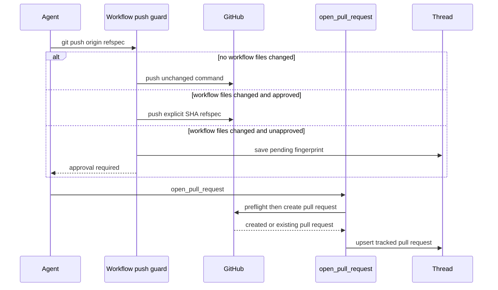
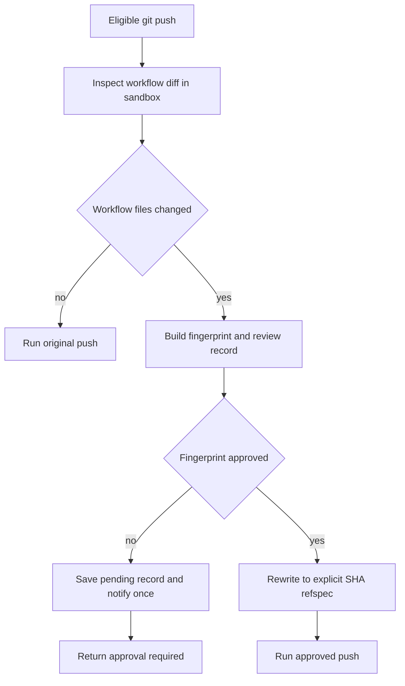

# Pull Request Creation and Approval

The delivery path is **commit → push → open or find a pull request → review and CI follow-up**. New pull requests are centralized in `open_pull_request`, while two middleware boundaries prevent a shell fallback from bypassing PR attribution and require human consent before GitHub Actions workflow changes are pushed. The agent thread persists the resulting PR record, which supplies the link to lifecycle processing, review, dashboard status, and `/baby-sit` automation.

Caption: branch delivery is gated before the PR tool creates or discovers the GitHub pull request.

## Create through the attributed tool

Push the branch to `origin` before calling `open_pull_request(owner, repo, head, base, title, body, draft=True, resolves_thread=False)`. Do not substitute `gh pr create`: the result includes `created`, which distinguishes a 201-created PR from a matching open PR discovered after GitHub returns 422. The latter is deliberate idempotency for a head branch; update it with `gh pr edit` rather than opening another PR.

The tool resolves a requested or triggering participant through `pr_author_login`. When there is a login, it obtains that person's valid OAuth token; absent or expired user authorization is reported as `GitHubUserAuthRequired`. When no participant login applies, it uses the GitHub App installation token and identifies the token kind as `bot`. Before creation, it also verifies workspace App visibility for user-token runs unless private credentials are configured.

Preflight reads the repository and base branch, and reads the head branch when it belongs to the target owner. It separates missing repository/App access (`github_app_access_missing_or_repo_not_found`), an unavailable branch (`github_pr_branch_not_visible`), and other preflight failures (`github_pr_preflight_failed`). Failure responses retain GitHub's status, selected diagnostic headers, and a bounded body excerpt; no available token has its own `no_github_token` failure.

### Body, draft, and tracking semantics

The runtime `draft_prs` preference overrides the requested draft value when configured. Before posting, the tool appends a `## References` section only if one is not already present: a dashboard plan link may be added, while Slack, Linear, or originating GitHub issue links are added only after GitHub positively confirms that the destination repository is private. It then stamps the PR attribution footer.

After creation or duplicate discovery, recording is best effort: a telemetry failure does not negate an existing GitHub PR. The tool fetches details, records usage and opening feedback, updates normalized `pull_requests` and legacy thread metadata, and saves a `PullRequest` registry entry linked to the agent thread. In a Slack code-channel session it also updates the repository context, registers the PR resource, and displays the diff only when GitHub returns nonempty diff content.

`resolves_thread=True` is persisted on the tracked record. PR lifecycle webhooks update records by PR URL; a thread auto-resolves only after all of its tracked PRs are closed or merged and at least one is marked to resolve the thread. Otherwise a completed set of PRs is surfaced as `attention_reason="prs_closed"`; reopening a PR clears that attention state and reverses an automatic resolution.

## Enforced mutation boundaries

### No shell PR-creation fallback

`PullRequestCreationGuardMiddleware` wraps `execute` and `background_execute`. It blocks `gh pr create`, `gh api` requests that POST or supply a body to a `/pulls` endpoint, and `curl` POST/body requests to GitHub's pulls endpoint. It inspects nested `bash`, `dash`, `sh`, and `zsh` `-c` commands to a fixed maximum depth and blocks at the depth limit rather than permitting an uninspectable command.

The response is non-recoverable `PullRequestCreationFallbackBlocked` with code `pr_creation_fallback_blocked`, so the agent must surface the attributed-tool failure. Hosted main-agent and subagent stacks install this guard; local desktop runs omit it. `WorkflowPushGuardMiddleware` is installed in both main-agent and subagent stacks.

### Workflow-file push approval

The push guard recognizes only conservative standalone pushes of the current branch to `origin`, including supported `git -C`, `cd ... &&`, and `--set-upstream` forms. Unsafe shell shapes and unrelated push forms are not interpreted by the guard. For an eligible push, it compares against the remote branch or merge base and proceeds normally when no `.github/workflows/` path changed.

For a workflow change, the guard gathers the binary diff, bounded preview, file and line statistics, base and head SHA, normalized remote, and a SHA-256 fingerprint of the complete change identity. That fingerprint is the approval key in thread metadata under `workflow_push_approvals`. A pending record retains the review material and notification state; decisions retain actor and timestamp, and the store retains only the 20 newest records.

Caption: workflow approval applies to the exact inspected change fingerprint, not to the branch generally.

An approved fingerprint causes the command to be rewritten to an explicit `<head_sha>:refs/heads/<branch>` refspec. A pending or rejected fingerprint returns `WorkflowPushApprovalRequired`; a changed workflow diff produces a new fingerprint and needs another decision. Slack notification is attempted only when the record is not already notified, and is marked notified only after posting returns a timestamp without an error.

The workflow-approval web API requires a session and same-origin protection. Reading requires a readable thread; approving or rejecting requires a promptable thread. Approval records the session subject and dispatches an agent follow-up that instructs a retry of the unchanged blocked push. Rejection only persists the denial.

## Review, comments, CI, and baby-sit

`request_pr_review` is a review handoff rather than PR creation. It parses a GitHub PR URL, resolves the active Slack thread and triggering identity from run configuration, and delegates to the GitHub webhook review trigger.

GitHub feedback collection merges issue comments, inline review comments, and nonempty reviews chronologically. On the first configured Open SWE mention it returns the complete timeline; on later mentions it returns items after the preceding mention. Handles come from `OPEN_SWE_MENTION_TAGS` or deployment defaults, and matching excludes a handle that is only a prefix of a longer handle. Before feedback reaches prompts, reserved wrapper tags are sanitized and nonregistered authors can be fenced as untrusted.

CI reads are best effort: check-run and commit-status reads return `None` on permission or HTTP errors rather than breaking webhook processing. Auto-fix candidates are completed check runs with `failure`, `timed_out`, or `action_required`; Open SWE's own checks are excluded. `names_failing_on_base` removes failures already present at the base SHA, and the no-explicit-mention auto-fix path uses `has_repo_write_permission`, which fails closed unless the requester has `write`, `maintain`, or `admin` access.

CI webhooks normalize branch and head SHA from `check_run`, `check_suite`, `workflow_run`, and legacy `status` payloads. The baby-sit handler considers completed CI events, identifies active watches by matching SHA or branch, de-duplicates deliveries under a watch lock, and evaluates the current PR checks. A pending, successful, terminal-blocked, or failing evaluation is handled by the watch lifecycle; only a qualifying failure dispatches an agent remediation run.

## Operational checks

Focus changes on `tests/github/test_open_pull_request.py` for preflight, duplicate handling, references, and metadata recording; `tests/agent/test_workflow_push_guard.py` for parsing, inspection, approval blocking, notification, and safe ref rewriting; and CI/baby-sit tests for payload normalization and watch dispatch. When changing approval state, also cover the thread API authorization and the fact that approval is scoped to a fingerprint rather than a mutable branch.
