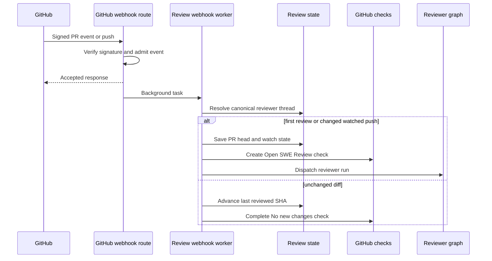
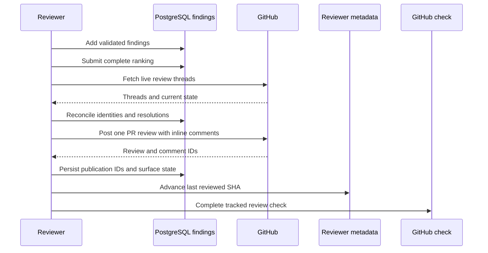

# Pull Request Review Workflow

Open SWE treats a pull request review as a durable, PR-scoped process rather than a one-off model call. GitHub webhooks, Slack requests, and the dashboard dispatch the `reviewer` graph onto one deterministic reviewer thread; findings are durable PostgreSQL records linked to that PR. Pushes, human replies, and the dashboard then revisit the same review state. For the graph's tool boundary and preparation design, see [Reviewer and Analyzer Architecture](../architecture/reviewer-and-analyzer.md); for generic ingress mechanics, see [Inbound Invocation to Durable Run](invocation.md).

## Admission and entrypoints

`POST /webhooks/github` reads the raw delivery body, verifies `X-Hub-Signature-256`, records the delivery, rejects unsupported event types/actions, and schedules accepted work with FastAPI `BackgroundTasks`. Before it admits repository work it checks workspace routing; an unreadable ownership lookup produces `503` so GitHub retries, while an unrouted repository is ignored.

Automatic reviewing is deliberately opt-in. `opened` and `ready_for_review` PR events, and push events that could cause re-review, require the repository to be in the enabled-review-repositories record. The default is disabled, and an unavailable store is treated as disabled rather than failing the webhook. First-review webhook paths also apply the public-repository organization gate. Draft PRs proceed only when the author's effective `review_draft_prs` setting permits it, falling back to the workspace setting.

A review can be started through these paths:

- **Automatic first review:** an admitted `opened` or `ready_for_review` event calls `process_github_pr_ready`. A `ready_for_review` event whose head already equals `last_reviewed_sha` updates `watch` but does not dispatch a redundant review.
- **Explicit request:** the Slack `request_pr_review` tool parses a GitHub PR URL; dashboard re-review calls use the same `trigger_pr_review_from_ref` implementation. It fetches PR metadata and a suitably scoped App token, ensures the reviewer thread, records PR/head metadata and `watch=True`, posts a transient in-progress comment, and dispatches the graph.
- **Watched push:** an accepted branch push can start a re-review only for an open PR with an existing, watched reviewer thread.
- **Finding reply:** a reply to an Open SWE inline comment is routed before ordinary mention handling. It reconciles persisted findings with GitHub threads and, if the parent maps to a finding, dispatches a focused reassessment run.

Diagram: webhook acknowledgement is separate from asynchronous review admission, state update, and reviewer dispatch.

## Canonical state and dashboard boundary

`reviewer_thread_id(owner, repo, pr_number)` is UUIDv5 over `"{owner}/{repo}/pr/{pr_number}/reviewer"`. It is a cross-process persisted-data contract: webhook handlers, dashboard views, and reviewer tools independently derive it to address the same LangGraph thread, so changing the formula would orphan existing state.

The reviewer thread owns execution-oriented metadata: `kind="reviewer"`, PR identity, current `head_sha`, `last_reviewed_sha`, `watch`, optional Slack origin, the current run ID, the transient status-comment ID, and check-settlement fields. Runs dispatch with `assistant_id="reviewer"`, which `langgraph.json` maps to `agent.graphs.reviewer:traced_reviewer_agent`.

Findings are no longer owned by thread metadata in normal operation. They live in PostgreSQL under the pull request, with a state row linking the PR to its reviewer thread; first access migrates legacy metadata findings once. This keeps durable review records separate from replaceable sandboxes while retaining thread metadata as the routing and run-state boundary. Finding records include location/side, severity, confidence, rank, lifecycle status, SHA history, publication IDs, monotonic surface state, and interactions. Reads normalize older flat GitHub IDs and nested `surface` data into canonical lists and `surface_state`.

The dashboard's review API is an authorized presentation and control layer. It reads the deterministic reviewer thread plus PostgreSQL findings, returns GitHub-sourced PR details, checks, and diff, and can trigger `trigger_re_review`; an unreviewed PR still has a dashboard payload with no reviewer thread/findings. Administrators manage automatic-review opt-in through `PUT /enabled-review-repos`, while ordinary readers must have repository access.

## Reviewer preparation and finding creation

The reviewer graph is a read-only assessment agent with controlled review tools. Its factory installs `PrepareReviewerRunMiddleware` before model use and the check-settlement hook after it. Preparation obtains a repository-scoped GitHub App token, ensures a replaceable sandbox/checkout, builds the appropriate first-review or delta re-review diff, and provides `diff_text` plus a per-file/per-side changed-line set. A re-review uses the prior reviewed SHA as its range. The prompt treats PR descriptions and review-thread material as untrusted data, and excludes style-only, speculative, pre-existing, and out-of-diff findings.

`add_finding` first normalizes a one-ended range, requires a generated non-default title, validates severity, confidence, side, and line ordering, and validates its anchor against the changed-line set. A range outside the diff returns `success: false`, `in_diff: false`, and an explicit instruction not to re-anchor or retry. File-level findings are permitted but are not renderable as inline comments. Suggestions longer than `MAX_SUGGESTION_LINES` (4) are discarded while the description-only finding remains.

Writes use a database row lock and a fresh read-modify-write cycle. `append_finding` de-duplicates open findings by fingerprint, and snapshot replacement merges by ID so it does not drop a concurrently appended finding. If the backing reviewer thread is missing, the storage layer raises `ReviewerThreadMissingError`; tool wrappers turn it into the structured `thread_not_found` do-not-retry result rather than encouraging an expensive retry.

## Ranking, publication, and GitHub effects

The reviewer must supply `publish_review(ranking=...)` with every eligible candidate ID exactly once and in best-first order; otherwise nothing is published. Candidates are open, in-diff, unpublished findings, and on a re-review must also have first appeared at the current head. The supplied rank is persisted. Publication then applies the severity threshold (default `medium`) and cap; ranked findings come first, with unranked ties ordered by severity and location. Confidence is retained for calibration, not used as a publication gate.

Diagram: publication reconciles durable findings before posting, then records GitHub identities before completing review bookkeeping.

`publish_review` resolves the effective head from live thread metadata rather than relying only on the frozen run config; a push received during a run can therefore move the target head. It posts one GitHub PR review, whose inline comments contain a hidden finding marker, title/description, location, and optional fenced suggestion; the review body supplies the summary. After GitHub accepts the post, it records the review and marker-matched comment identities in a consolidated findings write, then backfills thread IDs if necessary. This identity recording is what enables later reply routing and resolution.

The tool explicitly handles non-post and error outcomes:

- Eval runs are dry runs: they persist simulated publication data but post nothing.
- An empty re-review when an Open SWE review is already known skips a duplicate summary, yet resolves fixed threads, advances `last_reviewed_sha`, clears the in-progress comment, and settles the check.
- GitHub unresolved-anchor failures cause one filtered retry when identifiable bad anchors can be removed; otherwise the tool returns `unresolvable_findings` with remediation rather than retrying identical input.
- A numeric `review_id` without `dry_run` or `skipped_empty_re_review` is the signal that a real GitHub review was posted.

## Re-review, reconciliation, and settlement

A PR lifecycle event changes watch state without erasing the review: `closed` disables watch, `reopened` enables it, and `converted_to_draft` disables it only if the author is not eligible for draft reviews. For a watched branch push, the worker skips dispatch if the head equals `last_reviewed_sha`. If comparison proves the PR diff unchanged, it advances that SHA and creates then completes a **No new changes to review** success check on the new commit, because GitHub only displays checks on the current head. Otherwise it reconciles GitHub threads, stores the new head, creates a fresh **Open SWE Review** check, and dispatches a `re_review=True` run instructed to reconcile old findings and add net-new ones.

Reconciliation matches GitHub review threads by embedded finding marker first, then recorded thread/comment IDs. It backfills publication identity, marks findings surfaced, stores the latest non-bot reply as a `needs_reassessment` interaction, and marks an open finding resolved only when all matched threads are resolved. Outdated threads are terminal but do not themselves establish resolution. It writes only when state changed. The finding-reply webhook additionally records the reply and sends `reviewer_event="finding_reply"` plus the finding/reply context to the reviewer graph.

Automatic first reviews and push re-reviews create an in-progress **Open SWE Review** check and store `review_check_run_id` in thread metadata. `publish_review` settles it and clears that ID only after the GitHub completion PATCH succeeds; on failure it preserves the ID and stores `review_check_pending_result`. The `settle_review_check_on_exit` middleware retries a pending real result, or closes an un-published run as `neutral`: an incomplete reviewer is infrastructure failure, not a code failure.

## Operations and focused tests

Enable automatic review only through the enabled-review-repositories setting; installing the App is not sufficient. For a review that seems stuck, inspect reviewer metadata for `head_sha`, `last_reviewed_sha`, `watch`, `review_check_run_id`, and `review_check_pending_result`, then verify App-token access and sandbox preparation. Treat a `thread_not_found` tool result as terminal for that run.

`tests/reviewer/` covers admission/draft gating (`test_pr_ready_auto_review.py`), watched-push and unchanged-diff behavior (`test_reviewer_watch.py`), PostgreSQL migration/locking/filtering (`test_reviewer_findings.py`), tool validation (`test_reviewer_tools.py`), reconciliation (`test_reviewer_reconcile.py`), and the publication ranking, retry, status, and identity paths (`test_reviewer_publish.py`). Dashboard-facing review behavior is covered by `test_review_api.py`.
