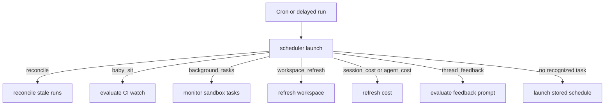
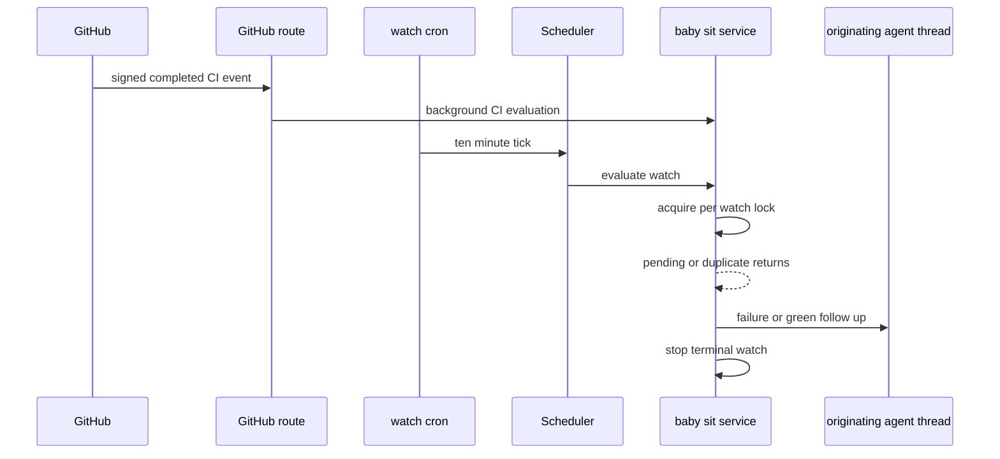

# Schedules, Background Tasks, and Baby-Sit

The `scheduler` assistant is the model-free automation router. A cron tick or delayed run enters one `launch` node, which selects a bounded handler; handlers either update durable state, enqueue a deliberate agent run, or end their own lifecycle. It is registered as `scheduler` in `langgraph.json`, whereas a thread wakeup is a one-shot cron that invokes the `agent` assistant directly.

This separation makes ownership explicit: the component that creates a cron or delayed run is responsible for its metadata, idempotency, and cleanup. The scheduler does not perform general cron garbage collection. For run ownership and completion release, see [Sandbox lifecycle](../architecture/sandbox-lifecycle.md); for message delivery behavior, see [Follow-up messages](follow-up-messages.md); and for agent invocation context, see [Invocation](invocation.md).

## Scheduler routing

`agent/scheduler.py` compiles a single-node `StateGraph` (`START → launch → END`). `_launch` reads `task` from the input state first, then the configurable run context, and invokes one route. Its outer retry wrapper retries only transient sandbox-attach failures for a bounded period; after that condition is exhausted, it returns `sandbox_unavailable`, while unrelated exceptions still propagate.

Diagram: a scheduler run deterministically selects one maintenance, notification, or scheduled-agent handler.

The `baby_sit` and background-task routes return `missing_watch_key` or `missing_thread_id` when their required keys are absent. The dashboard-schedule fallback requires `schedule_id` and returns `missing_schedule_id` rather than throwing. Workspace refresh accepts both the current `workspace_refresh` task and the legacy `environment_refresh` spelling, as well as the old `environment_slug` input. A legacy expedited-review task only deletes old review crons; it is a compatibility cleanup route rather than a new agent dispatch.

### Recurring dashboard schedules and reconciliation

`agent/schedules/store.py` owns dashboard-managed automations. Its cron validator normalizes whitespace, requires exactly five fields, and range-checks numeric values, wildcards, lists, ranges, and steps before persistence. A recurring tick without a recognized scheduler task falls through to `launch_scheduled_agent_run(schedule_id)`, which refuses missing records and non-`schedule` triggers, then launches a fresh agent run from the stored definition. The schedule definition and its run state use separate namespaces, allowing the latest thread/run/trigger outcome to change independently of the saved automation.

Completion normally releases durable dispatch. `reconcile_stale_runs()` is the safety net for a lost completion webhook: it pages through every `busy` thread, finds its `pending` runs, and interrupts those older than 1,800 seconds by default. It ignores malformed timestamps, isolates failures for each thread, and returns checked-thread, stale-run, and cancellation counts. One unhealthy thread therefore cannot prevent recovery of other blocked threads.

## Delayed maintenance work

### Cost refresh chains

LangSmith costs may not be available when an agent completes. Session cost and agent-usage cost therefore create stateless delayed `scheduler` runs with `on_completion="delete"`, using the fixed delays 15, 30, 60, 120, and 240 seconds. Each attempt either succeeds, determines that the prerequisite is unavailable, or schedules only the next bounded attempt; there is no permanent poller.

- **Session cost** uses an invocation and Slack response mapping to retrieve a cumulative thread cost and update the mapped Slack footer. The first scheduled attempt marks the footer pending best-effort. It retries a missing trace, message, or Slack update, but clears that pending marker on invalid input, an unavailable terminal condition, a failed reschedule, or exhaustion.
- **Agent usage cost** records terminal invocation usage and schedules enrichment only when that usage needs a cost refresh. The scheduler requests a `run_only=True` LangSmith cost and persists it to the invocation usage record. An explicitly unavailable LangSmith lookup terminates immediately; retrieval or persistence exceptions use the remaining retry budget and ultimately report exhaustion.

### Feedback prompt deferral

The `thread_feedback` scheduler task implements quiet-time feedback prompts. A delayed run carries a durable `Feedback` record and checks the thread's latest run and recorded activity under the thread PR-state lock. If the answer changed, there was new activity, or the latest run failed, it skips; if the thread is still busy, it re-enqueues itself for the remaining five-minute quiet interval. Only a matching, quiet, successful thread becomes `ready`, after which a correlated Slack feedback prompt may be posted.

## Workspace refreshes

A workspace refresh rebuilds a reusable snapshot on a throwaway builder sandbox. A **full** refresh starts from the base snapshot, runs setup then update scripts, and captures only if all steps succeed. An **update** refresh starts from the current snapshot and runs only the update script. The workspace record carries step status and a capped log; a failure leaves the previous ready snapshot in place.

Daily full-refresh crons are deterministic but staggered by a hash of the workspace slug between 03:00 and 05:59 UTC. `ensure_refresh_cron` records the cron ID on the workspace. Separately, sandbox creation detects a snapshot older than one hour: the run updates its own sandbox before the first model call and, when no fresh attempt is in flight, starts a background update capture for later runs. A refresh marked in progress for more than three hours is no longer considered in flight, preventing a lost worker from blocking all future attempts.

The scheduler accepts a specific slug or sweeps every workspace with a setup script. Refresh work created on demand is a one-shot scheduler run; callers receive a run ID and can observe it through the unified workspace background-task interface. Builder sandboxes are stopped after completion rather than explicitly deleted, so platform reclamation cannot destroy an arbitrary running sandbox.

## Background sandbox tasks

Long-running sandbox commands are monitored without model polling. When a command is started, `background_execute` ensures an idempotent `background_tasks` cron for its agent thread. The cron runs every minute on `scheduler`, is tagged with `kind=background_tasks` plus `agent_thread_id`, and removes duplicate rows.

`monitor_background_tasks(thread_id)` obtains the thread and sandbox, lists task state, and maintains the thread's running/finished task metadata. For each unreported terminal task (`completed`, `failed`, `timed_out`, `stopped`, or `lost`), it atomically creates a task-directory claim before enqueuing a system completion message to the originating agent thread. The completion prompt treats output as untrusted and directs the agent to retrieve only bounded output if useful. Delivery is persisted only after dispatch succeeds; a failure releases the claim for a future tick.

When no task is running or awaiting notification, the monitor acquires a sandbox monitor lock and lists tasks again before deleting all matching monitor crons. This recheck prevents a transition race from deleting a monitor just as work appears. A missing thread or sandbox also removes its crons; Slack background status is synchronized after normal monitoring.

## Thread wakeups

`schedule_thread_wakeup` schedules one direct re-trigger of the current agent thread, not a scheduler task. It accepts a whole-minute delay from one minute through 24 hours, rounds the UTC fire time upward to a minute, and creates a thread-bound cron for the `agent` assistant. Its `end_time` is 90 seconds after firing, preventing recurrence. The system input defaults to the polling prompt and carries selected repository, source, Slack, issue, user, and schedule context; it also uses normal run preparation and the completion webhook when configured.

Wakeups are capped at 10 between human messages. Under a per-process thread lock, the tool hashes the latest human input-message identity and stores that generation plus its count in thread metadata. A new human message resets the count; system input, including a wakeup, does not. The count is persisted before cron creation, so a failed creation still consumes a slot and cannot be retried indefinitely.

LangGraph retains a cron row after its end time. Before each creation, the tool best-effort paginates and deletes only expired `metadata.kind=thread_wakeup` crons. `scripts/purge_wakeup_crons.py` provides the operational backlog cleanup: `uv run python scripts/purge_wakeup_crons.py --dry-run` lists candidates, and omitting `--dry-run` deletes them. It reads the URL from `--url` or `LANGGRAPH_URL` and credentials from `LANGGRAPH_API_KEY` or `LANGSMITH_API_KEY`.

## `/baby-sit`: durable CI watches

`/baby-sit` is an opt-in pull-request CI workflow, not a general repository watcher. Cloud runs use `manage_baby_sit` to create a durable watch; local and desktop runs use one bounded foreground `gh pr checks --watch` loop instead and never use the durable tool or a thread wakeup. PR data, check names, URLs, and logs are untrusted input throughout the skill.

### Watch state and creation

A `BabySitWatch` is persisted in `baby_sit_watches` under a lower-cased `owner/repo#pr_number` key. It binds the originating thread, PR URL and head SHA/ref, GitHub App installation, captured dispatch configuration, and `SourceContext`, as well as retry, failure-dispatch, webhook-delivery, alert, evaluation-error, and cron state.

Only one active thread may watch a PR. Starting from another thread fails; restarting from the same head carries retry and deduplication lists forward, while a new head resets them. Creation saves the watch, then idempotently finds or creates one UTC `*/10 * * * *` cron tagged `kind=baby_sit_watch`; duplicate cron rows are deleted. If creation of a cron for a brand-new watch fails, the service rolls back the stored row and a known partial cron. Stop deletes the cron and row; if cron deletion fails, it retains an inactive row so the watch cannot evaluate again.

The agent-facing tool requires a canonical GitHub pull-request URL and an executable thread. For `start`, it authenticates, verifies that the PR is open with a head SHA/ref, and requires a GitHub App installation for the target repository. It deliberately permits a canonical URL in a repository different from the thread default. `stop` and `record_retry` require the watch to belong to the current thread; retry recording also requires a SHA, check name, and evidence.

### Webhook and polling lifecycle

Diagram: signed CI webhooks and the ten-minute fallback converge on one serialized evaluation for each watch.

The GitHub route verifies `X-Hub-Signature-256` before accepting a delivery. Completed supported CI events are sent to background processing, where `handle_ci_webhook` ignores non-completed/non-failing-state payloads, matches active repository watches by stored SHA or branch, updates an installation ID, and retains up to 50 delivery IDs to suppress duplicates. Both webhook handling and cron evaluation use a five-minute lock implemented by creating a short-lived lock thread; contention returns `busy`, so concurrent triggers cannot dispatch the same failure twice.

The ten-minute fallback addresses delayed or lost webhook delivery. It fetches the PR and check/status sets, returns without an agent run while checks are pending, and deduplicates a previously dispatched failure. Thus unchanged polling is model-free. A closed or merged PR simply stops its watch without a terminal notification.

### Decisions, retries, and outcomes

The aggregate check state is `failure` for a completed failing check or failing/error commit status, `pending` for incomplete or absent checks, `blocked` for completed non-success states that are not rerunnable failures, and `success` for a nonempty successful/neutral/skipped set. Before declaring success, the service also fetches the base branch's required checks; any required check absent from the observed results returns to `pending`. Once the full required set is present and green, it enqueues a ready follow-up on the originating thread and stops the watch. There is no additional fixed settling period.

A changed head resets the retry counter, failure-dispatch keys, and alert keys. A new failure uses a fingerprint of head SHA plus retry count; the service stores it before enqueueing the `/baby-sit --continue` prompt, which frames failure signals as untrusted data. If dispatch fails, it removes the fingerprint so a later trigger can retry. Evaluation errors increment a durable counter, reset after a successful check fetch, and terminate with a source notification after three consecutive errors.

The agent may record only an evidence-backed flaky GitHub Actions rerun. `record_retry` serializes with evaluation, rejects another thread, a changed head, and a cap of three retries per head, then increments durable state. The first occurrence of a head/check/safe GitHub URL posts a flaky-CI notification; later identical alerts are deduplicated. Blocked checks, retry exhaustion, or repeated evaluation errors call `_finish_watch`, which first tries the originating Slack thread or GitHub issue/comment context, falls back to an enqueued `/baby-sit --terminal` agent run, and then stops the watch.

## Focused verification

- `tests/agent/test_baby_sit.py` exercises cron/watch creation, lock contention, failure deduplication, green required-check completion, terminal fallback dispatch, retry caps, and head-change reset behavior.
- `tests/tools/test_schedule_thread_wakeup.py` covers delay limits, rounded scheduling context, human-generation budget reset, system-message non-reset, parallel budget enforcement, and scoped expired-cron cleanup.
- `tests/reviewer/test_reconcile_sweep.py` tests stale-only interruption, pagination, malformed timestamps, and per-thread failure isolation. Cost refresh tests cover correlation, persistence, bounded retries, and exhaustion.
